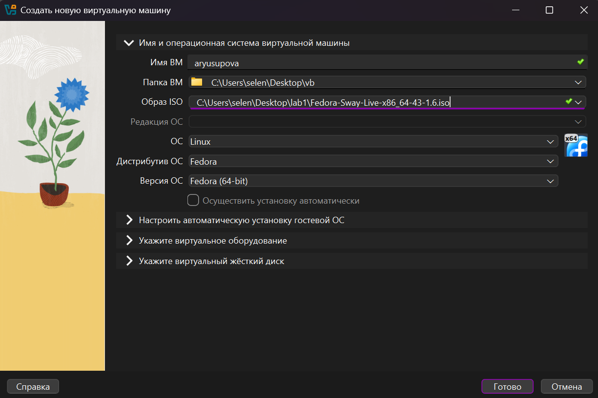
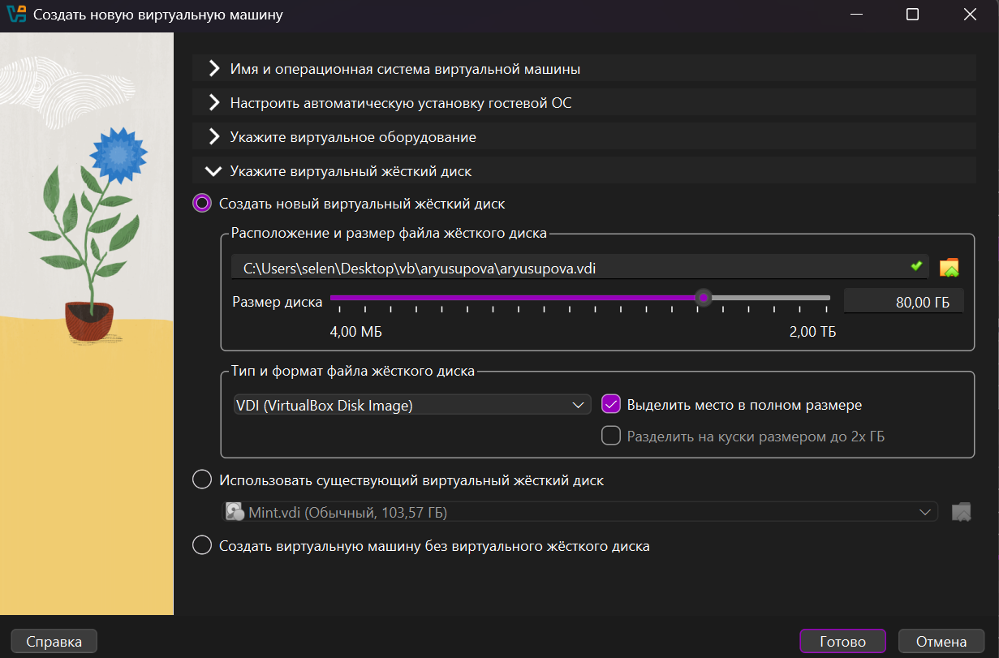
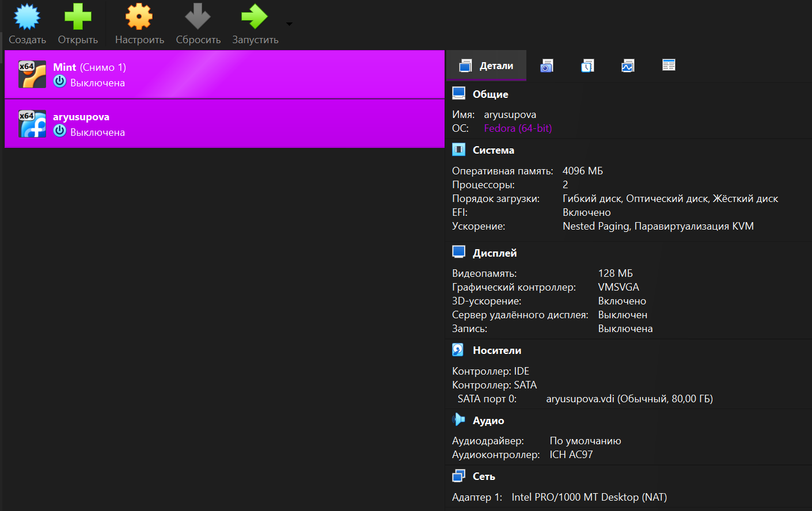
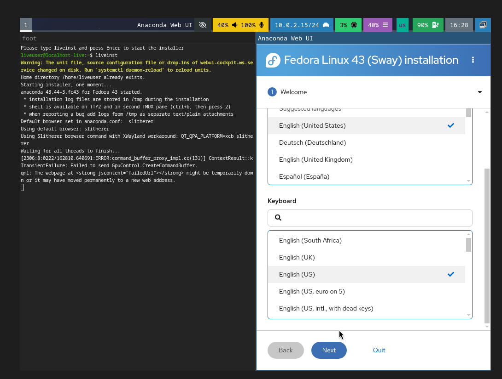
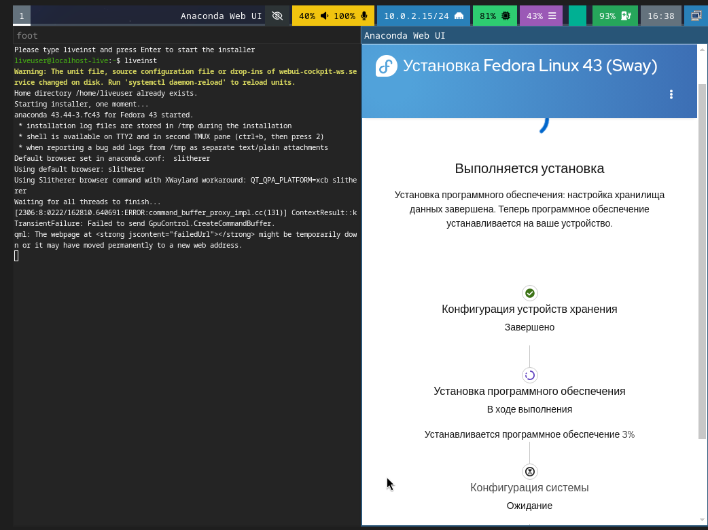
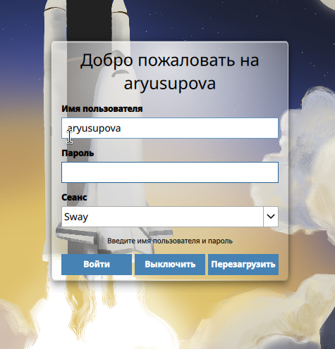
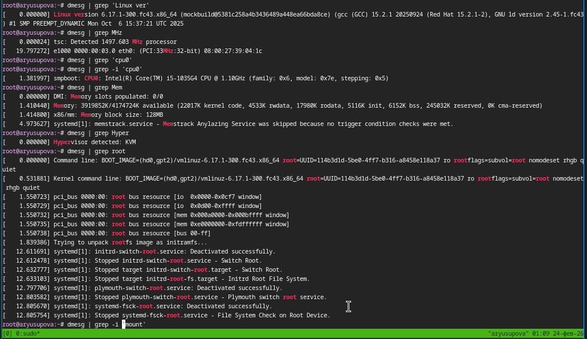
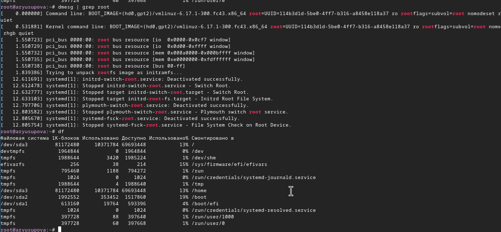

---
## Author
author:
  name: Юсупова Амина Руслановна
  affiliation:
    - name: Российский университет дружбы народов
      country: Российская Федерация
      postal-code: 117198
      city: Москва
      address: ул. Миклухо-Маклая, д. 6
lang: ru
format:
  pdf:
    documentclass: scrartcl
    latex-engine: xelatex
    mainfont: "Liberation Serif"
    sansfont: "Liberation Sans"
    monofont: "Liberation Mono"
    include-in-header:
      text: |
        \usepackage{fontspec}
        \setmainfont{Liberation Serif}
        \setsansfont{Liberation Sans}
        \setmonofont{Liberation Mono}
  pptx:
    toc: false
## Title
title: Лабораторная работа №1
subtitle: Установка ОС
license: CC BY
---

# Цели и задачи работы

## Цель лабораторной работы

Целью данной работы является приобретение практических навыков установки операционной системы на виртуальную машину, настройки минимально необходимых для дальнейшей работы сервисов

# Процесс выполнения лабораторной работы

## Создаю виртуальную машину

{ #fig:001 width=70% height=70% }

## Задаю конфигурацию жёсткого диска

{ #fig:002 width=70% height=70% }

## Добавляю новый привод оптических дисков и выбираю образ 

{ #fig:004 width=70% height=70% }

## Установка языка

{ #fig:004 width=70% height=70% }

## Завершение установки 

{ #fig:005 width=70% height=70% }

## Создание пользователя и вход в учётную запись

{ #fig:006 width=70% height=70% }
 
## Рабочая система

{ #fig:007 width=70% height=70% }

## Рабочая система

{ #fig:008 width=70% height=70% }

# Выводы по проделанной работе

## Вывод

Мы приобрели практические навыки установки операционной системы на виртуальную машину, настройки минимально необходимых для дальнейшей работы сервисов.
