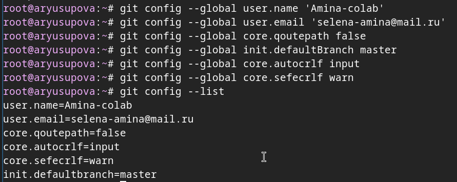
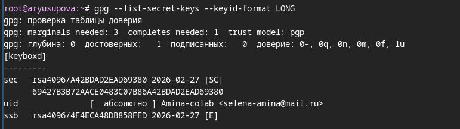
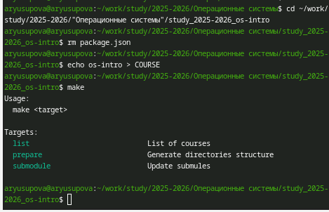
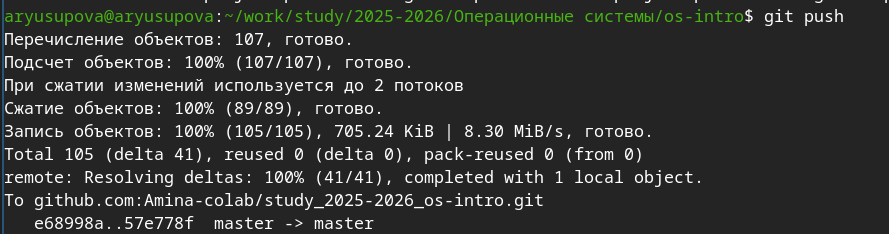

---
## Author
author:
  name: Юсупова Амина Руслановна
  affiliation:
    - name: Российский университет дружбы народов
      country: Российская Федерация
      postal-code: 117198
      city: Москва
      address: ул. Миклухо-Маклая, д. 6
lang: ru
format:
  pdf:
    documentclass: scrartcl
    latex-engine: xelatex
    mainfont: "Liberation Serif"
    sansfont: "Liberation Sans"
    monofont: "Liberation Mono"
    include-in-header:
      text: |
        \usepackage{fontspec}
        \setmainfont{Liberation Serif}
        \setsansfont{Liberation Sans}
        \setmonofont{Liberation Mono}
  pptx:
    toc: false
## Title
title: Лабораторная работа №2
subtitle: Управление версиями
license: CC BY
---
# Цели и задачи работы

## Цель лабораторной работы

Целью данной работы является изучение идеологии и применения средств контроля версий и освоение умений работать с git.

# Процесс выполнения лабораторной работы

## Глобальные параметры репозитория

{ #fig:001 width=70% height=70% }

## Добавляем GPG ключ в аккаунт

{ #fig:002 width=70% height=70% }

## Настройка gh

{ #fig:003 width=70% height=70% }

## Подготовка репозитория

{ #fig:004 width=70% height=70% }

---

{ #fig:005 width=70% height=70% }

# Выводы по проделанной работе

## Вывод

Мы приобрели практические навыки работы с сервисом github.

