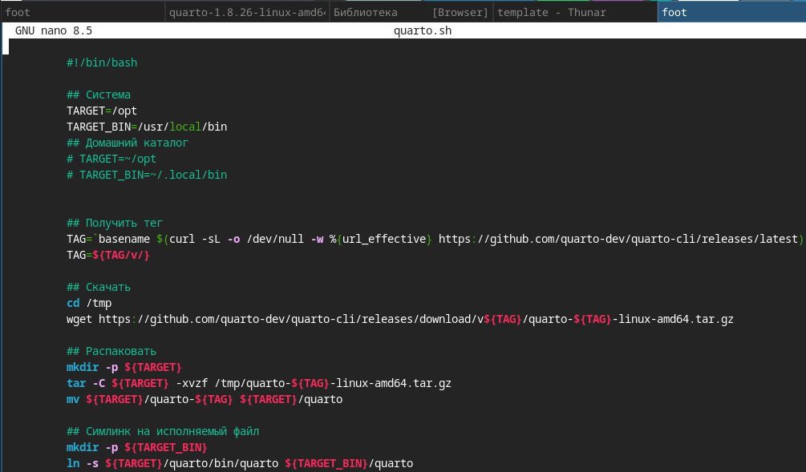
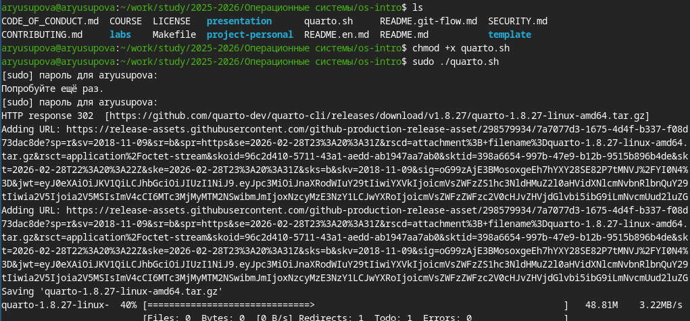
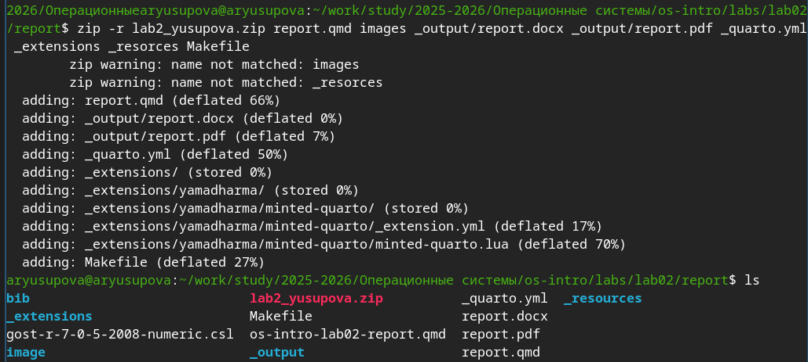

---
## Author
author:
  name: Юсупова Амина Руслановна
  affiliation:
    - name: Российский университет дружбы народов
      country: Российская Федерация
      postal-code: 117198
      city: Москва
      address: ул. Миклухо-Маклая, д. 6
lang: ru
format:
  pdf:
    documentclass: scrartcl
    latex-engine: xelatex
    mainfont: "Liberation Serif"
    sansfont: "Liberation Sans"
    monofont: "Liberation Mono"
    include-in-header:
      text: |
        \usepackage{fontspec}
        \setmainfont{Liberation Serif}
        \setsansfont{Liberation Sans}
        \setmonofont{Liberation Mono}
  pptx:
    toc: false
## Title
title: Лабораторная работа №3
subtitle: Markdown 
license: CC BY
---

# Цели и задачи работы

## Цель лабораторной работы

Целью данной работы является освоение процедуры оформления отчётов с помощью легковесного языка разметки Markdown и генерация документов в форматах PDF и DOCX с использованием системы Quarto.

# Процесс выполнения лабораторной работы

## Установка необходимого ПО

Для работы потребовались Pandoc, Quarto и фильтр pandoc-crossref. На скриншоте показан процесс установки Quarto с помощью скрипта.

{#fig:001 width=70% height=70%}

## Активизация файла `quarto.sh`

Для автоматизации сборки использовался Quarto. Делаем файл  `quarto.sh`  исполняемым

{#fig:002 width=70% height=70%}

## Компиляция в формат DOCX

С помощью Quarto был сгенерирован отчёт в формате Microsoft Word.

{#fig:003 width=70% height=70%}

## Компиляция в формат PDF

Аналогично получена PDF-версия отчёта с использованием LuaLaTeX.

{#fig:004 width=70% height=70%}

## Создание архива для сдачи

В соответствии с заданием все необходимые файлы (исходник, скриншоты, сгенерированные документы, конфигурация) были упакованы в архив.

{#fig:005 width=70% height=70%}

# Выводы по проделанной работе

## Вывод

В ходе выполнения лабораторной работы я освоила синтаксис языка разметки Markdown, научилась использовать Quarto для генерации отчётов в форматах PDF и DOCX, а также подготовила архив с результатами для сдачи.

