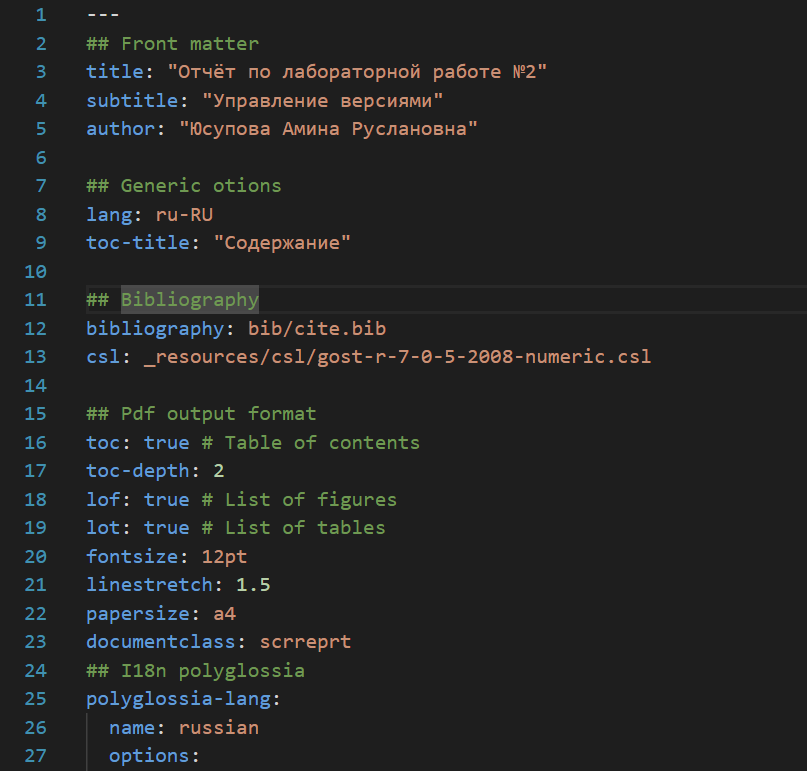
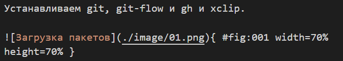
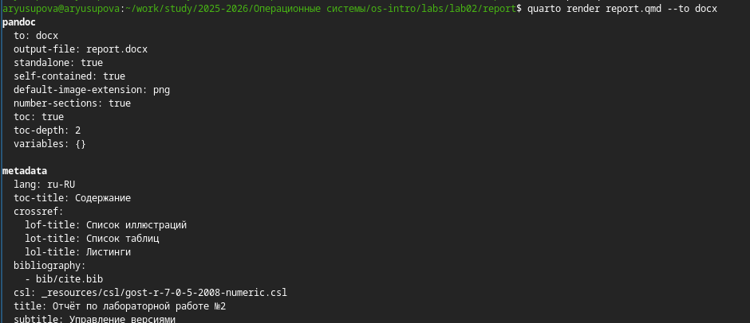
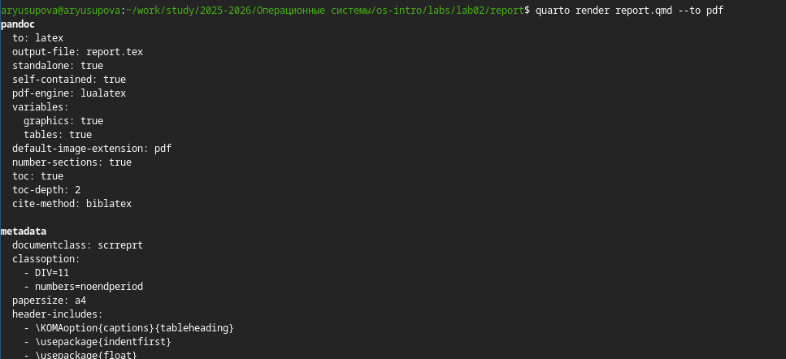

---
## Front matter
title: "Отчёт по лабораторной работе №3"
subtitle: "Markdown"
author: "Юсупова Амина Руслановна"

## Generic otions
lang: ru-RU
toc-title: "Содержание"

## Bibliography
bibliography: bib/cite.bib
csl: _resources/csl/gost-r-7-0-5-2008-numeric.csl

## Pdf output format
toc: true # Table of contents
toc-depth: 2
lof: true # List of figures
lot: true # List of tables
fontsize: 12pt
linestretch: 1.5
papersize: a4
documentclass: scrreprt
## I18n polyglossia
polyglossia-lang:
  name: russian
  options:
  - spelling=modern
  - babelshorthands=true
polyglossia-otherlangs:
  name: english
## I18n babel
babel-lang: russian
babel-otherlangs: english
## Fonts
mainfont: IBM Plex Serif
romanfont: IBM Plex Serif
sansfont: IBM Plex Sans
monofont: IBM Plex Mono
mathfont: STIX Two Math
mainfontoptions: Ligatures=Common,Ligatures=TeX,Scale=0.94
romanfontoptions: Ligatures=Common,Ligatures=TeX,Scale=0.94
sansfontoptions: Ligatures=Common,Ligatures=TeX,Scale=MatchLowercase,Scale=0.94
monofontoptions: Scale=MatchLowercase,Scale=0.94,FakeStretch=0.9
mathfontoptions: ''

biblatex: true
biblio-style: "gost-numeric"
biblatexoptions:
  - parentracker=true
  - backend=biber
  - hyperref=auto
  - language=auto
  - autolang=other*
  - citestyle=gost-numeric
## Pandoc-crossref LaTeX customization
figureTitle: "Рис."
tableTitle: "Таблица"
listingTitle: "Листинг"
lofTitle: "Список иллюстраций"
lotTitle: "Список таблиц"
lolTitle: "Листинги"
## Misc options
indent: true
header-includes:
  - \usepackage{indentfirst}
  - \usepackage{float} # keep figures where there are in the text
  - \floatplacement{figure}{H} # keep figures where there are in the text
---

# Цель работы

Целью работы является освоение процедуры оформления отчетов с помощью легковесного языка разметки Markdown.

# Задание

1. Создать отчёт по предыдущей лабораторной работе (№2) в формате Markdown (файл `.qmd`).

2. Включить в отчёт скриншоты, демонстрирующие ключевые этапы выполнения лабораторной работы №2.

3. Скомпилировать отчёт в форматы PDF и DOCX с помощью Quarto.

4. Подготовить архив, содержащий исходный файл, скриншоты, сгенерированные документы и вспомогательные файлы (Makefile, конфигурацию).

# Теоретическое введение

Маркдаун, он же markdown — удобный и быстрый способ разметки текста. 
Маркдаун используют, если недоступен HTML, а текст нужно сделать 
читаемым и хотя бы немного размеченным (заголовки, списки, картинки, ссылки).
Главный пример использования маркдауна, с которым мы часто сталкиваемся — файлы readme.md, 
которые есть в каждом репозитории на Гитхабе. 
md в имени файла это как раз сокращение от markdown.
Другой частый пример — сообщения в мессенджерах. Можно поставить звёздочки вокруг 
текста в Телеграме, и текст станет полужирным.

# Выполнение лабораторной работы

Установили программы pandoc и TexLive по указаниям в лабораторной работе. 

1. **Переход в каталог с шаблоном отчёта**  
   Для работы я перешла в каталог `lab02/report`, где находится файл отчёта по предыдущей лабораторной работе.

2. **Редактирование файла отчёта**
Файл os-intro-lab02-report.qmd был открыт в текстовом редакторе (VS Code). В нём я оформила титульный лист, вставила описание выполнения лабораторной работы №2 и добавила скриншоты.

{#fig:001 width=100%}

{#fig:002 width=100%} 

3. **Компиляция отчёта в формат DOCX**
Для генерации документа в формате Microsoft Word использована команда: `quarto render report.qmd --to docx`

{#fig:003 width=100%}

4. **Компиляция отчёта в формат PDF**
Для получения PDF-версии выполнена команда:
`quarto render report.qmd --to pdf`

{#fig:004 width=100%}

5. **Проверка полученных файлов**

После успешной компиляции в каталоге `_output` появились файлы `os-intro-lab02-report.docx` и `os-intro-lab02-report.pdf`. Их содержимое соответствует ожидаемому: все скриншоты, заголовки и текст отображаются корректно.

6. **Создание архива для сдачи**
В соответствии с заданием я упаковала все необходимые файлы в архив `lab02_yusupova.zip`

{#fig:005 width=100%}

В архив вошли:
+ исходный файл `os-intro-lab02-report.qmd`;

+ папка `images` со скриншотами;

+ сгенерированные документы `os-intro-lab02-report.docx` и `os-intro-lab02-report.pdf`;

+ конфигурационные файлы `_quarto.yml`, `_extensions`, `_resources`;

+ Makefile;

+ и папка `presentation` со всеми соотвествующими файлами.

7. **Загрузка на GitHub**
Заключительным этапом стало добавление всех изменений в локальный репозиторий и отправка их на сервер GitHub.

# Выводы
Изучили синтаксис языка разметки Markdown, получили отчет из шаблона при помощи Makefile. 
