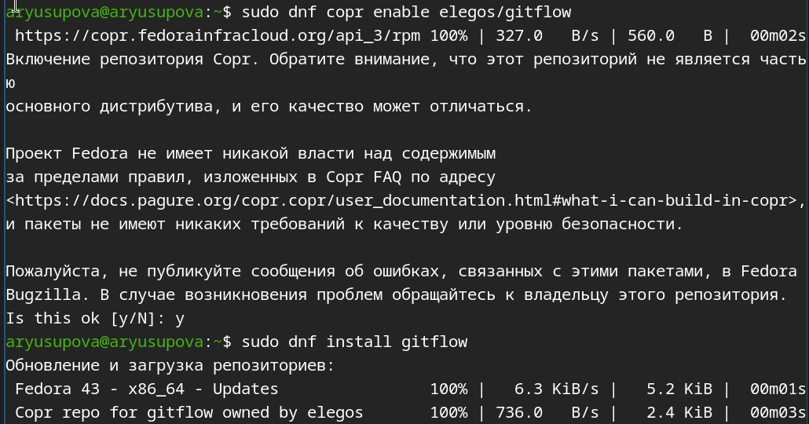
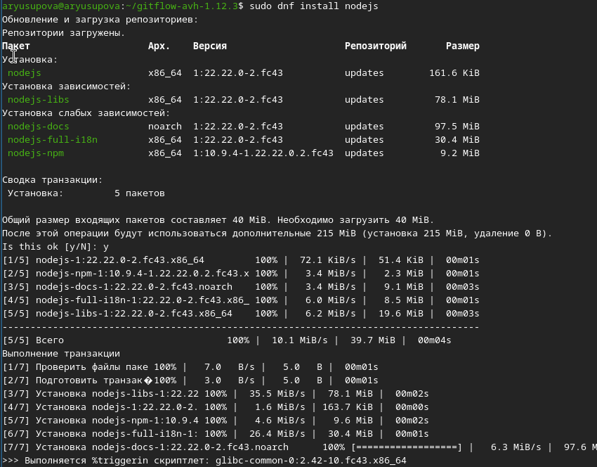
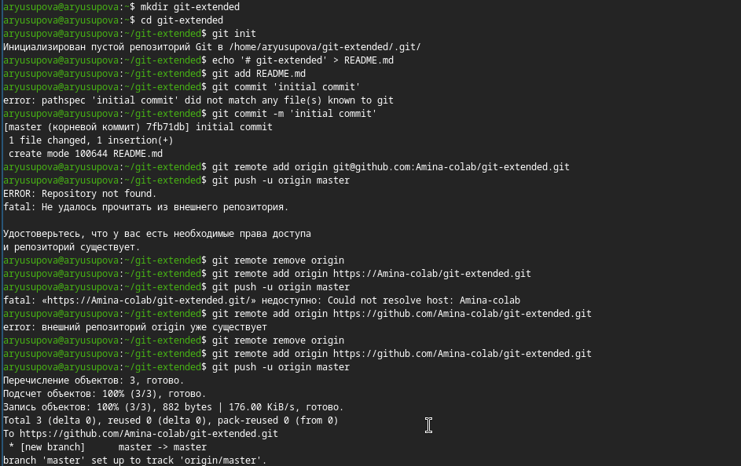
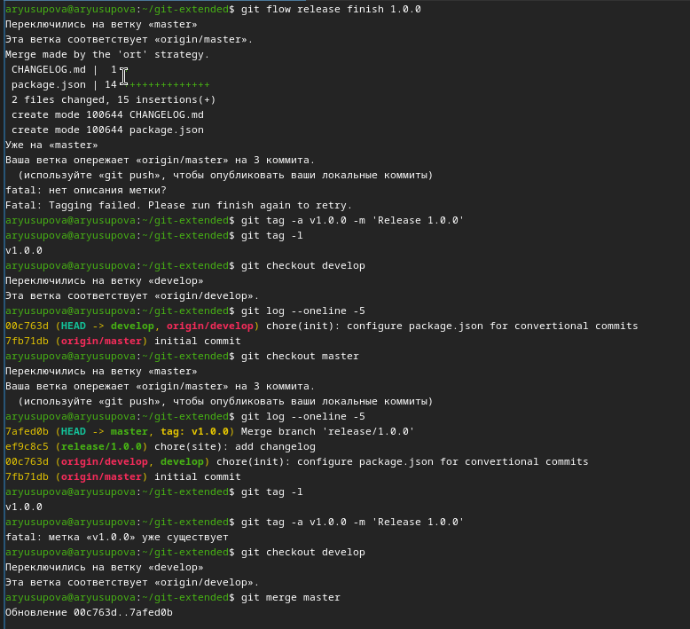
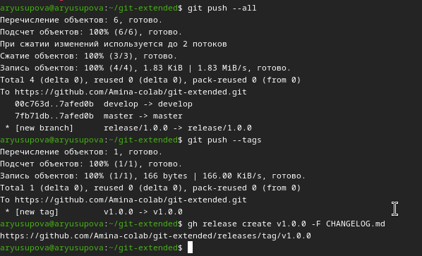
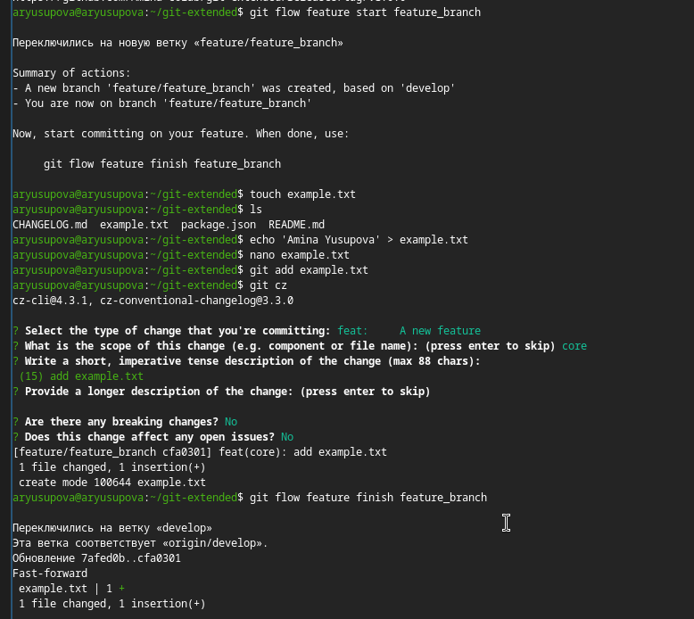
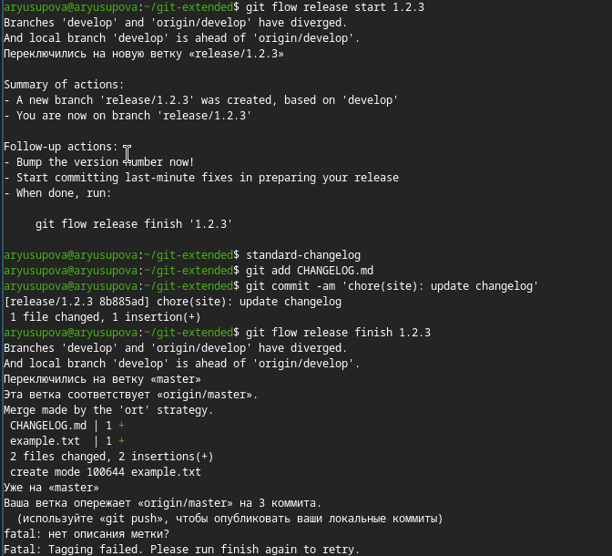
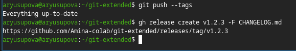

---
## Front matter
title: "Отчёт по лабораторной работе №4"
subtitle: "Продвинутое использование git"
author: "Юсупова Амина Руслановна"

## Generic otions
lang: ru-RU
toc-title: "Содержание"

## Bibliography
bibliography: bib/cite.bib
csl: _resources/csl/gost-r-7-0-5-2008-numeric.csl

## Pdf output format
toc: true # Table of contents
toc-depth: 2
lof: true # List of figures
lot: true # List of tables
fontsize: 12pt
linestretch: 1.5
papersize: a4
documentclass: scrreprt
## I18n polyglossia
polyglossia-lang:
  name: russian
  options:
  - spelling=modern
  - babelshorthands=true
polyglossia-otherlangs:
  name: english
## I18n babel
babel-lang: russian
babel-otherlangs: english
## Fonts
mainfont: IBM Plex Serif
romanfont: IBM Plex Serif
sansfont: IBM Plex Sans
monofont: IBM Plex Mono
mathfont: STIX Two Math
mainfontoptions: Ligatures=Common,Ligatures=TeX,Scale=0.94
romanfontoptions: Ligatures=Common,Ligatures=TeX,Scale=0.94
sansfontoptions: Ligatures=Common,Ligatures=TeX,Scale=MatchLowercase,Scale=0.94
monofontoptions: Scale=MatchLowercase,Scale=0.94,FakeStretch=0.9
mathfontoptions: ''

biblatex: true
biblio-style: "gost-numeric"
biblatexoptions:
  - parentracker=true
  - backend=biber
  - hyperref=auto
  - language=auto
  - autolang=other*
  - citestyle=gost-numeric
## Pandoc-crossref LaTeX customization
figureTitle: "Рис."
tableTitle: "Таблица"
listingTitle: "Листинг"
lofTitle: "Список иллюстраций"
lotTitle: "Список таблиц"
lolTitle: "Листинги"
## Misc options
indent: true
header-includes:
  - \usepackage{indentfirst}
  - \usepackage{float} # keep figures where there are in the text
  - \floatplacement{figure}{H} # keep figures where there are in the text
---

# Цель работы

Получение навыков правильной работы с репозиториями git.

# Теоретические сведения

+ Gitflow Workflow опубликована и популяризована Винсентом Дриссеном.

+ Gitflow Workflow предполагает выстраивание строгой модели ветвления с учётом выпуска проекта.

+ Данная модель отлично подходит для организации рабочего процесса на основе релизов.

+ Работа по модели Gitflow включает создание отдельной ветки для исправлений ошибок в рабочей среде.

+ Последовательность действий при работе по модели Gitflow:

+ Из ветки master создаётся ветка develop.

+ Из ветки develop создаётся ветка release.

+ Из ветки develop создаются ветки feature.

+ Когда работа над веткой feature завершена, она сливается с веткой develop.

+ Когда работа над веткой релиза release завершена, она сливается в ветки develop и master.

+ Если в master обнаружена проблема, из master создаётся ветка hotfix.

+ Когда работа над веткой исправления hotfix завершена, она сливается в ветки develop и master.

# Выполнение лабораторной работы

# Ход работы

## 1. Установка необходимых пакетов

Для начала работы были установлены следующие инструменты:

- **Git Flow** – расширение для управления ветками.
- **Node.js** – среда для работы с пакетным менеджером pnpm.
- **pnpm** – быстрый менеджер пакетов.
- **Commitizen** – инструмент для конвенциональных коммитов (устанавливается позже через pnpm).

### 1.1. Установка Git Flow

```bash
sudo dnf copr enable elegans/gitflow
sudo dnf install gitflow
```

{#fig:001 width=100%}


### 1.2. Установка Node.js и pnpm

```bash
sudo dnf install nodejs
sudo dnf install pnpm
pnpm setup
source ~/.bashrc
```

{#fig:001 width=100%}

{#fig:001 width=100%}

{#fig:001 width=100%}

## 2. Создание репозитория и инициализация Git Flow

Был создан новый каталог ```git-extended```, инициализирован Git-репозиторий и добавлен файл ```README.md```.

```bash
mkdir git-extended
cd git-extended
git init
echo '# git-extended' > README.md
git add README.md
git commit -m 'initial commit'
```

Затем репозиторий был связан с удалённым репозиторием на GitHub. Первоначально возникла ошибка из-за неправильного URL, но после исправления push выполнен успешно.

```bash
git remote add origin https://github.com/Amina-colab/git-extended.git
git push -u origin master
```
{#fig:001 width=100%}

Далее выполнена инициализация Git Flow с параметрами по умолчанию. В результате созданы ветки master и develop.

```bash
git flow init
git branch    
```
{#fig:001 width=100%}


Ветка ```develop``` была отправлена на сервер и настроена на отслеживание:

```
bash
git push --all
git branch --set-upstream-to=origin/develop develop
```

{#fig:001 width=100%}
https://08.png

## 3. Настройка package.json и Commitizen

С помощью pnpm был создан файл ```package.json```. Затем он отредактирован в редакторе nano: добавлено описание, указан автор, лицензия CC-BY-4.0 и настроен ```Commitizen```.

```bash
pnpm init
nano package.json
```
Содержимое ```package.json``` после редактирования:

```json
{
  "name": "git-extended",
  "version": "1.0.0",
  "description": "Git repo for educational purposes",
  "main": "index.js",
  "repository": "git@github.com:Amina-colab/git-extended.git",
  "author": "Amina Yusupova <selena-amina@mail.ru>",
  "license": "CC-BY-4.0",
  "config": {
    "commitizen": {
      "path": "cz-conventional-changelog"
    }
  }
}
```
{#fig:009 width=100%}

Далее изменения были закоммичены с помощью ```git cz```, что позволило оформить коммит по стандарту ```Conventional Commits```.

```bash 
git add .
git cz
```

В результате появился коммит с сообщением ```chore(init): configure package.json for conventional commits```.

{#fig:010 width=100%}

## 4. Создание первого релиза (v1.0.0)
Для подготовки релиза была создана ветка release/1.0.0:

```bash
git flow release start 1.0.0
```

Сгенерирован файл ```CHANGELOG.md``` с помощью утилиты ```standard-changelog``` и добавлен в индекс:

```bash
standard-changelog --first-release
git add CHANGELOG.md
git commit -am 'chore(site): add changelog'
```
{#fig:011 width=100%}

Затем выполнено завершение релиза. Команда ```git flow release finish``` автоматически слила изменения в ветки master и ```develop```. Однако возникла проблема с созданием тега (ошибка "fatal: нет описания метки?"). Тег был создан вручную:

```bash
git tag -a v1.0.0 -m 'Release 1.0.0'
```
{#fig:012 width=100%}

После этого ветки были отправлены на сервер вместе с тегами, а также создан релиз на GitHub через ```gh```:

```bash
git push --all
git push --tags
gh release create v1.0.0 -F CHANGELOG.md
```
{#fig:013 width=100%}

## 5. Работа с feature-веткой
Была создана feature-ветка для добавления нового файла:

```bash
git flow feature start feature_branch
```

В ней создан файл ```example.txt``` с содержимым и закоммичен с помощью ```git cz```:

```bash
touch example.txt
echo 'Amina Yusupova' > example.txt
git add example.txt
git cz   # выбран тип feat, scope core, описание "add example.txt"
```
Затем feature-ветка завершена и слита в ```develop```:

```bash
git flow feature finish feature_branch
```

{#fig:014 width=100%}


## 6. Создание второго релиза (v1.2.3)
Аналогично первому релизу была создана ветка release/1.2.3, обновлён CHANGELOG.md и выполнен коммит.

```bash
git flow release start 1.2.3
standard-changelog
git add CHANGELOG.md
git commit -am 'chore(site): update changelog'
```
{#fig:015 width=100%}


При завершении релиза снова возникла ошибка с тегом, но это не помешало успешно выполнить слияние. Тег был создан автоматически (или пропущен), но затем проверен и отправлен.

```bash
git flow release finish 1.2.3
git push --all
git push --tags
gh release create v1.2.3 -F CHANGELOG.md
```
{#fig:015 width=100%}

на скриншоте видна ошибка, но она не критична

{#fig:016 width=100%}


# Выводы
В ходе лабораторной работы были освоены основные приёмы работы с Git Flow:

- установка и настройка необходимого инструментария;

- инициализация репозитория с ветками master и develop;

- создание и завершение feature-веток;

- подготовка и публикация релизов с автоматической генерацией changelog;

- использование конвенциональных коммитов через Commitizen.

- Полученные навыки позволяют эффективно организовать командную работу над проектами и стандартизировать процесс внесения изменений.