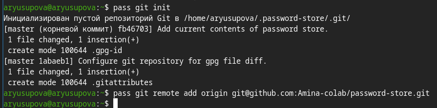
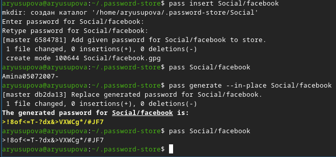
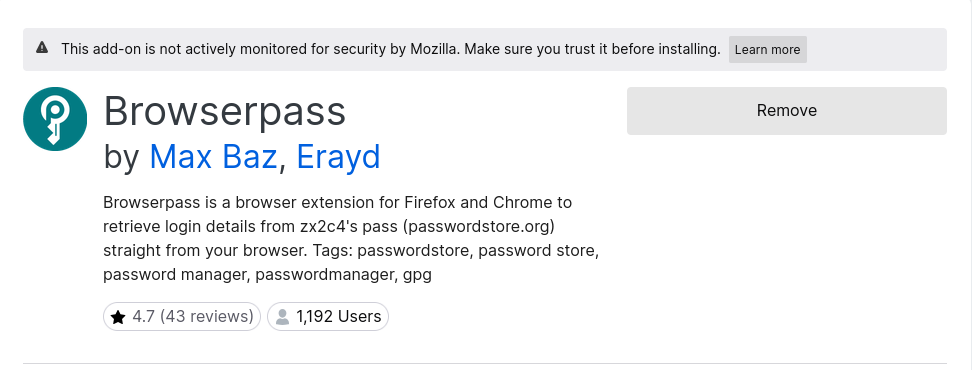
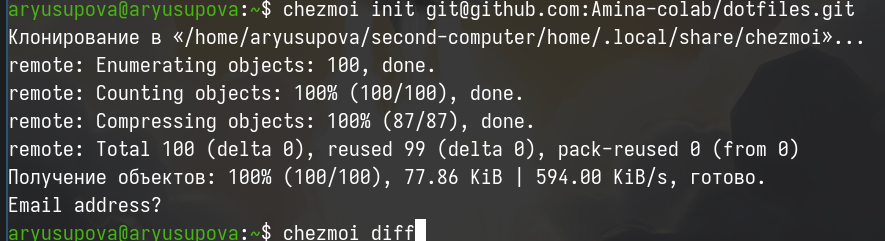
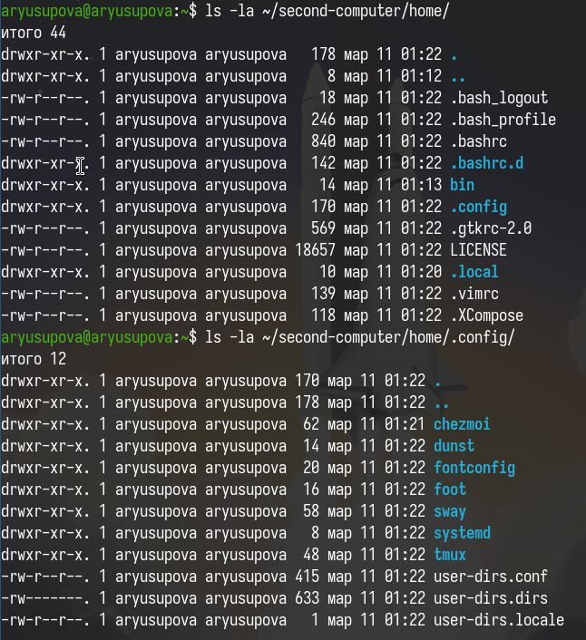

---
## Author
author:
  name: Юсупова Амина Руслановна
  affiliation:
    - name: Российский университет дружбы народов
      country: Российская Федерация
      postal-code: 117198
      city: Москва
      address: ул. Миклухо-Маклая, д. 6
lang: ru
format:
  pdf:
    documentclass: scrartcl
    latex-engine: xelatex
    mainfont: "Liberation Serif"
    sansfont: "Liberation Sans"
    monofont: "Liberation Mono"
    include-in-header:
      text: |
        \usepackage{fontspec}
        \setmainfont{Liberation Serif}
        \setsansfont{Liberation Sans}
        \setmonofont{Liberation Mono}
  pptx:
    toc: false
## Title
title: Лабораторная работа №5
subtitle: Настройка рабочей среды
license: CC BY
---

# Цели и задачи работы

## Цель лабораторной работы

Освоить работу с менеджером паролей pass, его синхронизацию через Git, интеграцию с браузером (browserpass), а также изучить возможности chezmoi для управления dotfiles на нескольких машинах.

# Процесс выполнения лабораторной работы

## Установка pass и проверка GPG

{#fig:001 width=70% height=70%}

##

{#fig:002 width=70% height=70%}

## Инициализация хранилища

{#fig:003 width=70% height=70%}

## Создание репозитория

{#fig:004 width=70% height=70%}

## Настройка Git-синхронизации в pass

{#fig:005 width=70%}

##

{#fig:006 width=70% height=70%}

## Основные операции с паролями

{#fig:007 width=70%}

## Интеграция с браузером (browserpass)

{#fig:008 width=70%}

##

{#fig:009 width=70%}

## Установка шрифтов Iosevka (опционально)

{#fig:010 width=70%}

## Установка chezmoi

{#fig:011 width=70%}

## Создание репозитория для dotfiles

{#fig:012 width=70%}

## Имитация второго компьютера и применение конфигурации

{#fig:013 width=70%}
{#fig:014 width=70%}
{#fig:015 width=70%}

# Выводы по проделанной работе

## Вывод

В ходе работы были освоены:

+ установка и настройка pass с шифрованием GPG;
синхронизация паролей через Git и GitHub;

+ интеграция с браузером через browserpass;

+ установка шрифтов Iosevka;

+ работа с chezmoi для управления dotfiles, включая создание репозитория и развёртывание конфигурации на втором компьютере