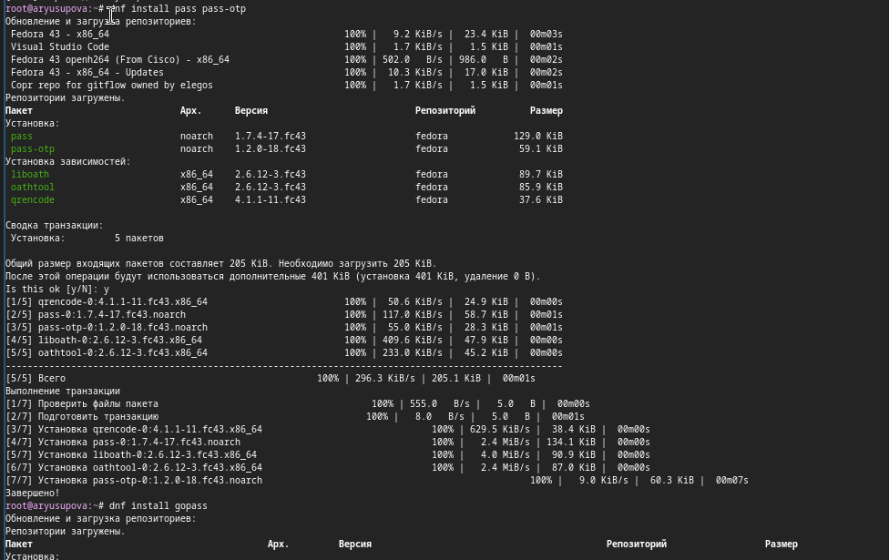
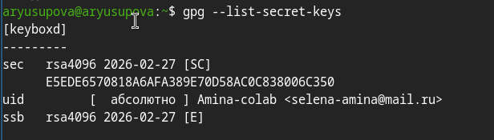
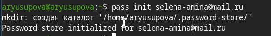
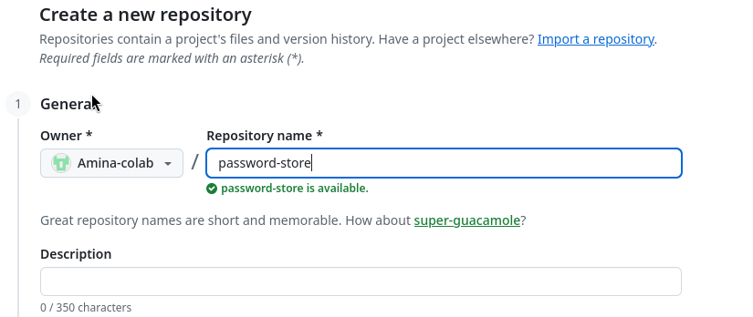
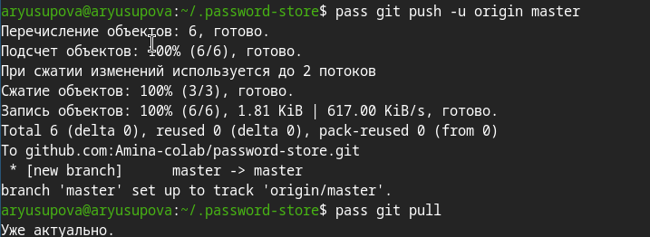
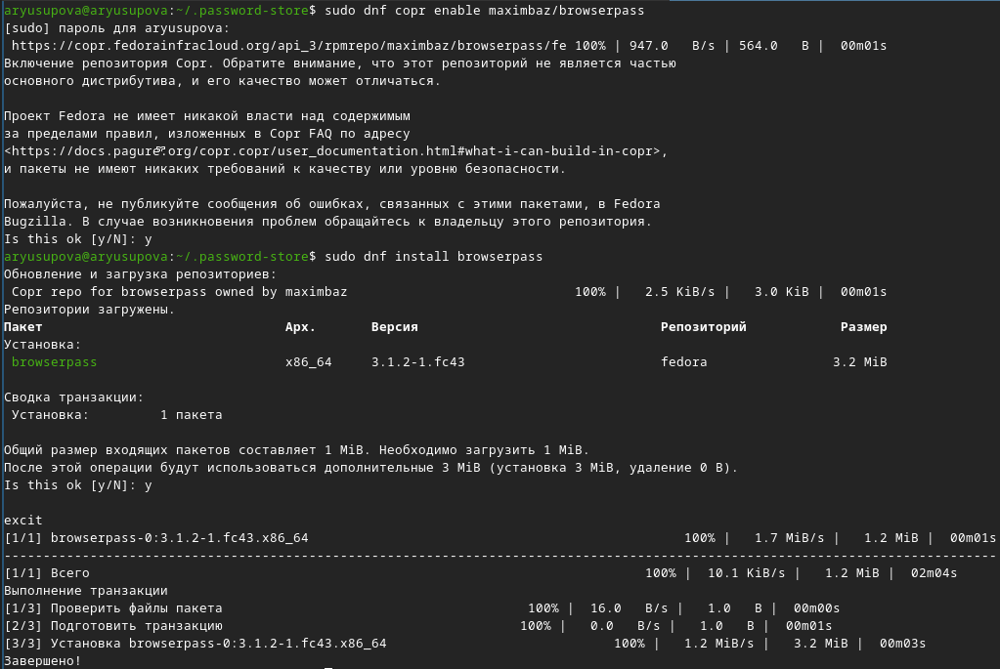
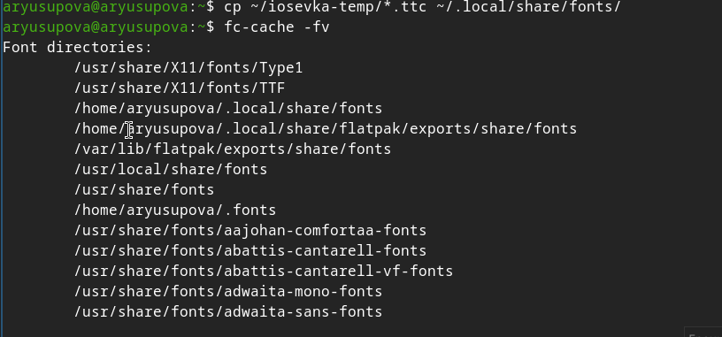
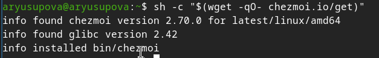
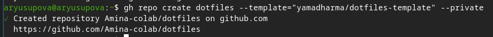
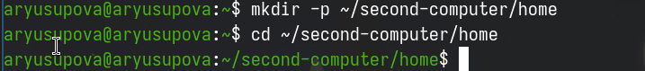

---
## Front matter
title: "Отчёт по лабораторной работе №5"
subtitle: "Настройка рабочей среды"
author: "Юсупова Амина Руслановна"

## Generic otions
lang: ru-RU
toc-title: "Содержание"

## Bibliography
bibliography: bib/cite.bib
csl: _resources/csl/gost-r-7-0-5-2008-numeric.csl

## Pdf output format
toc: true # Table of contents
toc-depth: 2
lof: true # List of figures
lot: true # List of tables
fontsize: 12pt
linestretch: 1.5
papersize: a4
documentclass: scrreprt
## I18n polyglossia
polyglossia-lang:
  name: russian
  options:
  - spelling=modern
  - babelshorthands=true
polyglossia-otherlangs:
  name: english
## I18n babel
babel-lang: russian
babel-otherlangs: english
## Fonts
mainfont: IBM Plex Serif
romanfont: IBM Plex Serif
sansfont: IBM Plex Sans
monofont: IBM Plex Mono
mathfont: STIX Two Math
mainfontoptions: Ligatures=Common,Ligatures=TeX,Scale=0.94
romanfontoptions: Ligatures=Common,Ligatures=TeX,Scale=0.94
sansfontoptions: Ligatures=Common,Ligatures=TeX,Scale=MatchLowercase,Scale=0.94
monofontoptions: Scale=MatchLowercase,Scale=0.94,FakeStretch=0.9
mathfontoptions: ''

biblatex: true
biblio-style: "gost-numeric"
biblatexoptions:
  - parentracker=true
  - backend=biber
  - hyperref=auto
  - language=auto
  - autolang=other*
  - citestyle=gost-numeric
## Pandoc-crossref LaTeX customization
figureTitle: "Рис."
tableTitle: "Таблица"
listingTitle: "Листинг"
lofTitle: "Список иллюстраций"
lotTitle: "Список таблиц"
lolTitle: "Листинги"
## Misc options
indent: true
header-includes:
  - \usepackage{indentfirst}
  - \usepackage{float} # keep figures where there are in the text
  - \floatplacement{figure}{H} # keep figures where there are in the text
---

# Цель работы

Освоить работу с менеджером паролей pass, его синхронизацию через Git, интеграцию с браузером (browserpass), а также изучить возможности chezmoi для управления dotfiles на нескольких машинах.

# Теоретические сведения

+ pass – простой менеджер паролей, использующий GPG-шифрование и Git для синхронизации.

+ browserpass – расширение для браузера, позволяющее автоматически заполнять логины и пароли из хранилища pass.

+ chezmoi – инструмент для управления dotfiles, позволяющий безопасно хранить и применять конфигурации на разных компьютерах.

# Выполнение лабораторной работы

## 1. Установка pass и pass-otp
Менеджер паролей и расширение для одноразовых паролей установлены через dnf.
{#fig:001 width=70%}

## 2. Проверка GPG-ключа
Для шифрования необходим GPG-ключ. Просмотр существующих ключей подтвердил наличие ключа пользователя (рис. 2).

{#fig:002 width=70%}

## 3. Инициализация хранилища pass
Хранилище инициализировано с привязкой к email владельца ключа.

{#fig:003 width=70%}

## 4. Создание удалённого репозитория для паролей
На GitHub создан приватный репозиторий password-store

{#fig:004 width=70%}


## 5. Настройка Git-синхронизации в pass
В хранилище инициализирован Git, добавлен удалённый репозиторий и выполнена первая синхронизация.

{#fig:005 width=70%}

{#fig:006 width=70%}

## 6. Основные операции с паролями
Добавлен пароль для Social/facebook командой pass insert.

Просмотр пароля: pass Social/facebook.

Замена пароля на сгенерированный: pass generate --in-place Social/facebook.

{#fig:007 width=70%}

## 7. Настройка интеграции с браузером (browserpass)
Установлено расширение для Firefox и пакет browserpass из COPR-репозитория.

{#fig:008 width=70%}

{#fig:009 width=70%}

## 8. Установка шрифтов Iosevka (опционально)
Подключён репозиторий peterwu/iosevka. Из-за проблем с загрузкой через dnf шрифты установлены вручную: архив скачан с GitHub, файлы ```.ttc``` скопированы в ```~/.local/share/fonts```, кэш обновлён.

{#fig:010 width=70%}

## 9. Установка chezmoi
Скрипт с официального сайта загрузил и установил chezmoi версии 2.70.0

{#fig:011 width=70%}

## 10. Создание репозитория для dotfiles
С помощью утилиты gh создан приватный репозиторий dotfiles на основе шаблона

{#fig:012 width=70%}

## 11. Инициализация chezmoi на основном компьютере
Репозиторий склонирован и применён (предположительно, добавлены текущие конфигурации). Этот шаг на скриншотах не отображён, но необходим для наполнения репозитория.

## 12. Настройка второго компьютера (имитация)
Создана директория ```~/second-computer/home```, в которой выполнена инициализация chezmoi с тем же репозиторием. После применения (chezmoi apply) в этой папке появились конфигурационные файлы.

{#fig:013 width=70%}

##

{#fig:014 width=70%}

## 

{#fig:015 width=70%}

# Выводы

В ходе работы были освоены:
+ установка и настройка pass с шифрованием GPG;
+ синхронизация паролей через Git и GitHub;
+ интеграция с браузером через browserpass;
+ установка шрифтов Iosevka;
+ работа с chezmoi для управления dotfiles, включая создание репозитория и развёртывание конфигурации на втором компьютере.
