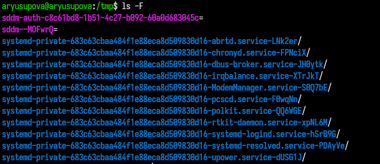
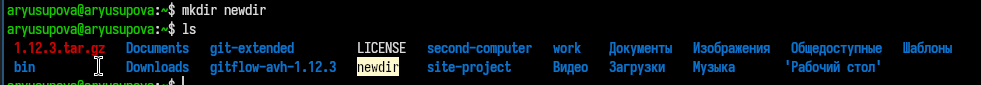
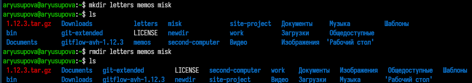
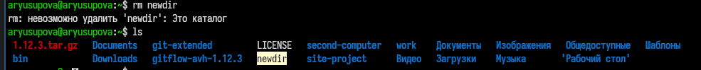
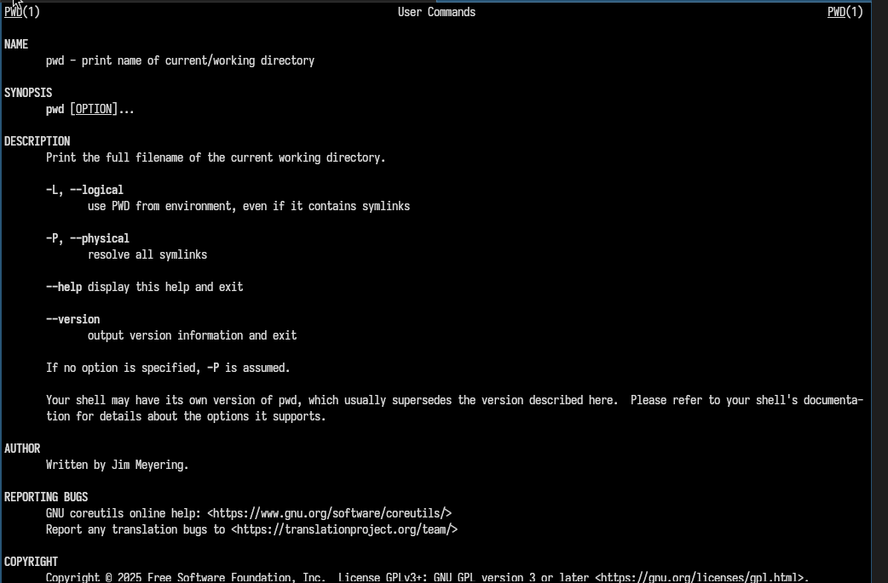
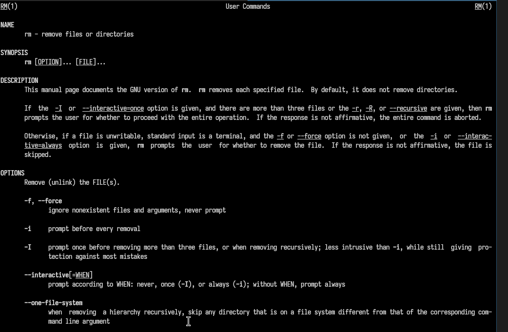

---
## Author
author:
  name: Юсупова Амина Руслановна
  affiliation:
    - name: Российский университет дружбы народов
      country: Российская Федерация
      postal-code: 117198
      city: Москва
      address: ул. Миклухо-Маклая, д. 6
lang: ru
format:
  pdf:
    documentclass: scrartcl
    latex-engine: xelatex
    mainfont: "Liberation Serif"
    sansfont: "Liberation Sans"
    monofont: "Liberation Mono"
    include-in-header:
      text: |
        \usepackage{fontspec}
        \setmainfont{Liberation Serif}
        \setsansfont{Liberation Sans}
        \setmonofont{Liberation Mono}
  pptx:
    toc: false
## Title
title: Лабораторная работа №6
subtitle: Основы интерфейса командной строки
license: CC BY
---

# Цели и задачи работы

## Цель лабораторной работы

Приобретение практических навыков взаимодействия пользователя с системой посредством командной строки

## Задачи лабораторной работы

1.  Определить имя и путь домашнего каталога

2.  Изучить команду ls.

3.  Выполнить действия с каталогами.

4.  Получить дополнительные сведения при помощи справки по командам.

5.  Изучить команду history.

# Процесс выполнения лабораторной работы

## Имя и путь к домашнему каталогу

{#fig:001 width=70%}

## Опции команды ls

{#fig:002 width=70%}

## 

{#fig:003 width=70%}

## Каталог /var/spool

{#fig:004 width=70%}

## Домашний каталог

{#fig:005 width=70%}

## Работа с каталогами

{#fig:006 width=70%}

##  

{#fig:007 width=70%}

##  

{#fig:008 width=70%}

##  

{#fig:009 width=70%}

##  

{#fig:010 width=70%}

## Опции команды ls

{#fig:011 width=70%}

## Справка по командам

{#fig:012 width=70%}

##  

{#fig:013 width=70%}

##  

{#fig:014 width=70%}

##  

{#fig:015 width=70%}

## Модификацию и исполнение нескольких команд 

{#fig:015 width=70%}

# Выводы по проделанной работе

## Выводы 

Мы приобрели практические навыки взаимодействия пользователя с системой посредством командной строки.

