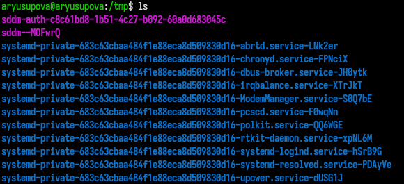
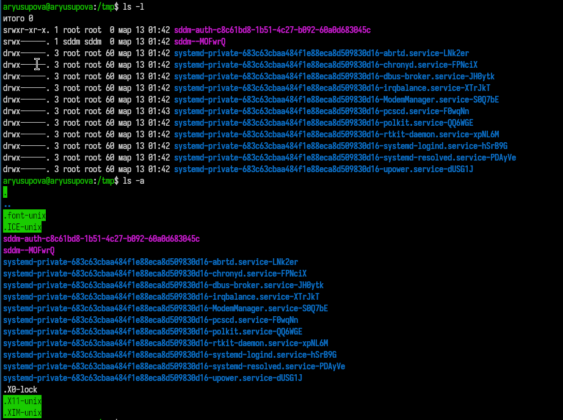
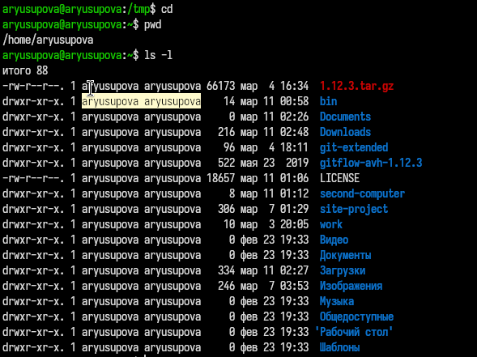
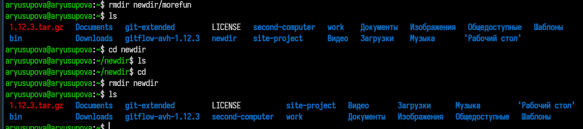
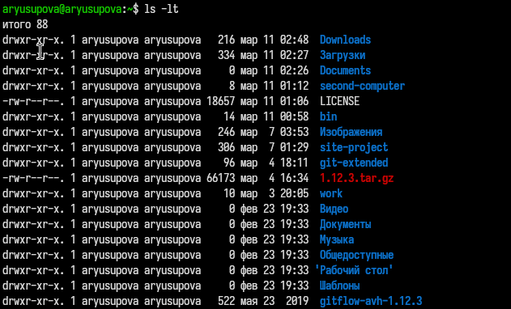
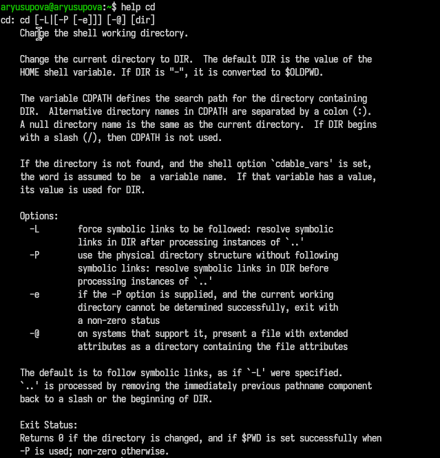
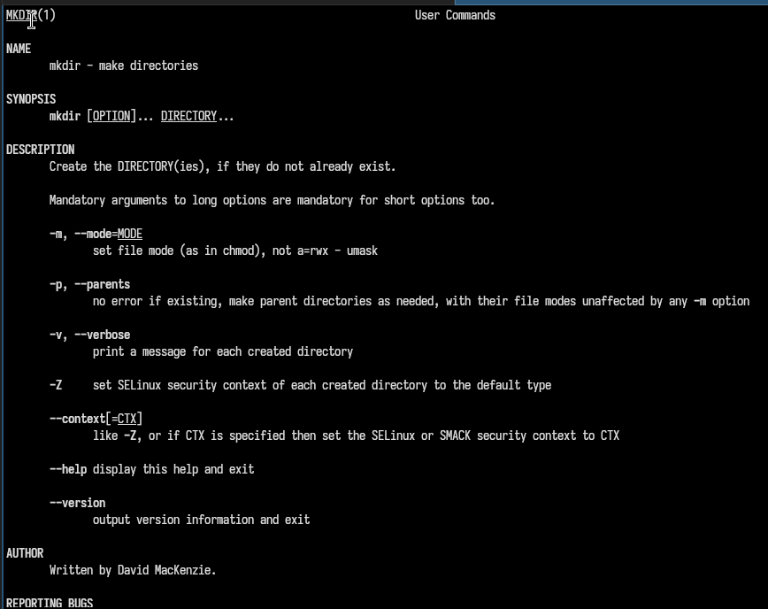
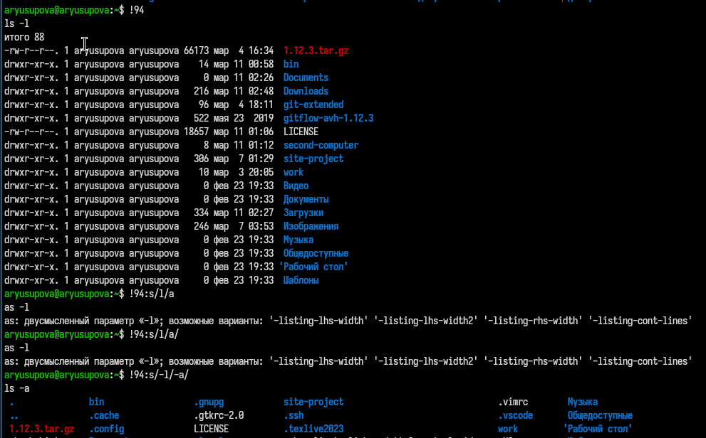

---
## Front matter
title: "Отчёт по лабораторной работе №6"
subtitle: "Основы интерфейса командной строки"
author: "Юсупова Амина Руслановна"

## Generic otions
lang: ru-RU
toc-title: "Содержание"

## Bibliography
bibliography: bib/cite.bib
csl: _resources/csl/gost-r-7-0-5-2008-numeric.csl

## Pdf output format
toc: true # Table of contents
toc-depth: 2
lof: true # List of figures
lot: true # List of tables
fontsize: 12pt
linestretch: 1.5
papersize: a4
documentclass: scrreprt
## I18n polyglossia
polyglossia-lang:
  name: russian
  options:
  - spelling=modern
  - babelshorthands=true
polyglossia-otherlangs:
  name: english
## I18n babel
babel-lang: russian
babel-otherlangs: english
## Fonts
mainfont: IBM Plex Serif
romanfont: IBM Plex Serif
sansfont: IBM Plex Sans
monofont: IBM Plex Mono
mathfont: STIX Two Math
mainfontoptions: Ligatures=Common,Ligatures=TeX,Scale=0.94
romanfontoptions: Ligatures=Common,Ligatures=TeX,Scale=0.94
sansfontoptions: Ligatures=Common,Ligatures=TeX,Scale=MatchLowercase,Scale=0.94
monofontoptions: Scale=MatchLowercase,Scale=0.94,FakeStretch=0.9
mathfontoptions: ''

biblatex: true
biblio-style: "gost-numeric"
biblatexoptions:
  - parentracker=true
  - backend=biber
  - hyperref=auto
  - language=auto
  - autolang=other*
  - citestyle=gost-numeric
## Pandoc-crossref LaTeX customization
figureTitle: "Рис."
tableTitle: "Таблица"
listingTitle: "Листинг"
lofTitle: "Список иллюстраций"
lotTitle: "Список таблиц"
lolTitle: "Листинги"
## Misc options
indent: true
header-includes:
  - \usepackage{indentfirst}
  - \usepackage{float} # keep figures where there are in the text
  - \floatplacement{figure}{H} # keep figures where there are in the text
---

# Цель работы

Приобретение практических навыков взаимодействия пользователя с системой посредством командной строки

# Теоретические сведения

В операционной системе типа Linux взаимодействие пользователя с системой обычно осуществляется с помощью командной строки посредством построчного ввода команд. При этом обычно используется командные интерпретаторы языка shell: /bin/sh; /bin/csh; /bin/ksh.

Командой в операционной системе называется записанный по специальным правилам текст (возможно с аргументами), представляющий собой указание на выполнение какой-либо функций (или действий) в операционной системе. Обычно первым словом идёт имя команды, остальной текст — аргументы или опции, конкретизирующие действие. Общий формат команд можно представить следующим образом:

<имя_команды><разделитель><аргументы>

+ Команда man используется для просмотра (оперативная помощь) в диалоговом режиме руководства (manual) по основным командам операционной системы типа Linux.

+ Команда cd. Команда cd используется для перемещения по файловой системе операционной системы типа Linux.

+ Команда pwd. Для определения абсолютного пути к текущему каталогу используется команда pwd (print working directory).

+ Команда ls. Команда ls используется для просмотра содержимого каталога.

+ Команда mkdir. Команда mkdir используется для создания каталогов.

+ Команда rm. Команда rm используется для удаления файлов и/или каталогов.

# Выполнение лабораторной работы

## 1. Определение полного имени домашнего каталога

Для того чтобы узнать абсолютный путь к домашнему каталогу, используется команда `pwd`. На скриншоте видно, что домашний каталог пользователя имеет путь `/home/aryusupova`.

{#fig:001 width=70%}

## 2. Работа с каталогом /tmp

 2.1. С помощью команды `cd /tmp` был осуществлён переход в каталог временных файлов.

 2.2. Для просмотра содержимого используется команда `ls`. На рис. 2 показан простой вывод списка файлов и подкаталогов в `/tmp`.

{#fig:002 width=70%}

- **`ls -l`** — выводит детальную информацию о файлах и каталогах: права доступа, владелец, размер, дата изменения и имя.
- **`ls -a`** — показывает все файлы, включая скрытые (начинающиеся с точки).

{#fig:003 width=70%}

Опция `-F` добавляет к именам файлов символы, указывающие на их тип: `/` для каталогов, `*` для исполняемых файлов, `@` для символических ссылок.

{#fig:004 width=70%}

 2.3. Для просмотра содержимого каталога `/var/spool` без перехода в него использована команда `ls /var/spool`. 

{#fig:005 width=70%}

2.4. Возврат в домашний каталог выполнен командой `cd` без аргументов. Текущий каталог снова подтверждён командой `pwd`. Подробный список содержимого получен с помощью `ls -l` . Видно, что владельцем всех файлов и подкаталогов является пользователь `aryusupова`.

{#fig:006 width=70%}

## 3. Создание и удаление каталогов

3.1. Команда `mkdir newdir` создала новый каталог.

{#fig:007 width=70%}

3.2. С помощью команды `mkdir newdir/morefun` создан подкаталог. 

{#fig:008 width=70%}

3.3. Команда `mkdir letters memos` создаёт два каталога. Затем они удаляются командой `rmdir letters memos`. После удаления каталоги исчезают из списка.

{#fig:009 width=70%}

3.4. Команда `rm newdir` выдаёт ошибку, так как `rm` без опций удаляет только файлы, а не каталоги. На рис. 9 показано сообщение об ошибке, и каталог `newdir` остаётся на месте.

{#fig:010 width=70%}

3.5. Сначала удаляем `morefun` командой `rmdir newdir/morefun` (пустой подкаталог). Затем переходим в `newdir` (`cd newdir`), проверяем, что он пуст (`ls`), возвращаемся назад (`cd`) и удаляем `newdir` командой `rmdir newdir`. На рис. 10 показаны эти действия и итоговое содержимое домашнего каталога, где `newdir` больше нет.

{#fig:011 width=70%}

## 4. Команда man

С помощью команды man определим, какую опцию команды ls нужно использовать для просмотра содержимое не только указанного каталога, но и подката- логов, входящих в него. Введя в консоли man ls Мы получим справку на английском языке и в ней нужный нам ключ к команде. Это ключ -R

## 5. Сортировка списка файлов по времени изменения

Для сортировки содержимого каталога по времени последнего изменения используется комбинация опций `-lt` (сортировка по времени, подробный формат). На рис. 11 показан результат команды `ls -ltt` (дополнительная опция `-t` уже есть, а второй `t` означает показ времени с точностью до секунд, но в Linux обычно работает). Самые новые файлы отображаются первыми.

{#fig:012 width=70%}

## 6. Изучение справочной информации о командах

Для получения справки о встроенных командах используется `help`, для внешних – `man`. На рис. 12 показан вывод `help cd`, на рис. 13 – фрагмент `man mkdir`, на рис. 14 – фрагмент `man rm`. Эти команды позволяют узнать доступные опции и их назначение.

{#fig:013 width=70%}

{#fig:014 width=70%}

{#fig:015 width=70%}

## 7. Работа с историей команд

Команда `history` выводит список ранее выполненных команд. Показан пример модификации команды из истории: строка с номером 194 (`ls -l`) изменена на `ls -a` с помощью конструкции `194:s/-l/-a/`. Результат выполнения модифицированной команды также отображён.

{#fig:016 width=70%}

# Выводы

Мы приобрели практические навыки взаимодействия пользователя с системой посредством командной строки.

# Контрольные вопросы

1. Что такое командная строка? Ответ: текстовый интерфейс взаимодействия пользователя с системой

2. При помощи какой команды можно определить абсолютный путь текущего каталога? Приведите пример. Ответ: команда pwd, пример:

+ cd /var/www
+ pwd
+ /var/www/

3. При помощи какой команды и каких опций можно определить только тип файлов и их имена в текущем каталоге? Приведите примеры. 
  Ответ: команда ls с опцией -F.

4. Каким образом отобразить информацию о скрытых файлах? Приведите примерыю. Ответ: ls -a — показывает все файлы, включая скрытые (начинающиеся с точки). Пример: ls -a → .bashrc .profile.
  

5. При помощи каких команд можно удалить файл и каталог? Можно ли это сделать одной и той же командой? Ответ: С помощью команды rm можно удалить как отдельный файл так и целый каталог, в случае каталога необходимо указать опцию -r.

6.  Каким образом можно вывести информацию о последних выполненных пользователем командах? работы? Ответ: команда history — выводит список последних выполненных команд.

7. Как воспользоваться историей команд для их модифицированного выполнения? Приведите примеры. Ответ: Модификация команды из истории: !номер:s/старое/новое/. Пример: !3:s/ls/ll/ заменит в команде №3 "ls" на "ll" и выполнит.

8. Приведите примеры запуска нескольких команд в одной строке. Ответ: Несколько команд в строке: через ; (последовательно) или && (при успехе). Пример: cd /tmp; ls -l.

9. Дайте определение и приведите примера символов экранирования. Ответ: Экранирование — отмена специального значения символа с помощью \. Пример: echo \$HOME выведет $HOME, а не значение переменной.

10.  Охарактеризуйте вывод информации на экран после выполнения команды ls с опцией. Ответ: ls -l выводит: тип файла, права доступа, число ссылок, владельца, группу, размер, дату, имя. Пример: -rw-r--r-- 1 user group 1024 Mar 13 10:00 file.txt.

11.  Что такое относительный путь к файлу? Приведите примеры использования относительного и абсолютного пути при выполнении какой-либо команды. Ответ: относительный путь - путь к тому или иному файлу или директории относительной текущей рабочей директории, пример: папка /www/ в директории /var/ абсолютный путь: /var/www/ относительный путь(если рабочая директория - /var/): /www/

12.  Как получить информацию об интересующей вас команде? Ответ: можно попробовать найти информацию по использованию с помощью утилиты man, или попробовать ввести опцию --help.

13.  Какая клавиша или комбинация клавиш служит для автоматического дополнения вводимых команд? Ответ: клавиша Tab.