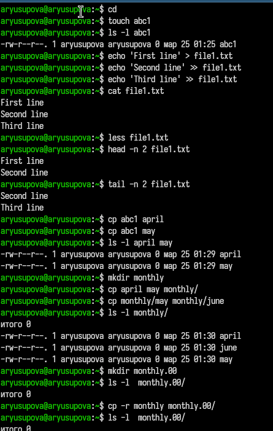
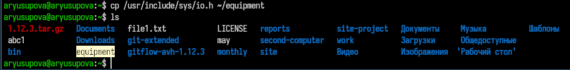
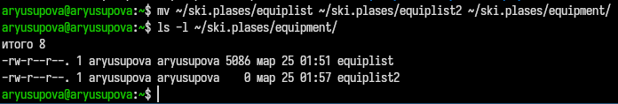
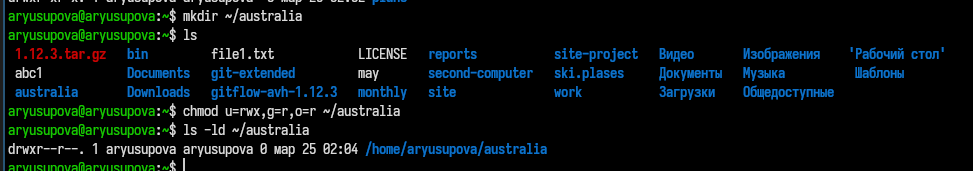
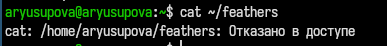
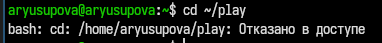
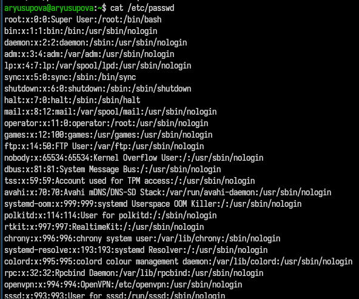
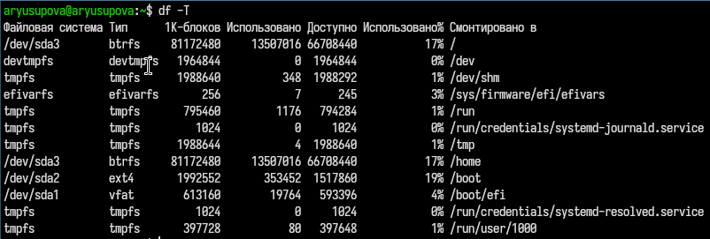
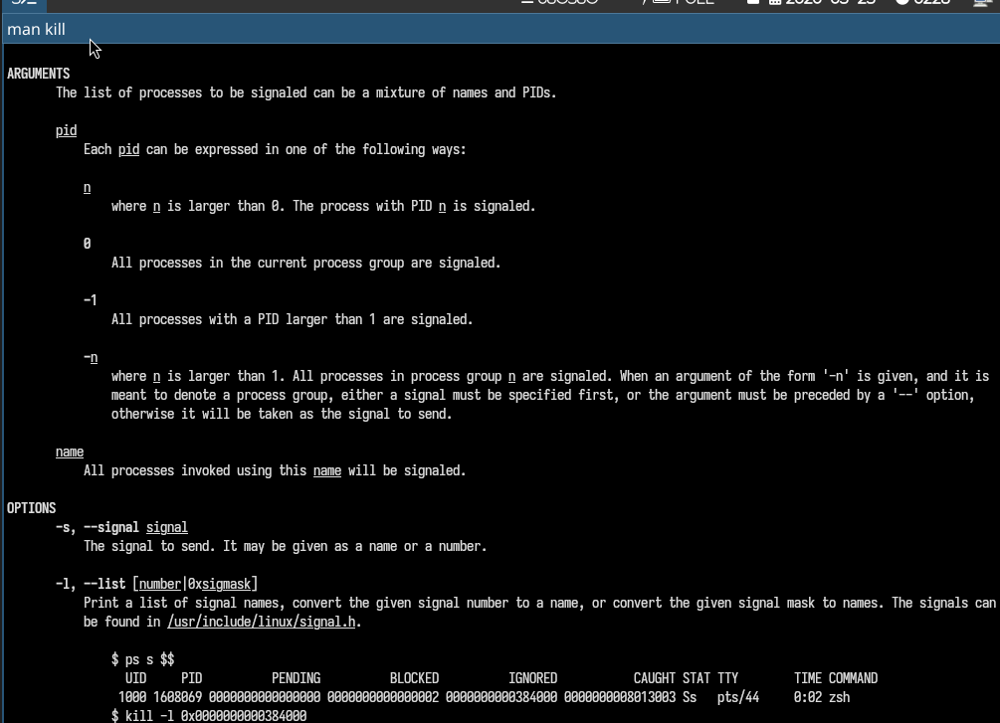

---
## Author
author:
  name: Юсупова Амина Руслановна
  affiliation:
    - name: Российский университет дружбы народов
      country: Российская Федерация
      postal-code: 117198
      city: Москва
      address: ул. Миклухо-Маклая, д. 6
lang: ru
format:
  pdf:
    documentclass: scrartcl
    latex-engine: xelatex
    mainfont: "Liberation Serif"
    sansfont: "Liberation Sans"
    monofont: "Liberation Mono"
    include-in-header:
      text: |
        \usepackage{fontspec}
        \setmainfont{Liberation Serif}
        \setsansfont{Liberation Sans}
        \setmonofont{Liberation Mono}
  pptx:
    toc: false
## Title
title: Лабораторная работа №7
subtitle: Анализ файловой системы Linux
license: CC BY

---

# Цели и задачи лабораторной работы

## Цель работы

Ознакомление с файловой системой Linux, её структурой, именами и содержанием каталогов.  
Приобретение практических навыков по применению команд для работы с файлами и каталогами, управлению процессами, проверке использования диска и обслуживанию файловой системы.

# Выполнение лабораторной работы

## Копирование и перемещение файлов

##

##

## Управление правами доступа

Пример установки прав на каталог `australia`:

## Проверка влияния прав:

- Лишение права на чтение файла `feathers` → `cat` и `cp` завершаются с ошибкой

##

- Лишение права на выполнение каталога `play` → переход в каталог невозможен

## Просмотр содержимого файлов

## Анализ файловых систем

## Изучение справочных страниц (man)

- **mount** – монтирование ФС, опция `-t` для указания типа
- **mkfs** – создание ФС, опция `-t` задаёт тип (по умолчанию ext2)
- **fsck** – проверка ФС, опция `-y` для автоматического исправления
- **kill** – отправка сигналов процессам, опции `-s`, `-l`

## 

# Выводы по проделанной работе

## Выводы

В ходе работы приобретены практические навыки:

- работа с файлами и каталогами (создание, копирование, перемещение, переименование)
- изменение прав доступа
- просмотр содержимого файлов
- анализ файловых систем (команда `df`)
- работа со справочной системой `man`

