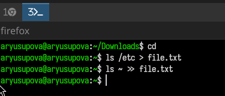
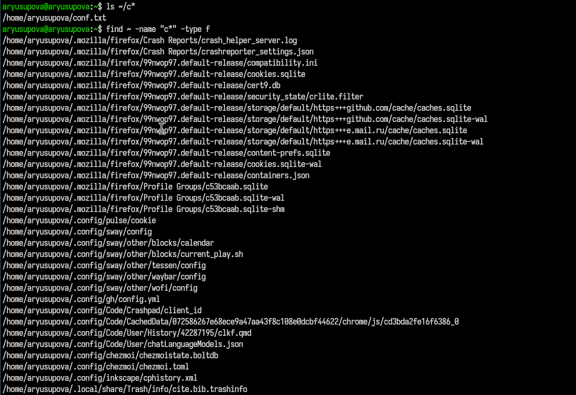
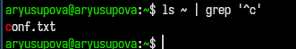
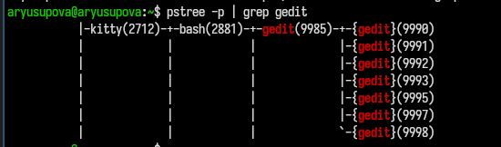
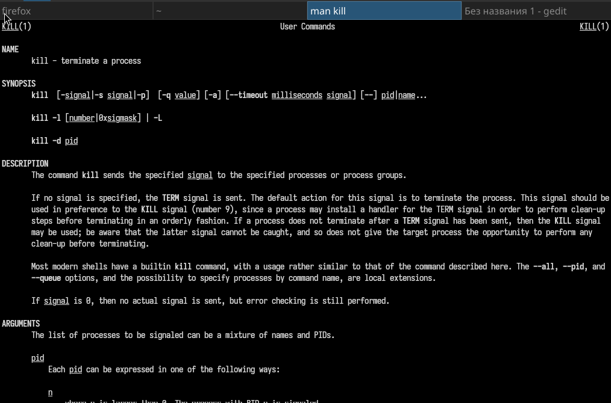

---
## Author
author:
  name: Юсупова Амина Руслановна
  affiliation:
    - name: Российский университет дружбы народов
      country: Российская Федерация
      postal-code: 117198
      city: Москва
      address: ул. Миклухо-Маклая, д. 6
lang: ru
format:
  pdf:
    documentclass: scrartcl
    latex-engine: xelatex
    mainfont: "Liberation Serif"
    sansfont: "Liberation Sans"
    monofont: "Liberation Mono"
    include-in-header:
      text: |
        \usepackage{fontspec}
        \setmainfont{Liberation Serif}
        \setsansfont{Liberation Sans}
        \setmonofont{Liberation Mono}
  pptx:
    toc: false
## Title
title: Лабораторная работа №8
subtitle: Поиск файлов. Перенаправление ввода-вывода. Просмотр запущенных процессов
license: CC BY

---

# Цели и задачи лабораторной работы

## Цель работы

Ознакомление с инструментами поиска файлов и фильтрации текстовых данных. Приобретение практических навыков: по управлению процессами (и заданиями), по проверке использования диска и обслуживанию файловых систем.

# Выполнение лабораторной работы

## Запись содержимого каталогов в файл

- `ls /etc > file.txt` – список файлов `/etc` записан в `file.txt`
- `ls ~ >> file.txt` – список домашнего каталога добавлен в конец того же файла

## Отбор файлов с расширением `.conf`

- `grep '\.conf$' file.txt` – вывод строк, оканчивающихся на `.conf`
- `grep '\.conf$' file.txt > conf.txt` – сохранение результата в `conf.txt`

##

## Поиск файлов в домашнем каталоге, начинающихся с `c`

Несколько способов:
- `ls ~ | grep '^c'` – все объекты (файлы и каталоги)
- `find ~ -maxdepth 1 -type f -name "c*"` – только файлы
- `ls -p ~ | grep -v / | grep '^c'` – исключает каталоги

## 

## Постраничный вывод имён файлов из `/etc`, начинающихся с `h`

`ls /etc/h* | less`

## Запуск фонового процесса для записи имён файлов с префиксом `log`

`find / -name "log*" -type f > ~/logfile 2>/dev/null &`

Поиск всех файлов, имена которых начинаются с `log`, с подавлением ошибок.

## Удаление файла ~/logfile

`rm ~/logfile`

Процесс `find` завершился с кодом 1 (сообщение о завершении).

## Запуск редактора gedit в фоновом режиме

`gedit &`

## Определение идентификатора процесса gedit

- `ps aux | grep gedit | grep -v grep`
- `pgrep gedit`
- `pidof gedit`
- `pstree -p | grep gedit`

##

## Завершение процесса gedit

- Изучена справка `man kill`
- `killall gedit` – завершение всех процессов с именем `gedit`

##

## Выполнение команд `df` и `du`

- `df -h` – использование дискового пространства в удобочитаемом виде
- `du -sh ~` – размер домашнего каталога

## Вывод всех директорий в домашнем каталоге с помощью `find`

`find ~ -type d` – все поддиректории (включая вложенные)  
`find ~ -maxdepth 1 -type d` – только директории первого уровня

# Выводы по проделанной работе

## Выводы

В ходе работы приобретены практические навыки:

- перенаправления потоков ввода-вывода (`>`, `>>`);
- использования конвейеров (`|`) для фильтрации данных;
- поиска файлов с помощью `find` и `grep`;
- управления фоновыми задачами и процессами (`&`, `jobs`, `kill`, `killall`);
- получения информации о дисковом пространстве (`df`, `du`).

