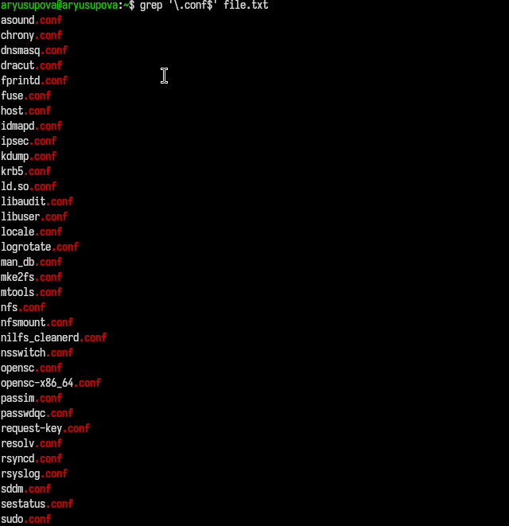
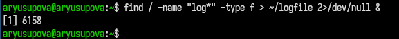
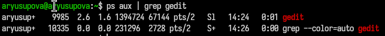
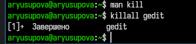
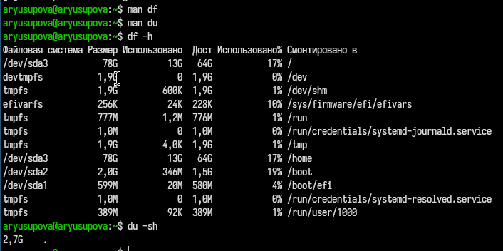
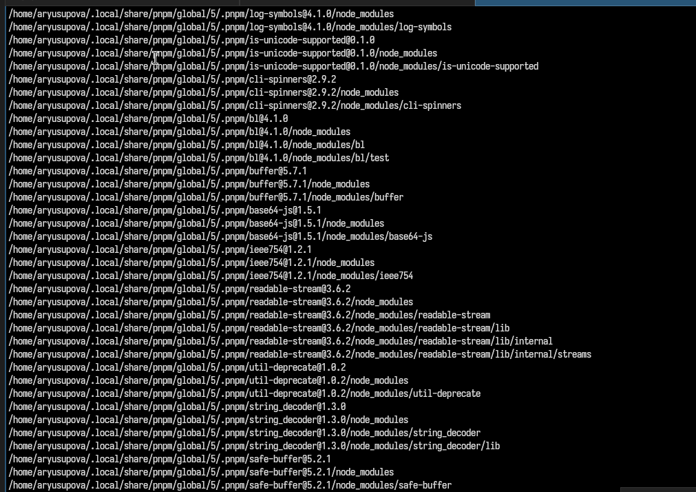

---
## Front matter
title: "Отчёт по лабораторной работе №8"
subtitle: "Поиск файлов. Перенаправление ввода-вывода. Просмотр запущенных процессов"
author: "Юсупова Амина Руслановна"

## Generic otions
lang: ru-RU
toc-title: "Содержание"

## Bibliography
bibliography: bib/cite.bib
csl: _resources/csl/gost-r-7-0-5-2008-numeric.csl

## Pdf output format
toc: true # Table of contents
toc-depth: 2
lof: true # List of figures
lot: true # List of tables
fontsize: 12pt
linestretch: 1.5
papersize: a4
documentclass: scrreprt
## I18n polyglossia
polyglossia-lang:
  name: russian
  options:
  - spelling=modern
  - babelshorthands=true
polyglossia-otherlangs:
  name: english
## I18n babel
babel-lang: russian
babel-otherlangs: english
## Fonts
mainfont: IBM Plex Serif
romanfont: IBM Plex Serif
sansfont: IBM Plex Sans
monofont: IBM Plex Mono
mathfont: STIX Two Math
mainfontoptions: Ligatures=Common,Ligatures=TeX,Scale=0.94
romanfontoptions: Ligatures=Common,Ligatures=TeX,Scale=0.94
sansfontoptions: Ligatures=Common,Ligatures=TeX,Scale=MatchLowercase,Scale=0.94
monofontoptions: Scale=MatchLowercase,Scale=0.94,FakeStretch=0.9
mathfontoptions: ''

biblatex: true
biblio-style: "gost-numeric"
biblatexoptions:
  - parentracker=true
  - backend=biber
  - hyperref=auto
  - language=auto
  - autolang=other*
  - citestyle=gost-numeric
## Pandoc-crossref LaTeX customization
figureTitle: "Рис."
tableTitle: "Таблица"
listingTitle: "Листинг"
lofTitle: "Список иллюстраций"
lotTitle: "Список таблиц"
lolTitle: "Листинги"
## Misc options
indent: true
header-includes:
  - \usepackage{indentfirst}
  - \usepackage{float} # keep figures where there are in the text
  - \floatplacement{figure}{H} # keep figures where there are in the text
---

# Цель работы

Ознакомление с инструментами поиска файлов и фильтрации текстовых данных. Приобретение практических навыков: по управлению процессами (и заданиями), по проверке использования диска и обслуживанию файловых систем.

# Теоретические сведения

В операционной системе Linux каждый процесс имеет три стандартных потока ввода-вывода: **stdin** (0), **stdout** (1) и **stderr** (2). Перенаправление потоков выполняется с помощью символов `>`, `>>`, `<`, `&>`. Конвейер (`|`) позволяет передавать вывод одной команды на ввод другой.

Для поиска файлов используется команда `find`, для фильтрации текста – `grep`. Информацию о процессах даёт команда `ps`, управление фоновыми задачами осуществляется с помощью `jobs`, `fg`, `bg`. Для завершения процессов применяется `kill`.

# Выполнение лабораторной работы

## 1. Вход в систему
Вход в систему выполнен под учётной записью пользователя `aryusupova` 

## 2. Запись содержимого каталогов в файл file.txt
С помощью команды `ls /etc > file.txt` список файлов каталога `/etc` записан в файл `file.txt`. Затем командой `ls ~ >> file.txt` список файлов домашнего каталога добавлен в конец того же файла.

{#fig:001 width=70%}

## 3. Отбор файлов с расширением .conf и сохранение в conf.txt
Команда `grep '\.conf$' file.txt` вывела на экран строки, оканчивающиеся на `.conf` (рис. 2). После проверки результат был перенаправлен в файл `conf.txt` командой `grep '\.conf$' file.txt > conf.txt`.

{#fig:002 width=70%}

{#fig:003 width=70%}

## 4. Поиск файлов в домашнем каталоге, начинающихся с символа c
Для поиска файлов, имена которых начинаются с `c`, использовано несколько способов:

1. `ls ~ | grep '^c'` – выводит все объекты (файлы и каталоги) в домашнем каталоге, имена которых начинаются на `c`.  
2. `find ~ -maxdepth 1 -type f -name "c*"` – ищет только файлы (не каталоги) в домашнем каталоге без углубления в подкаталоги.  
3. `ls -p ~ | grep -v / | grep '^c'` – исключает из вывода каталоги и оставляет только файлы.

{#fig:004 width=70%}

{#fig:005 width=70%}

## 5. Постраничный вывод имён файлов из /etc, начинающихся с h
Выполнена команда `ls /etc/h* | less`. Вывод прокручивается по страницам с помощью клавиш `Page Up`/`Page Down`.

{#fig:006 width=70%}

## 6. Запуск фонового процесса для записи имён файлов с префиксом log
Команда `find / -name "log*" -type f > ~/logfile 2>/dev/null &` запущена в фоновом режиме. Она ищет все файлы, имена которых начинаются с `log`, и сохраняет их пути в файл `~/logfile`, подавляя сообщения об ошибках.

{#fig:006 width=70%}

## 7. Удаление файла ~/logfile
Файл `~/logfile` удалён командой `rm ~/logfile`. При этом процесс `find` завершился с кодом 1 (сообщение о завершении) (рис. 7).

{#fig:007 width=70%}

## 8. Запуск редактора gedit в фоновом режиме
Редактор `gedit` запущен в фоновом режиме командой `gedit &`.

{#fig:008 width=70%}

## 9. Определение идентификатора процесса gedit
С помощью конвейера `ps aux | grep gedit` выведены строки, содержащие `gedit`, а затем с помощью `grep -v grep` исключена строка с самим процессом `grep`. PID процесса `gedit` – `9985`.

{#fig:009 width=70%}

Альтернативные способы:
- `pgrep gedit` – выводит только PID.
- `pidof gedit` – также возвращает PID.
- `pstree -p | grep gedit` – показывает дерево процессов с PID.

{#fig:010 width=70%}

## 10. Изучение справки kill и завершение процесса gedit
Справка команды `kill` изучена с помощью `man kill`. Для завершения процесса `gedit` использована команда `killall gedit`. Редактор успешно завершён.

{#fig:011 width=70%}

{#fig:012 width=70%}

## 11. Выполнение команд df и du
Справка команд `df` и `du` изучена через `man`. Затем выполнены:
- `df -h` – для отображения использования дискового пространства в удобочитаемом виде.
- `du -sh ~` – для определения размера домашнего каталога (рис. 13).

{#fig:013 width=70%}

## 12. Вывод всех директорий в домашнем каталоге с помощью find
Команда `find ~ -type d` выводит список всех поддиректорий (включая вложенные) в домашнем каталоге. Для вывода только директорий первого уровня использована опция `-maxdepth 1`.

{#fig:014 width=70%}

# Выводы

В ходе лабораторной работы были приобретены навыки:
- перенаправления потоков ввода-вывода (`>`, `>>`);
- использования конвейеров (`|`) для фильтрации данных;
- поиска файлов с помощью `find` и `grep`;
- управления фоновыми задачами и процессами (`&`, `jobs`, `kill`, `killall`);
- получения информации о дисковом пространстве (`df`, `du`).

# Ответы на контрольные вопросы

### 1. Какие потоки ввода вывода вы знаете?
В Linux существуют три стандартных потока:
- **stdin** (0) – стандартный ввод (клавиатура);
- **stdout** (1) – стандартный вывод (экран);
- **stderr** (2) – стандартный вывод ошибок (экран).

### 2. Объясните разницу между операцией `>` и `>>`.
- `>` – перенаправляет вывод в файл, перезаписывая его содержимое.
- `>>` – дописывает вывод в конец существующего файла, не удаляя предыдущие данные.

### 3. Что такое конвейер?
Конвейер (pipe, `|`) – механизм, позволяющий передавать вывод одной команды на ввод другой. Например: `ps aux | grep bash`.

### 4. Что такое процесс? Чем это понятие отличается от программы?
**Программа** – статичный набор инструкций, хранящийся на диске.  
**Процесс** – экземпляр выполняющейся программы, имеющий собственное адресное пространство, идентификатор (PID) и состояние.

### 5. Что такое PID и GID?
- **PID** (Process ID) – уникальный идентификатор процесса.
- **GID** (Group ID) – идентификатор группы процесса (или группы пользователя).

### 6. Что такое задачи и какая команда позволяет ими управлять?
Задачи (jobs) – фоновые или остановленные процессы, запущенные из текущей оболочки. Для управления используются команды `jobs`, `fg`, `bg`, `kill %номер`.

### 7. Найдите информацию об утилитах top и htop. Каковы их функции?
- **top** – интерактивная утилита для отображения процессов, загрузки CPU, памяти в реальном времени.
- **htop** – улучшенная версия top: цветной интерфейс, управление мышью, более удобные возможности сортировки и фильтрации.

### 8. Назовите и дайте характеристику команде поиска файлов. Приведите примеры использования этой команды.
Команда `find` используется для поиска файлов и директорий по различным критериям.  
Примеры:
- `find / -name "*.txt"` – найти все файлы с расширением .txt.
- `find ~ -type d` – найти все директории в домашнем каталоге.
- `find . -mtime -1` – найти файлы, изменённые за последние 24 часа.

### 9. Можно ли по контексту (содержанию) найти файл? Если да, то как?
Да. Для этого используется `grep -r "искомый текст" /путь`. Пример:  
`grep -r "error" /var/log/` – найти все строки с ошибкой в логах.

### 10. Как определить объем свободной памяти на жёстком диске?
Команда `df -h` показывает свободное и занятое место на всех смонтированных разделах.

### 11. Как определить объем вашего домашнего каталога?
Команда `du -sh ~` выводит суммарный размер домашнего каталога.

### 12. Как удалить зависший процесс?
- Найти его PID (`ps aux | grep имя_процесса`).
- Отправить сигнал завершения: `kill <PID>`.
- Если не реагирует, использовать принудительное завершение: `kill -9 <PID>` или `killall -9 имя_процесса`.