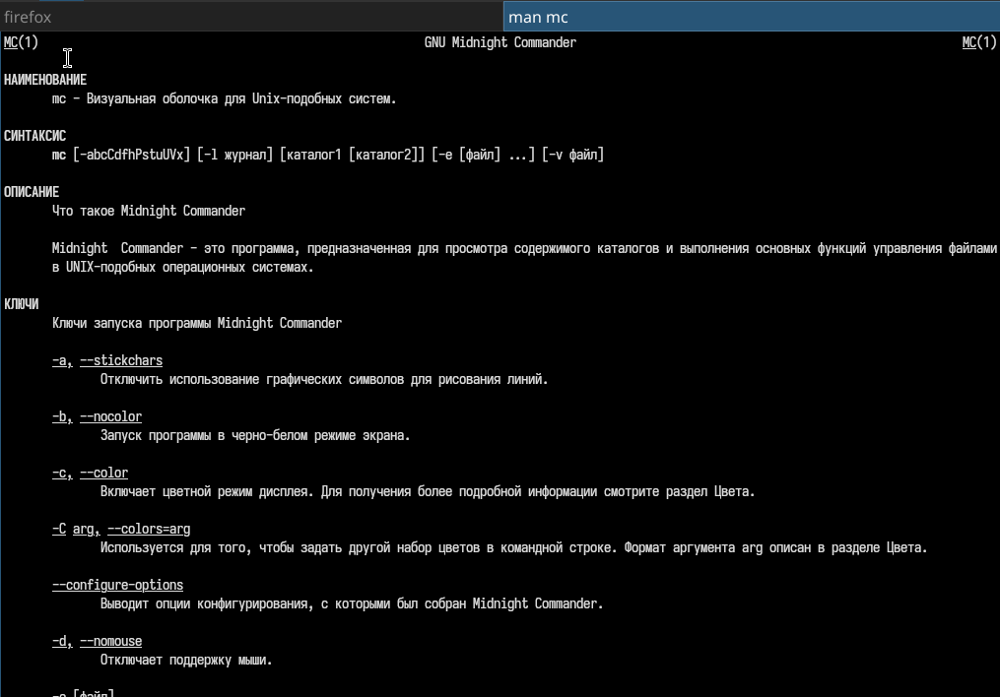
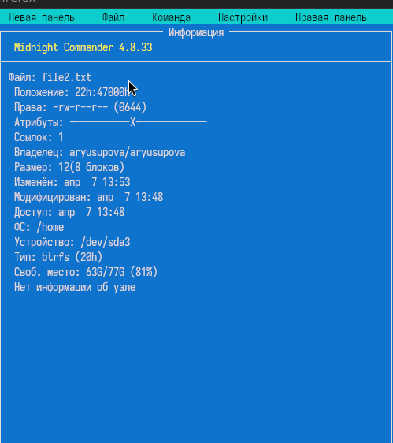
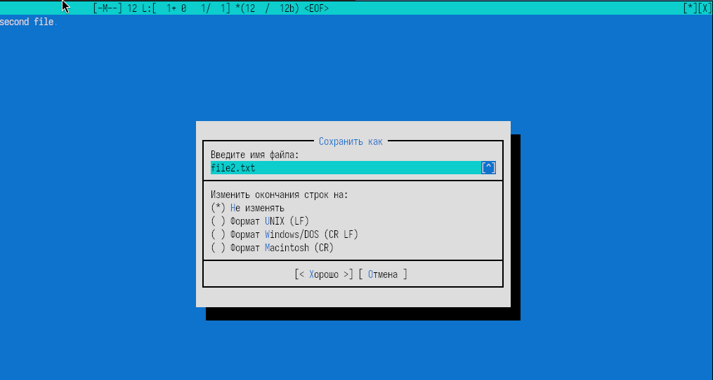
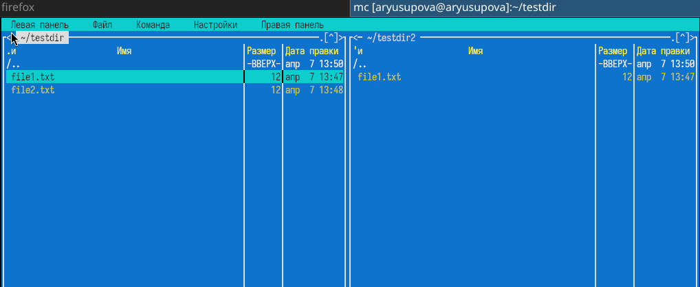
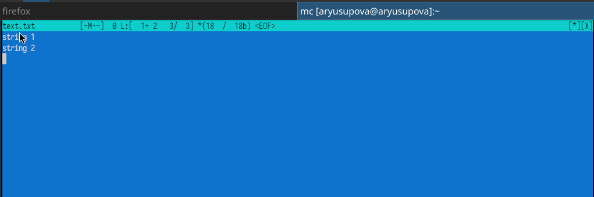
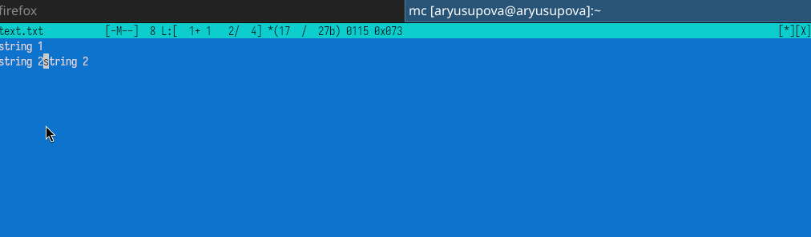
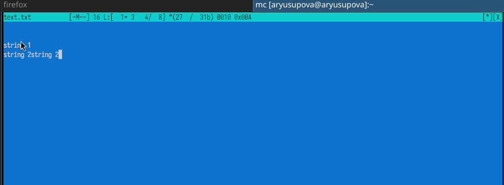
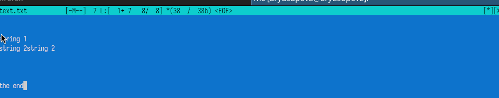
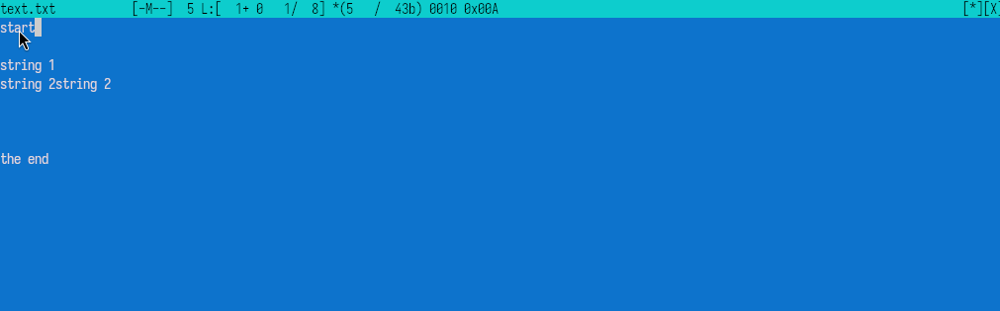
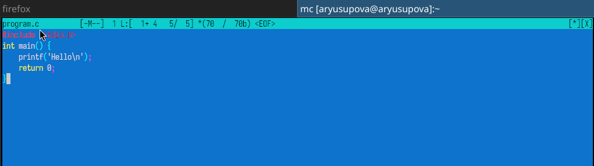

---
## Author
author:
  name: Юсупова Амина Руслановна
  affiliation:
    - name: Российский университет дружбы народов
      country: Российская Федерация
      postal-code: 117198
      city: Москва
      address: ул. Миклухо-Маклая, д. 6
lang: ru
format:
  pdf:
    documentclass: scrartcl
    latex-engine: xelatex
    mainfont: "Liberation Serif"
    sansfont: "Liberation Sans"
    monofont: "Liberation Mono"
    include-in-header:
      text: |
        \usepackage{fontspec}
        \setmainfont{Liberation Serif}
        \setsansfont{Liberation Sans}
        \setmonofont{Liberation Mono}
  pptx:
    toc: false
## Title
title: Лабораторная работа №9
subtitle: Командная оболочка Midnight Commander
license: CC BY

---

# Цели и задачи лабораторной работы

## Цель работы

Освоение основных возможностей командной оболочки Midnight Commander. Приобретение навыков практической работы по просмотру каталогов и файлов; манипуляций с ними.

# Выполнение лабораторной работы

## Запуск Midnight Commander

## 

## Управление панелями

## Создание каталога и файлов

##

##

## Копирование и перемещение файлов

##

## Просмотр информации о файле

## Встроенный редактор

## Редактирование текста (основные команды)

##

##

## Пример работы с редактором

##

## Подсветка синтаксиса

# Выводы по проделанной работе

## Выводы

В ходе лабораторной работы освоены:

- управление панелями Midnight Commander (режимы, сравнение, скрытие);
- основные операции с файлами и каталогами (создание, копирование, перемещение, удаление, просмотр информации);
- работа с меню **Файл**, **Команда**, **Настройки**;
- использование встроенного редактора (набор, выделение, копирование, перемещение, отмена, навигация);
- включение и отключение подсветки синтаксиса для файлов исходного кода.

