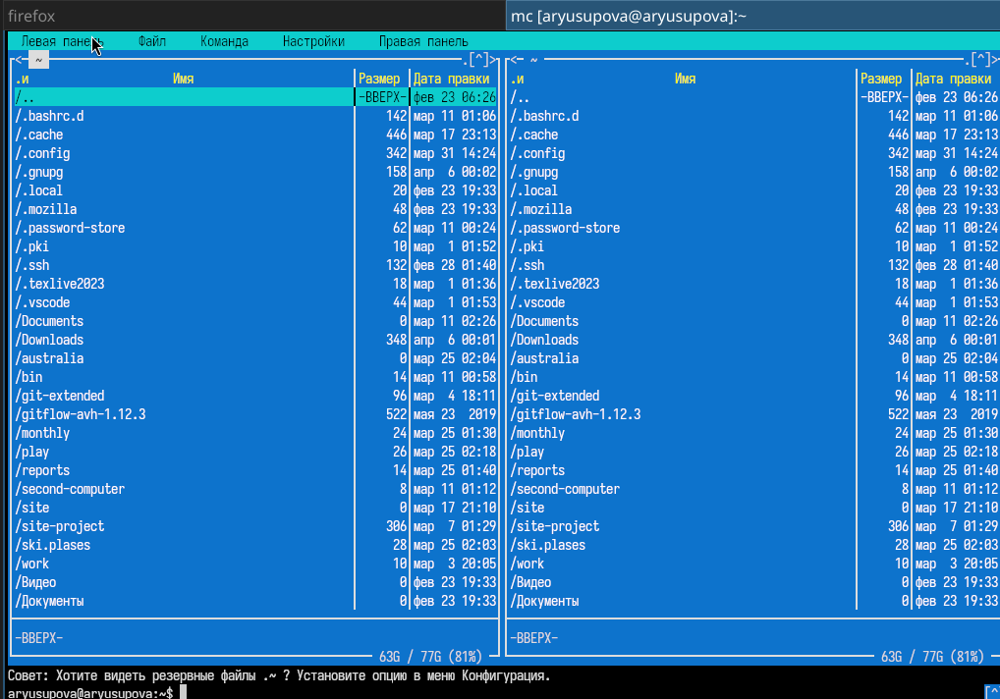
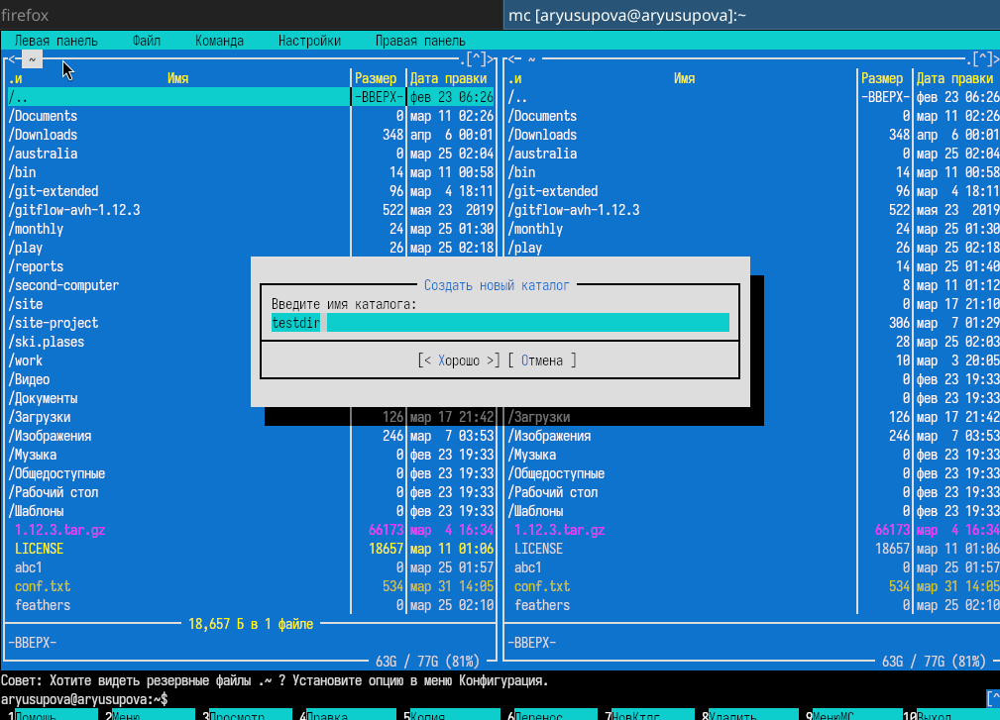
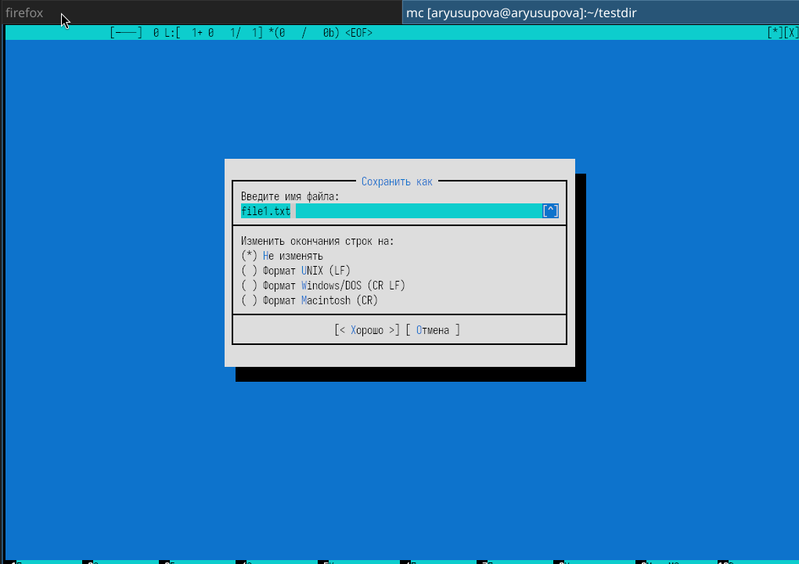
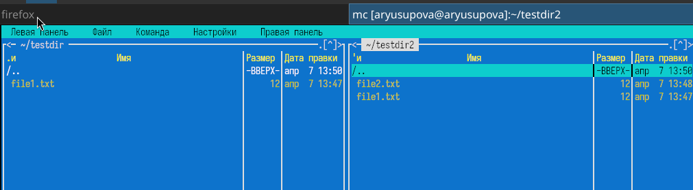
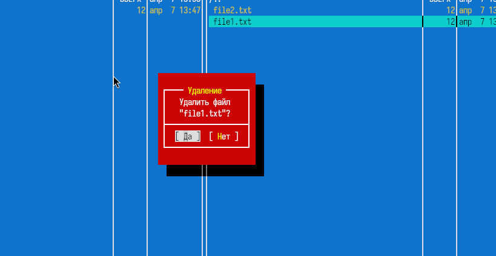
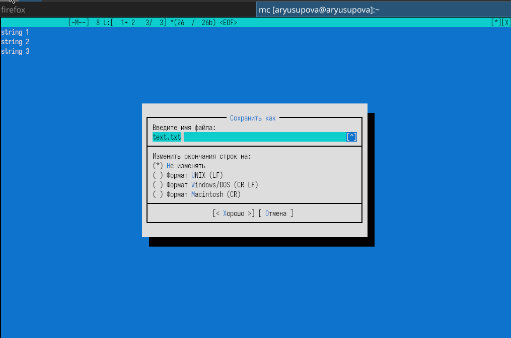

---
## Front matter
title: "Отчёт по лабораторной работе №9"
subtitle: "Командная оболочка Midnight Commander"
author: "Юсупова Амина Руслановна"

## Generic otions
lang: ru-RU
toc-title: "Содержание"

## Bibliography
bibliography: bib/cite.bib
csl: _resources/csl/gost-r-7-0-5-2008-numeric.csl

## Pdf output format
toc: true # Table of contents
toc-depth: 2
lof: true # List of figures
lot: true # List of tables
fontsize: 12pt
linestretch: 1.5
papersize: a4
documentclass: scrreprt
## I18n polyglossia
polyglossia-lang:
  name: russian
  options:
  - spelling=modern
  - babelshorthands=true
polyglossia-otherlangs:
  name: english
## I18n babel
babel-lang: russian
babel-otherlangs: english
## Fonts
mainfont: IBM Plex Serif
romanfont: IBM Plex Serif
sansfont: IBM Plex Sans
monofont: IBM Plex Mono
mathfont: STIX Two Math
mainfontoptions: Ligatures=Common,Ligatures=TeX,Scale=0.94
romanfontoptions: Ligatures=Common,Ligatures=TeX,Scale=0.94
sansfontoptions: Ligatures=Common,Ligatures=TeX,Scale=MatchLowercase,Scale=0.94
monofontoptions: Scale=MatchLowercase,Scale=0.94,FakeStretch=0.9
mathfontoptions: ''

biblatex: true
biblio-style: "gost-numeric"
biblatexoptions:
  - parentracker=true
  - backend=biber
  - hyperref=auto
  - language=auto
  - autolang=other*
  - citestyle=gost-numeric
## Pandoc-crossref LaTeX customization
figureTitle: "Рис."
tableTitle: "Таблица"
listingTitle: "Листинг"
lofTitle: "Список иллюстраций"
lotTitle: "Список таблиц"
lolTitle: "Листинги"
## Misc options
indent: true
header-includes:
  - \usepackage{indentfirst}
  - \usepackage{float} # keep figures where there are in the text
  - \floatplacement{figure}{H} # keep figures where there are in the text
---

# Цель работы

Освоение основных возможностей командной оболочки Midnight Commander. Приобретение навыков практической работы по просмотру каталогов и файлов; манипуляций
с ними.

# Теоретические сведения

Midnight Commander (mc) — псевдографическая командная оболочка для UNIX/Linux. Она предоставляет две панели, отображающие списки файлов двух каталогов. Управление осуществляется с помощью функциональных клавиш `F1`–`F10`, комбинаций клавиш и меню, вызываемого клавишей `F9`. Встроенный редактор (`F4`) позволяет редактировать текстовые файлы с поддержкой подсветки синтаксиса.

# Выполнение лабораторной работы

## 1. Запуск Midnight Commander и общее знакомство

В терминале введена команда `mc`. На экране появилось стандартное окно с двумя панелями, строкой меню (вызывается `F9`) и панелью функциональных клавиш внизу.

{#fig:001 width=70%}

## 2. Управление панелями

### 2.1. Перестановка панелей и временное отключение

- Нажата комбинация `Ctrl+u` – левая и правая панели поменялись местами.
- Нажата `Ctrl+o` – панели временно скрылись, стал виден обычный терминал. Введена команда `ls`, затем повторным `Ctrl+o` возвращены панели.

### 2.2. Режимы отображения

- Через меню `F9` → **Правая панель** → **Режим** → **Информация** на правой панели стали отображаться сведения о выделенном файле.
- Через `F9` → **Левая панель** → **Режим** → **Дерево** на левой панели показана структура каталогов.

{#fig:002 width=70%}

{#fig:003 width=70%}

### 2.3. Сравнение каталогов

На двух панелях открыты разные каталоги. Нажата последовательность `Ctrl+x d` – появилось окно сравнения. Результат сравнения показан на рисунке.

{#fig:004 width=70%}

## 3. Операции с файлами

### 3.1. Создание каталога и файлов

- Клавишей `F7` создан каталог `testdir`.
- Переход в него (`Enter`).
- С помощью `Shift+F4` создан файл `file1.txt`, введён текст «Hello, world!», сохранён (`F2`) и закрыт (`F10`).
- Аналогично создан файл `file2.txt` с текстом «Second file».

{#fig:005 width=70%}

### 3.2. Копирование, перемещение, удаление

- Выделен файл `file1.txt`, нажата `F5` – скопирован на другую панель.
- Файл `file2.txt` переименован через `F6` в `file2_renamed.txt`.
- Созданный файл удалён клавишей `F8` (с подтверждением).

{#fig:006 width=70%}

{#fig:007 width=70%}

## 4. Меню «Файл»

Через меню `F9` → **Файл** выполнены:

- **Просмотр** файла (`F3`) – содержимое `file1.txt` показано без возможности редактирования.
- **Редактирование без сохранения** – открыт файл (`F4`), внесены изменения, при выходе (`F10`) выбран ответ «Нет».
- **Создание каталога** (`F7`) – создан каталог `newdir`.
- **Копирование** – файл `file1.txt` скопирован в `newdir` (`F5` → указан путь `newdir/`).

## 5. Меню «Команда»

- **Поиск файлов** (`M+?`) – задан каталог `/home`, имя `*.txt`, содержимое `Hello`. Найден файл `file1.txt`.
- **История командной строки** (`M+h`) – показан список ранее введённых команд.
- **Быстрые каталоги** (`Ctrl+\`) – переход в `/tmp`.
- **Редактирование файла расширений** – просмотрен файл `~/.mc/ext.d/ext.sh` (без изменений).

{#fig:008 width=70%}

## 6. Меню «Настройки»

- **Конфигурация** – включена опция «Показывать скрытые файлы» (эквивалент `M+.`).
- **Внешний вид** – установлен режим «Full screen» (убрана нижняя строка).
- **Подтверждение** – включён запрос подтверждения при удалении.

## 7. Работа со встроенным редактором

### 7.1. Создание и редактирование `text.txt`

- Создан файл `text.txt` (`Shift+F4`).
- Вставлен произвольный текст (скопирован из браузера через `Shift+Insert`).

{#fig:009 width=70%}

- **Удаление строки** – курсор на строке, `F8`.
- **Выделение фрагмента** – `F3` в начале, перемещение, `F3` в конце.
- **Копирование выделенного** – `F5`, указано место.
- **Перемещение выделенного** – `F6`.
- **Сохранение** – `F2`.
- **Отмена действия** – `M+u` (Alt+u).
- **Переход в конец файла** – `Ctrl+End`, дописана строка.
- **Переход в начало файла** – `Ctrl+Home`, дописана строка.
- **Сохранение и закрытие** – `F2`, затем `F10`.

{#fig:010 width=70%}

### 7.2. Работа с файлом исходного кода

- Создан файл `program.c` с простой программой на C.
- Открыт редактором (`F4`).
- Подсветка синтаксиса включена (обычно автоматически). Проверено отключение/включение через `M+s`.

{#fig:011 width=70%}

## 8. Завершение работы

Midnight Commander закрыт клавишей `F10`.

# Выводы

В ходе лабораторной работы освоены основные возможности Midnight Commander:

- управление панелями (переключение режимов, сравнение каталогов, временное отключение);
- операции с файлами (копирование, перемещение, удаление, создание каталогов);
- использование меню **Файл**, **Команда**, **Настройки**;
- работа со встроенным редактором (набор, редактирование, выделение, копирование, перемещение, поиск, отмена действий);
- включение подсветки синтаксиса для файлов с исходным кодом.

# Ответы на контрольные вопросы

### 1. Какие режимы работы есть в mc? Охарактеризуйте их.

- **Стандартный (две панели)** – отображение списков файлов двух каталогов.
- **Информация** – на панели выводятся сведения о выделенном файле (права, размер, время).
- **Дерево** – отображается структура каталогов в виде дерева.
- **Быстрый просмотр** – на панели показывается содержимое выделенного файла (для текстовых файлов).

### 2. Какие операции с файлами можно выполнить как с помощью команд shell, так и с помощью меню (комбинаций клавиш) mc? Приведите примеры.

- Копирование: `cp` в shell, `F5` в mc.
- Перемещение/переименование: `mv` в shell, `F6` в mc.
- Удаление: `rm` в shell, `F8` в mc.
- Создание каталога: `mkdir` в shell, `F7` в mc.
- Просмотр файла: `cat`/`less` в shell, `F3` в mc.

### 3. Опишите структуру меню левой (или правой) панели mc, дайте характеристику командам.

Меню **Левая панель** (аналогично **Правая панель**) содержит:

- **Режим** – выбор режима отображения (Список, Информация, Дерево, Быстрый просмотр).
- **Формат списка** – настройка полей (имя, размер, дата, права).
- **Сортировка** – по имени, расширению, времени, размеру.
- **Фильтр** – отображение только файлов, соответствующих маске.
- **Переставить панели** – меняет панели местами.

### 4. Опишите структуру меню Файл mc, дайте характеристику командам.

- **Просмотр** (`F3`) – просмотр содержимого файла.
- **Редактирование** (`F4`) – открытие файла во встроен редакторе.
- **Копирование** (`F5`) – копирование файлов.
- **Перемещение** (`F6`) – перемещение/переименование.
- **Права доступа** (`Ctrl+x c`) – изменение прав `chmod`.
- **Владелец/группа** (`Ctrl+x o`) – изменение владельца.
- **Символическая ссылка** (`Ctrl+x s`) – создание символической ссылки.
- **Жёсткая ссылка** (`Ctrl+x l`) – создание жёсткой ссылки.
- **Создание каталога** (`F7`).
- **Удалить** (`F8`).
- **Выход** (`F10`).

### 5. Опишите структуру меню Команда mc, дайте характеристику командам.

- **Дерево каталогов** – отображение дерева каталогов.
- **Поиск файла** – поиск по имени, содержимому, размеру и т.д.
- **Переставить панели** – меняет панели местами.
- **Сравнить каталоги** – сравнение содержимого двух каталогов.
- **История командной строки** – список ранее введённых команд.
- **Каталоги быстрого доступа** – список избранных каталогов (`Ctrl+\`).
- **Редактировать файл расширений** – настройка ассоциаций файлов.
- **Редактировать файл меню** – настройка пользовательского меню (`F2`).

### 6. Опишите структуру меню Настройки mc, дайте характеристику командам.

- **Конфигурация** – общие настройки (показ скрытых файлов, поведение панелей).
- **Внешний вид и настройки панелей** – цветовая схема, расположение элементов.
- **Подтверждение** – запрос подтверждения при удалении, перезаписи, выходе.
- **Раскладка клавиш** – переназначение функциональных клавиш.
- **Виртуальная ФС** – настройки для работы с архивными файлами.

### 7. Назовите и дайте характеристику встроенным командам mc.

Встроенные команды вводятся в командную строку mc (после `Ctrl+o`):

- `cd` – смена текущего каталога.
- `ls` – вывод списка файлов.
- `cp`, `mv`, `rm` – стандартные команды UNIX.
- `pwd` – показать текущий путь.

Также к встроенным относят комбинации `Ctrl+x` с последующей буквой (например, `Ctrl+x d` – сравнить каталоги).

### 8. Назовите и дайте характеристику командам встроенного редактора mc.

- `F2` – сохранить файл.
- `F3` – начать/закончить выделение блока.
- `F4` – найти и заменить (или переключить режим).
- `F5` – скопировать выделенный блок.
- `F6` – переместить выделенный блок.
- `F7` – найти текст.
- `F8` – удалить строку или блок.
- `Ctrl+Home` – в начало файла.
- `Ctrl+End` – в конец файла.
- `M+u` (Alt+u) – отменить последнее действие.
- `M+s` – включить/отключить подсветку синтаксиса.

### 9. Дайте характеристику средствам mc, которые позволяют создавать меню, определяемые пользователем.

Пользовательское меню (вызывается `F2`) определяется файлом `~/.mc/menu`. В нём можно описывать пункты меню, выполняющие произвольные команды (например, сборку проекта, архивацию). Формат: строка с `+` для определения нового пункта, затем команды, начинающиеся с `=`. Пример:
