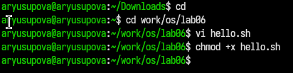
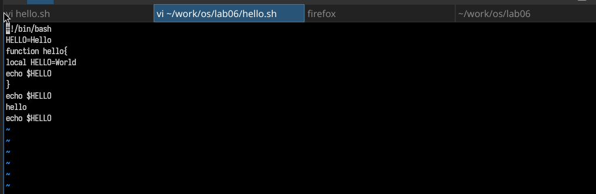

---
## Front matter
title: "Отчёт по лабораторной работе №10"
subtitle: "Текстовой редактор vi"
author: "Юсупова Амина Руслановна"

## Generic otions
lang: ru-RU
toc-title: "Содержание"

## Bibliography
bibliography: bib/cite.bib
csl: _resources/csl/gost-r-7-0-5-2008-numeric.csl

## Pdf output format
toc: true # Table of contents
toc-depth: 2
lof: true # List of figures
lot: true # List of tables
fontsize: 12pt
linestretch: 1.5
papersize: a4
documentclass: scrreprt
## I18n polyglossia
polyglossia-lang:
  name: russian
  options:
  - spelling=modern
  - babelshorthands=true
polyglossia-otherlangs:
  name: english
## I18n babel
babel-lang: russian
babel-otherlangs: english
## Fonts
mainfont: IBM Plex Serif
romanfont: IBM Plex Serif
sansfont: IBM Plex Sans
monofont: IBM Plex Mono
mathfont: STIX Two Math
mainfontoptions: Ligatures=Common,Ligatures=TeX,Scale=0.94
romanfontoptions: Ligatures=Common,Ligatures=TeX,Scale=0.94
sansfontoptions: Ligatures=Common,Ligatures=TeX,Scale=MatchLowercase,Scale=0.94
monofontoptions: Scale=MatchLowercase,Scale=0.94,FakeStretch=0.9
mathfontoptions: ''

biblatex: true
biblio-style: "gost-numeric"
biblatexoptions:
  - parentracker=true
  - backend=biber
  - hyperref=auto
  - language=auto
  - autolang=other*
  - citestyle=gost-numeric
## Pandoc-crossref LaTeX customization
figureTitle: "Рис."
tableTitle: "Таблица"
listingTitle: "Листинг"
lofTitle: "Список иллюстраций"
lotTitle: "Список таблиц"
lolTitle: "Листинги"
## Misc options
indent: true
header-includes:
  - \usepackage{indentfirst}
  - \usepackage{float} # keep figures where there are in the text
  - \floatplacement{figure}{H} # keep figures where there are in the text
---

# Цель работы

Познакомиться с операционной системой Linux. Получить практические навыки работы с редактором vi, установленным по умолчанию практически во всех дистрибутивах.

# Теоретические сведения

Редактор vi (Visual display editor) — интерактивный экранный редактор текста, который имеет три режима работы:

- **Командный режим** — предназначен для ввода команд редактирования и навигации по редактируемому файлу.
- **Режим вставки** — предназначен для ввода содержания редактируемого файла.
- **Режим последней строки** — используется для записи изменений в файл и выхода из редактора.

Для вызова редактора vi необходимо указать команду `vi` и имя редактируемого файла: `vi <имя_файла>`. При этом в случае отсутствия файла с указанным именем будет создан такой файл.

Переход в командный режим осуществляется нажатием клавиши `Esc`. Для выхода из редактора vi необходимо перейти в режим последней строки: находясь в командном режиме, нажать `:` (двоеточие), затем:
- набрать символы `wq`, если перед выходом из редактора требуется записать изменения в файл;
- набрать символ `q` (или `q!`), если требуется выйти из редактора без сохранения.

# Выполнение лабораторной работы

## Задание 1. Создание нового файла с использованием vi

1. Создан каталог `~/work/os/lab06` командой `mkdir -p ~/work/os/lab06`.
2. Выполнен переход в созданный каталог: `cd ~/work/os/lab06`.
3. Вызван редактор vi и создан файл `hello.sh`: `vi hello.sh`.
4. Нажата клавиша `i` для перехода в режим вставки и введён следующий текст:


``` bash 
#!/bin/bash
HELL=Hello
function hello {
    local HELLO=World
    echo $HELLO
}
echo $HELLO
hello 
```

{#fig:001 width=70%}

5. Нажата клавиша Esc для перехода в командный режим после завершения ввода текста.

6. Нажата клавиша : для перехода в режим последней строки.

7. Набраны символы wq и нажата клавиша Enter для сохранения текста и завершения работы.

8. Файл сделан исполняемым: chmod +x hello.sh.

{#fig:002 width=70%}

## Задание 2. Редактирование существующего файла

1. Вызван редактор vi для редактирования файла: vi ~/work/os/lab06/hello.sh.

{#fig:003 width=70%}


2. Курсор установлен в конец слова HELL во второй строке.

3. Выполнен переход в режим вставки (клавиша a), слово HELL заменено на HELLO. Нажата Esc для возврата в командный режим.

4. Курсор установлен на четвёртую строку. Слово LOCAL удалено (команда dw).

5. Выполнен переход в режим вставки (i), набрано слово local. Нажата Esc для возврата в командный режим.

6. Курсор установлен на последней строке файла. После неё вставлена строка с текстом echo $HELLO (команда o).

7. Нажата Esc для перехода в командный режим.

8. Удалена последняя строка (команда dd).

9. Введена команда отмены изменений u для отмены последней команды — удалённая строка восстановлена.

10. Нажата клавиша : для перехода в режим последней строки. Записаны произведённые изменения и выполнен выход из vi: wq.

11. В результате редактирования файл hello.sh стал содержать следующий код:

```bash
#!/bin/bash
HELLO=Hello
function hello {
    local HELLO=World
    echo $HELLO
}
echo $HELLO
hello
echo $HELLO
```

# Выводы
В ходе лабораторной работы я познакомилась с операционной системой Linux и получила практические навыки работы с редактором vi. Были освоены:

- создание новых файлов с помощью vi;

- переход между режимами (командный, вставки, последней строки);

- ввод и редактирование текста;

- навигация по файлу (перемещение курсора, переход в конец строки и файла);

- удаление символов, слов и строк;

- отмена действий с помощью команды u;

- сохранение изменений и выход из редактора.

# Ответы на контрольные вопросы

1. Дайте краткую характеристику режимам работы редактора vi.
Командный режим — предназначен для ввода команд редактирования и навигации по редактируемому файлу.

Режим вставки — предназначен для ввода содержания редактируемого файла.

Режим последней строки — используется для записи изменений в файл и выхода из редактора.

2. Как выйти из редактора, не сохраняя произведённые изменения?
В командном режиме нажать :, затем ввести q! и нажать Enter.

3. Назовите и дайте краткую характеристику командам позиционирования.
- 0 (ноль) — переход в начало строки.

- $ — переход в конец строки.

- G — переход в конец файла.

- nG — переход на строку с номером n.

- gg — переход в начало файла.

4. Что для редактора vi является словом?
Словом считается последовательность букв, цифр и символа подчёркивания, ограниченная пробелами, знаками пунктуации или переводами строки.

5. Каким образом из любого места редактируемого файла перейти в начало (конец) файла?

- В начало файла: gg или :1.

- В конец файла: G или :$.

6. Назовите и дайте краткую характеристику основным группам команд редактирования.
Вставка текста: a (после курсора), A (в конец строки), i (перед курсором), o (следующая строка), O (предыдущая строка).

Удаление текста: x (символ), dw (слово), dd (строка), d$ (до конца строки), d0 (до начала строки).

Отмена изменений: u — отмена последнего действия.

7. Необходимо заполнить строку символами $. Каковы ваши действия?
Перейти в начало строки (0), нажать C (удалить до конца строки и перейти в режим вставки), ввести нужное количество символов $, нажать Esc.

8. Как отменить некорректное действие, связанное с процессом редактирования?
В командном режиме нажать клавишу u (undo).

9. Назовите и дайте характеристику основным группам команд режима последней строки.
  
:w — записать (сохранить) файл.

:q — выйти.

:wq или :x — сохранить и выйти.

:q! — выйти без сохранения.

:set nu — включить нумерацию строк.

:set nonu — отключить нумерацию строк.

:set ic — игнорировать регистр при поиске.

:set list — отображать невидимые символы.

10.  Как определить, не перемещая курсора, позицию, в которой заканчивается строка?
В командном режиме нажать $ — курсор переместится на последний символ строки, показав её конец.

11.  Выполните анализ опций редактора vi (сколько их, как узнать их назначение и т.д.).
Все опции можно посмотреть командой :set all. Их назначение описано во встроенной справке (:help set). Опции включаются командой :set <опция> и отключаются :set no<опция>.

12.  Как определить режим работы редактора vi?
По индикатору в строке состояния (если он включён).

По поведению клавиш: в командном режиме нажатие букв не вводит их в текст, а выполняет команды; в режиме вставки буквы печатаются.

По наличию надписи -- INSERT -- внизу экрана (в режиме вставки).

13. Постройте граф взаимосвязи режимов работы редактора vi.
   
                    +---------------------+
                    |                     |
                    |  Командный режим    |
                    |                     |
                    +---------------------+
                       |    |         ^
                  (Esc)|    |(i,a,o)  |(Esc)
                       |    |         |
                       |    V         |
                       |  +---------------------+
                       |  |                     |
                       |  |   Режим вставки      |
                       |  |                     |
                       |  +---------------------+
                       |
                       | (:)
                       |
                       V
               +---------------------+
               |                     |
               | Режим последней      |
               | строки               |
               |                     |
               +---------------------+