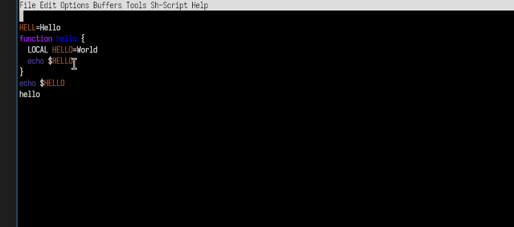
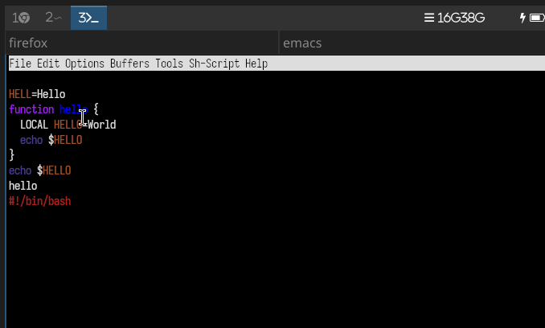
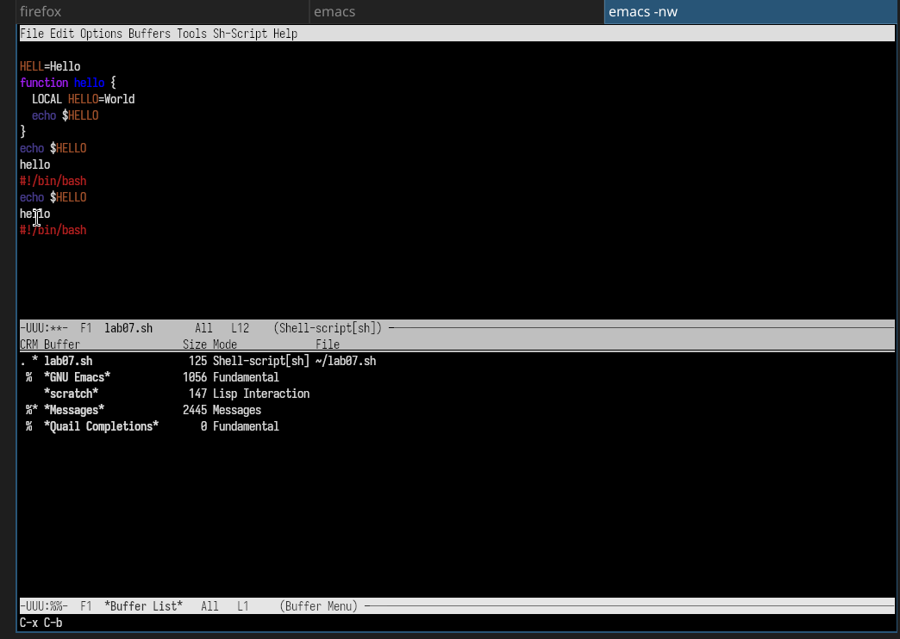
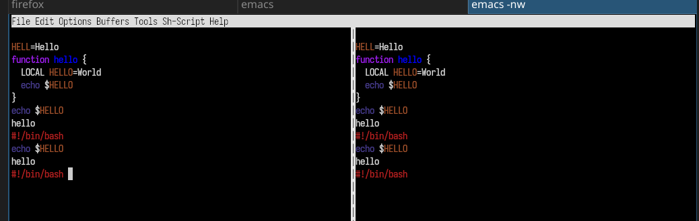
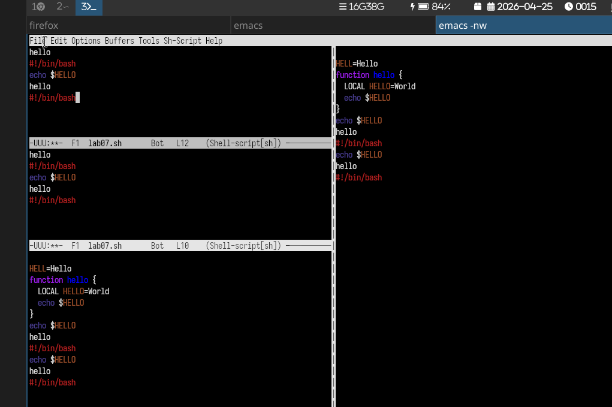
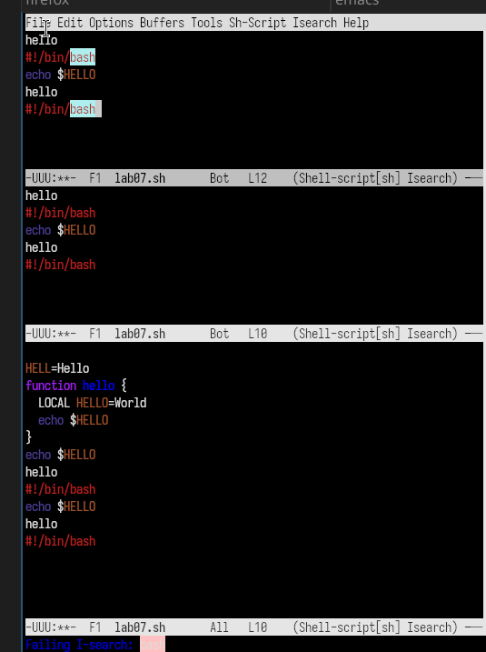
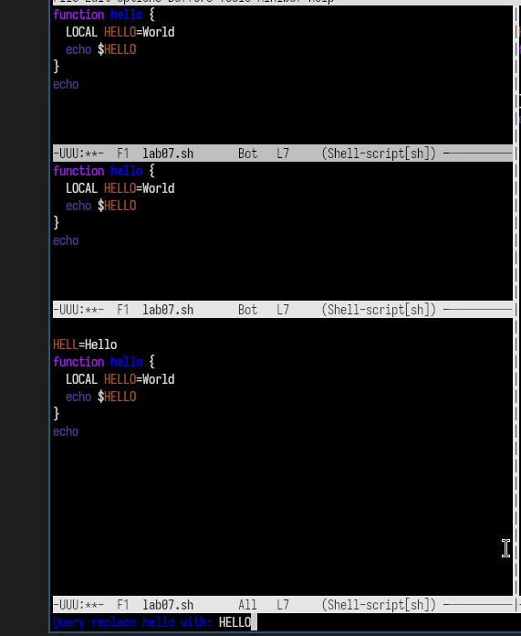

---
## Author
author:
  name: Юсупова Амина Руслановна
  affiliation:
    - name: Российский университет дружбы народов
      country: Российская Федерация
      postal-code: 117198
      city: Москва
      address: ул. Миклухо-Маклая, д. 6
lang: ru
format:
  pdf:
    documentclass: scrartcl
    latex-engine: xelatex
    mainfont: "Liberation Serif"
    sansfont: "Liberation Sans"
    monofont: "Liberation Mono"
    include-in-header:
      text: |
        \usepackage{fontspec}
        \setmainfont{Liberation Serif}
        \setsansfont{Liberation Sans}
        \setmonofont{Liberation Mono}
  pptx:
    toc: false
## Title
title: Лабораторная работа №11
subtitle: Текстовой редактор emacs
license: CC BY

---

# Цели и задачи лабораторной работы

## Цель работы

Познакомиться с операционной системой Linux. Получить практические навыки работы с редактором Emacs.

# Выполнение лабораторной работы

## Запуск Emacs, создание файла, ввод кода

{#fig:001 width=70%}#

## Редактирование текста

### Вырезание текста 

{#fig:003 width=70%}

### Вставка строки в конец файла

{#fig:004 width=70%}

## Управление буферами.
### Вывод списка активных буферов на экран (C-x C-b).

{#fig:007 width=70%}

## Управление окнами.
### Деление фрейма на 4 части

{#fig:008 width=70%}

### 

{#fig:009 width=70%}

## Режим поиска
### Поиск слов

{#fig:010 width=70%}

### Режим поиска и замены 

{#fig:011 width=70%}

# Выводы по проделанной работе
## Выводы 
В ходе выполнения 11 лабораторной работы я познакомилась с операционной системой Linux и получила практические навыки работы с редактором Emacs.
