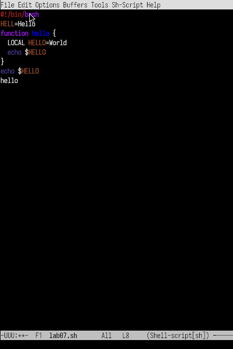
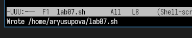
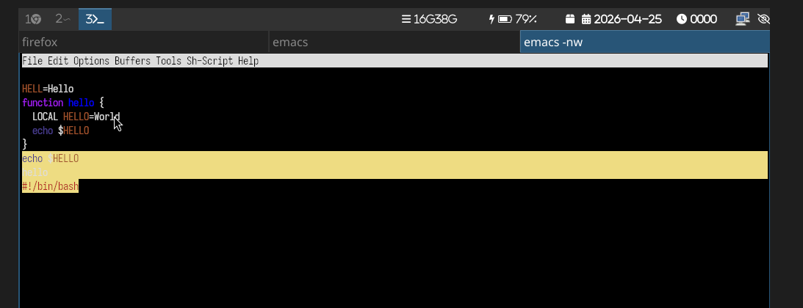
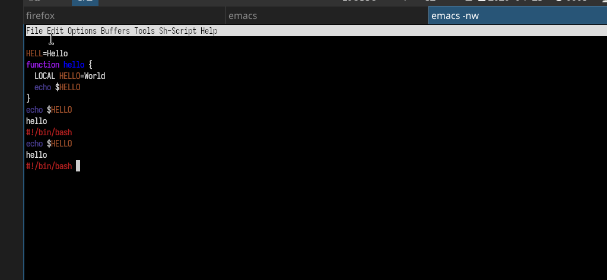

---
## Front matter
title: "Отчёт по лабораторной работе №11"
subtitle: "Текстовой редактор emacs"
author: "Юсупова Амина Руслановна"

## Generic otions
lang: ru-RU
toc-title: "Содержание"

## Bibliography
bibliography: bib/cite.bib
csl: _resources/csl/gost-r-7-0-5-2008-numeric.csl

## Pdf output format
toc: true # Table of contents
toc-depth: 2
lof: true # List of figures
lot: true # List of tables
fontsize: 12pt
linestretch: 1.5
papersize: a4
documentclass: scrreprt
## I18n polyglossia
polyglossia-lang:
  name: russian
  options:
  - spelling=modern
  - babelshorthands=true
polyglossia-otherlangs:
  name: english
## I18n babel
babel-lang: russian
babel-otherlangs: english
## Fonts
mainfont: IBM Plex Serif
romanfont: IBM Plex Serif
sansfont: IBM Plex Sans
monofont: IBM Plex Mono
mathfont: STIX Two Math
mainfontoptions: Ligatures=Common,Ligatures=TeX,Scale=0.94
romanfontoptions: Ligatures=Common,Ligatures=TeX,Scale=0.94
sansfontoptions: Ligatures=Common,Ligatures=TeX,Scale=MatchLowercase,Scale=0.94
monofontoptions: Scale=MatchLowercase,Scale=0.94,FakeStretch=0.9
mathfontoptions: ''

biblatex: true
biblio-style: "gost-numeric"
biblatexoptions:
  - parentracker=true
  - backend=biber
  - hyperref=auto
  - language=auto
  - autolang=other*
  - citestyle=gost-numeric
## Pandoc-crossref LaTeX customization
figureTitle: "Рис."
tableTitle: "Таблица"
listingTitle: "Листинг"
lofTitle: "Список иллюстраций"
lotTitle: "Список таблиц"
lolTitle: "Листинги"
## Misc options
indent: true
header-includes:
  - \usepackage{indentfirst}
  - \usepackage{float} # keep figures where there are in the text
  - \floatplacement{figure}{H} # keep figures where there are in the text
---

# Цель работы

Познакомиться с операционной системой Linux. Получить практические навыки работы с редактором Emacs.

# Теоретические сведения

Emacs — мощный экранный редактор текста, написанный на языке высокого уровня Elisp. Основные понятия Emacs:

- **Буфер** — объект, представляющий какой-либо текст.
- **Фрейм** — соответствует окну в обычном понимании этого слова.
- **Окно** — прямоугольная область фрейма, отображающая один из буферов.
- **Область вывода** — одна или несколько строк внизу фрейма, в которой Emacs выводит сообщения.
- **Минибуфер** — используется для ввода дополнительной информации.

Основные комбинации клавиш в Emacs представлены в таблицах 9.1-9.7 лабораторной работы.

# Выполнение лабораторной работы

## Запуск Emacs и создание файла

### 1. Запущен Emacs командой `emacs` в терминале.

### 2. Создан файл `lab07.sh` с помощью комбинации `C-x C-f` (Ctrl-x Ctrl-f).

### 3. В режиме вставки набран следующий текст:

```bash
#!/bin/bash
HELL=Hello
function hello {
    LOCAL HELLO=World
    echo $HELLO
}
echo $HELLO
hello
```

{#fig:001 width=70%}

### 4. Файл сохранён

{#fig:002 width=70%}

### 5. Редактирование текста 
#### 5.1 Вырезание командой строки
Вырезаем командой С-k первую строку 

{#fig:003 width=70%}

#### 5.2. Вставка строки в конец файла

Вставляем 1 строку в конец файла в с=помощью команды С-y
{#fig:004 width=70%}

#### 5.3. Выделение область текста
Выделяем текст с помощью команды C-space
{#fig:005 width=70%}

#### 5.4. Скопировать область в буфер обмена (M-w).
#### 5.5. Вставить область в конец файла.

Вставляем в конец файла выеленный текст 

{#fig:006 width=70%}

#### 5.6. Вновь выделить эту область и на этот раз вырезать её (C-w).
#### 5.7. Отмените последнее действие (C-/). 

### 6. Использование команды по перемещению курсора
#### 6.1. Переместите курсор в начало строки.

Перемещаем курсор в начало строки с помощью команды (C-a).

#### 6.2. Переместите курсор в конец строки.

Перемещаем курсор в конец строки с помощью команды (C-e).

#### 6.3. Переместите курсор в начало буфера.

Перемещаем курсор в начало буфера с помощью команды (M-<).

#### 6.4. Переместите курсор в конец буфера.

Перемещаем курсор в конец буфера с помощью команды (M->).

### 7. Управление буферами.
#### 7.1. Вывести список активных буферов на экран (C-x C-b).

{#fig:007 width=70%}

#### 7.2. Переместитесь во вновь открытое окно (C-x) o со списком открытых буферов и переключитесь на другой буфер.
#### 7.3. Закройте это окно (C-x 0).
#### 7.4. Теперь вновь переключайтесь между буферами, но уже без вывода их списка на экран (C-x b).

### 8. Управление окнами.
#### 8.1. Деление фрейма на 4 части

Для начала разделитю фрейм на два окна по вертикали (C-x 3), а затем каждое из этих окон на две части по горизонтали (C-x 2)

{#fig:008 width=70%}
{#fig:009 width=70%}

#### 8.2. В каждом из четырёх созданных окон открыла новый буфер (файл) и ввела несколько строк текста.

### 9. Режим поиска
#### 9.1. Поиск слов

Переключаюсь в режим поиска (C-s) и нахожу несколько слов, присутствующих в тексте.

{#fig:010 width=70%}

#### 9.2. Переключайтесь между результатами поиска, нажимая C-s.

#### 9.3. Выйдите из режима поиска, нажав C-g.

#### 9.4. Режим поиска и замены 

Переходим в режим поиска и замены (M-%), ввожу текст, который следует найти и заменить, нажимаю Enter ,затем ввожу текст для замены. После того как будут подсвечены результаты поиска, нажмимаю ! для подтверждения замены.

{#fig:011 width=70%}

#### 9.5. Другой режим поиска 

Пробую другой режим поиска, нажав M-s o. 

M-s o ищет по шаблону (регулярному выражению), а C-s ищет точное совпадение


# Выводы 
В ходе выполнения 11 лабораторной работы я познакомилась с операционной системой Linux и получила практические навыки работы с редактором Emacs.

# Ответы на контрольные вопросы

### 1. Краткая характеристика редактора Emacs
Emacs — мощный экранный редактор текста, написанный на языке Elisp. Поддерживает множество режимов работы (C, Lisp, Shell, Text и др.), позволяет настраивать поведение под конкретные задачи. Имеет встроенную справку, учебник, поддержку макросов и расширений.

### 2. Особенности, усложняющие освоение Emacs новичком
   
- Большое количество комбинаций клавиш (например, C-x C-f, M-<, C-s и т.д.)

- Специфическая терминология (буфер, фрейм, минибуфер, точка вставки)

- Отсутствие привычного графического интерфейса (многие операции выполняются только с клавиатуры)

- Множество режимов работы, в которых поведение клавиш может отличаться

### 3. Своими словами объясните, что такое буфер и окно в терминологии Emacs.

**Буфер** — это область в памяти, где Emacs хранит текст. Это может быть содержимое файла, результат выполнения команды, вывод справки или просто временная заметка. Буфер существует независимо от того, видим мы его на экране или нет.

**Окно** — это видимая прямоугольная область на экране (фрейме), в которой отображается один из буферов. В одном фрейме может быть несколько окон, показывающих разные буферы (или один и тот же буфер в разных окнах).

**Простая аналогия:** Буфер — это лист бумаги, а окно — это лупа, через которую вы смотрите на этот лист. Можно смотреть на один лист через несколько луп, а можно убрать лупу (закрыть окно) — лист (буфер) при этом никуда не денется.

### 4. Можно ли открыть больше 10 буферов в одном окне?

**Да, можно.** Emacs не накладывает ограничений на количество буферов. Вы можете создать несколько десятков или сотен буферов. Проблема будет не в ограничении Emacs, а в удобстве навигации. Для переключения между буферами используются команды:

- `C-x b` — переключиться на другой буфер по имени
- `C-x C-b` — отобразить список всех буферов в отдельном окне

### 5. Какие буферы создаются по умолчанию при запуске Emacs?

При запуске Emacs автоматически создаёт три буфера:

| Буфер | Назначение |
|-------|------------|
| `*scratch*` | "Черновик" — временный буфер для заметок и выполнения выражений на языке Elisp. При закрытии Emacs не предлагает его сохранить. |
| `*Messages*` | Системный журнал — содержит сообщения Emacs (ошибки, предупреждения, результаты операций). |
| `*GNU Emacs*` | Приветственный экран — содержит информацию о версии, справку и ссылки на полезные команды. |


### 6. Какие клавиши вы нажмёте, чтобы выполнить комбинации `C-c |` и `C-c C-|`?

| Комбинация | Что нажать |
|------------|------------|
| `C-c \|` | Удерживать **Ctrl**, нажать **c**, отпустить обе клавиши, затем удерживать **Ctrl** и нажать **\|** (вертикальная черта) |
| `C-c C-\|` | Удерживать **Ctrl**, нажать **c**, отпустить, затем удерживать **Ctrl** и нажать **\|** (вертикальная черта) |

**Примечание:** Клавиша `|` обычно находится на той же кнопке, что и `\` (на многих раскладках — Shift+`\` или `Shift+Ё` на русской клавиатуре).

**Что делают эти команды:**
- `C-c |` — выполняет команду оболочки (shell) для выделенного текста
- `C-c C-|` — выполняет команду оболочки и **заменяет** выделенный текст результатом её выполнения

### 7. Как поделить текущее окно на две части?

| Действие | Комбинация клавиш | Результат |
|----------|------------------|-----------|
| Разделить **по горизонтали** (верх/низ) | `C-x 2` | Появляется второе окно под текущим |
| Разделить **по вертикали** (лево/право) | `C-x 3` | Появляется второе окно справа от текущего |

**Дополнительные команды для работы с окнами:**

| Команда | Действие |
|---------|----------|
| `C-x 0` | Закрыть текущее окно |
| `C-x 1` | Закрыть все окна, кроме текущего |
| `C-x o` | Перейти в другое окно (переключение между окнами) |

### 8. В каком файле хранятся настройки редактора Emacs?

Настройки Emacs хранятся в файле **`~/.emacs`** или **`~/.emacs.d/init.el`** (более современный вариант).

- `~` — домашняя директория пользователя
- Файл может отсутствовать изначально — его нужно создать вручную
- Настройки пишутся на языке Elisp (Emacs Lisp)

**Пример содержимого `~/.emacs`:**

```elisp
;; Отключить приветственный экран
(setq inhibit-startup-message t)

;; Включить нумерацию строк
(global-display-line-numbers-mode t)

;; Назначить клавишу F5 для сохранения всех файлов
(global-set-key (kbd "<f5>") 'save-buffer)
```

### 9. Какую функцию выполняет клавиша `|` и можно ли её переназначить?

**Функция по умолчанию:**

Клавиша `|` (вертикальная черта) вводит символ `|` в текст. Этот символ широко используется в программировании и командной строке:

- **В языках программирования** — логическое ИЛИ (`||`), побитовое ИЛИ (`|`)
- **В командной строке Linux** — конвейер (pipe) для передачи вывода одной команды на вход другой (`grep "text" file.txt | wc -l`)
- **В регулярных выражениях** — оператор альтернативы (`cat|dog` означает "cat или dog")

**Можно ли переназначить? Да, можно.**

В Emacs можно переназначить любую клавишу, включая `|`. Для этого используется файл настроек `~/.emacs` или `~/.emacs.d/init.el`.

**Синтаксис переназначения:**

```elisp
(global-set-key (kbd "|") 'имя-функции)

;; Пример 1: Назначить клавише | вызов команды M-x
(global-set-key (kbd "|") 'execute-extended-command)

;; Пример 2: Назначить | для вставки текущей даты
(global-set-key (kbd "|") (lambda () (interactive) (insert (format-time-string "%Y-%m-%d"))))

;; Пример 3: Назначить | для открытия списка буферов
(global-set-key (kbd "|") 'list-buffers)
```

### 10. Какой редактор вам показался удобнее в работе — vi или emacs? Объясните почему.

**Ответ:** Мне лично удобнее работать с редактором **Emacs**.

**Почему Emacs удобнее:**

1. **Единый режим работы**  
   В Emacs нет разделения на командный режим и режим ввода. Я всегда печатаю текст, и клавиши работают предсказуемо. В vi я часто забывал, в каком режиме нахожусь, и случайно вводил команды вместо текста.

2. **Понятные комбинации клавиш**  
   В Emacs многие команды запоминаются по первым буквам английских слов:  
   - `C-x C-f` — открыть файл (Find)  
   - `C-x C-s` — сохранить файл (Save)  
   - `C-x C-c` — выйти (Close)  
   - `C-s` — найти (Search)  

3. **Графический интерфейс и меню**  
   У Emacs есть привычное меню (File, Edit, Help), которое помогает новичку. В vi всё управление — через клавиши, и без знания команд не обойтись.

4. **Встроенный учебник**  
   Команда `C-h t` открывает интерактивный учебник прямо в Emacs. Я прошёл его и освоил основные приёмы за 20-30 минут.

5. **Подсветка синтаксиса и режимы**  
   Emacs автоматически определяет тип файла и включает подсветку синтаксиса (для Shell-скриптов, Python, C и других языков).

**Что мне понравилось в vi:**

- Очень быстро запускается
- Есть на любом сервере Linux по умолчанию
- После освоения можно редактировать очень быстро

**Итог:**  
Для повседневной работы я выберу **Emacs**, потому что он дружелюбнее к новичкам и имеет удобный графический интерфейс. Но базовые команды vi я тоже выучил — на случай, если придётся работать на удалённом сервере без графической оболочки.