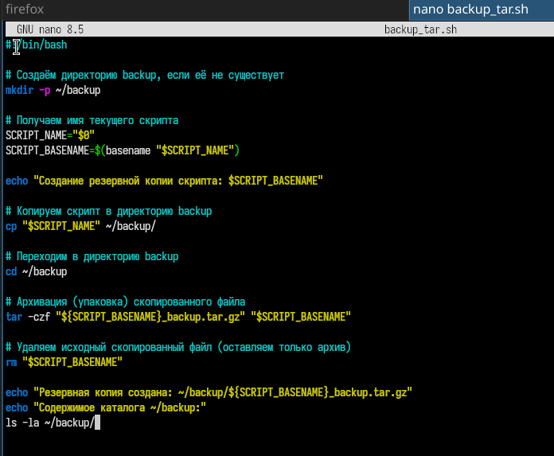
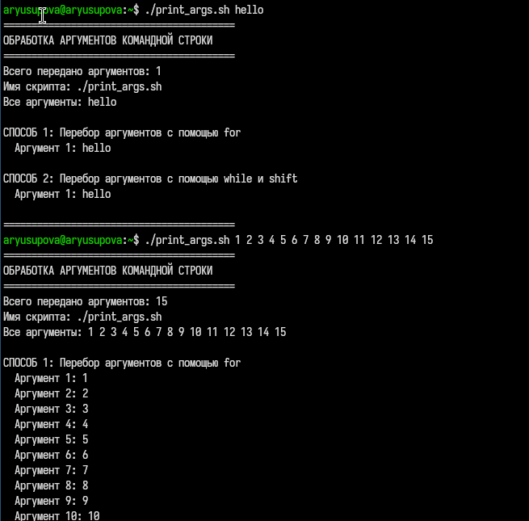
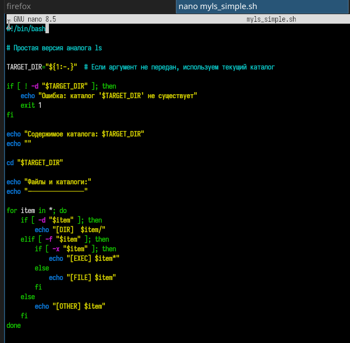
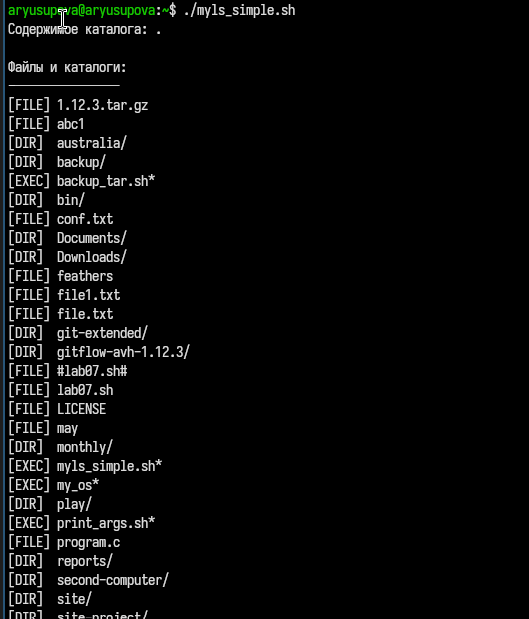
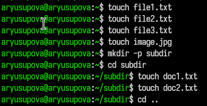
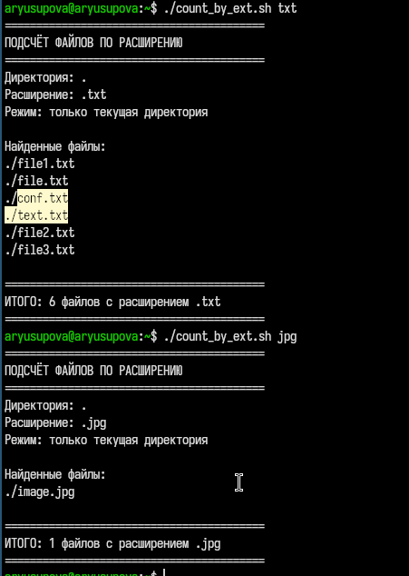

---
## Author
author:
  name: Юсупова Амина Руслановна
  affiliation:
    - name: Российский университет дружбы народов
      country: Российская Федерация
      postal-code: 117198
      city: Москва
      address: ул. Миклухо-Маклая, д. 6
lang: ru
format:
  pdf:
    documentclass: scrartcl
    latex-engine: xelatex
    mainfont: "Liberation Serif"
    sansfont: "Liberation Sans"
    monofont: "Liberation Mono"
    include-in-header:
      text: |
        \usepackage{fontspec}
        \setmainfont{Liberation Serif}
        \setsansfont{Liberation Sans}
        \setmonofont{Liberation Mono}
  pptx:
    toc: false
## Title
title: Лабораторная работа №12
subtitle: Программирование в командном процессоре ОС UNIX. Командные файлы
license: CC BY

---

# Цели и задачи лабораторной работы

## Цель работы

Изучить основы программирования в оболочке ОС UNIX/Linux. Научиться писать небольшие командные файлы

## Задачи

## Задачи лабораторной работы

1. Написать скрипт резервного копирования

2. Написать скрипт по обработке произвольного числа аргументов

3. Написать скрипт аналог команды `ls`

4. Написат скрипт для подсчёта файлов по расширению

# Выполнение лабораторной работы

## Задание 1

### Создание рабочего файла и написание кода  

{#fig:001 width=70%}

### Запуск скрипта 

{#fig:003 width=70%}

## Задание 2

### Создание рабочего файла и написание кода  

{#fig:004 width=70%}

### Запуск скрипта 

{#fig:006 width=70%}

## Задание 3

### Создание рабочего файла и написание кода  

{#fig:007 width=70%}

### Запуск скрипта

{#fig:009 width=70%}

## Задание 4

### Создание рабочего файла и написание кода  

{#fig:010 width=70%}

### Запуск скрипта 

{#fig:012 width=70%}

### 

{#fig:013 width=70%}

# Выводы по проделанной работе

## Выводы 

В ходе выполнения 12 лабораторной работы я познакомилась с основами программирования в командной оболочке bash и получила практические навыки создания скриптов для автоматизации задач в ОС Linux.
