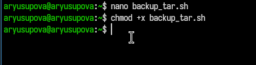
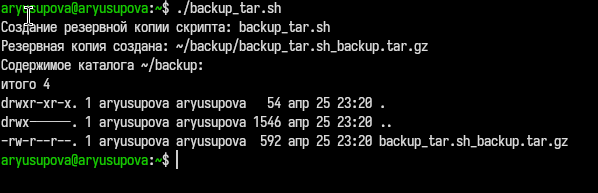
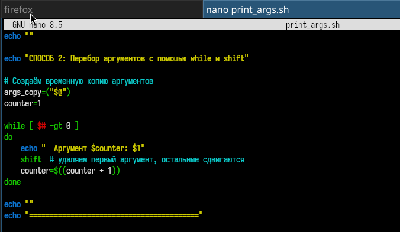
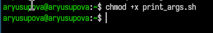
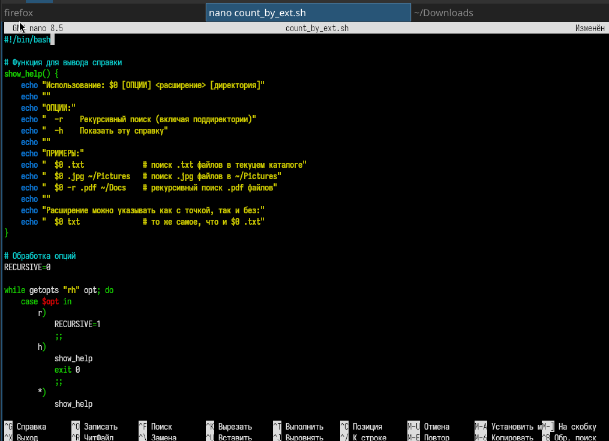

---
## Front matter
title: "Отчёт по лабораторной работе №12"
subtitle: "Программирование в командном процессоре ОС UNIX. Командные файлы"
author: "Юсупова Амина Руслановна"

## Generic otions
lang: ru-RU
toc-title: "Содержание"

## Bibliography
bibliography: bib/cite.bib
csl: _resources/csl/gost-r-7-0-5-2008-numeric.csl

## Pdf output format
toc: true # Table of contents
toc-depth: 2
lof: true # List of figures
lot: true # List of tables
fontsize: 12pt
linestretch: 1.5
papersize: a4
documentclass: scrreprt
## I18n polyglossia
polyglossia-lang:
  name: russian
  options:
  - spelling=modern
  - babelshorthands=true
polyglossia-otherlangs:
  name: english
## I18n babel
babel-lang: russian
babel-otherlangs: english
## Fonts
mainfont: IBM Plex Serif
romanfont: IBM Plex Serif
sansfont: IBM Plex Sans
monofont: IBM Plex Mono
mathfont: STIX Two Math
mainfontoptions: Ligatures=Common,Ligatures=TeX,Scale=0.94
romanfontoptions: Ligatures=Common,Ligatures=TeX,Scale=0.94
sansfontoptions: Ligatures=Common,Ligatures=TeX,Scale=MatchLowercase,Scale=0.94
monofontoptions: Scale=MatchLowercase,Scale=0.94,FakeStretch=0.9
mathfontoptions: ''

biblatex: true
biblio-style: "gost-numeric"
biblatexoptions:
  - parentracker=true
  - backend=biber
  - hyperref=auto
  - language=auto
  - autolang=other*
  - citestyle=gost-numeric
## Pandoc-crossref LaTeX customization
figureTitle: "Рис."
tableTitle: "Таблица"
listingTitle: "Листинг"
lofTitle: "Список иллюстраций"
lotTitle: "Список таблиц"
lolTitle: "Листинги"
## Misc options
indent: true
header-includes:
  - \usepackage{indentfirst}
  - \usepackage{float} # keep figures where there are in the text
  - \floatplacement{figure}{H} # keep figures where there are in the text
---

# Цель работы

Изучить основы программирования в оболочке ОС UNIX/Linux. Научиться писать небольшие командные файлы

# Теоретические сведения

## Командные процессоры (оболочки)

**Командный процессор (shell)** — программа, обеспечивающая взаимодействие пользователя с операционной системой. В UNIX/Linux наиболее распространены следующие оболочки:

| Оболочка | Описание |
|----------|----------|
| **sh** (Bourne shell) | Стандартная оболочка с базовым набором функций |
| **csh** (C-shell) | C-подобный синтаксис, история команд |
| **ksh** (Korn shell) | Сочетает свойства csh и sh |
| **bash** (Bourne Again Shell) | Наиболее популярная, совмещает все возможности |

**POSIX** — набор стандартов для совместимости UNIX-подобных систем.

# Выполнение лабораторной работы

## Задание 1

### 1. Создание рабочего файла и написание кода  

Для начала я создала рабочий файл ```backup_tar.sh```. А далее я написала скрипт, который при запуске будет делать резервную копию самого себя

{#fig:001 width=70%}

### 2. Исполняемый скрипт 

Теперь я делаю скрипт исполняемым, чтобы программа работала 

{#fig:002 width=70%}

### 3. Запуск скрипта 
Теперь я запускаю скрипт в командной строке

{#fig:003 width=70%}

Как видно на картинке создана копия в каталоге ```backup```


## Задание 2

### 1. Создание рабочего файла и написание кода  

Для начала я создала рабочий файл ```print_args.sh```. А далее я написала скрипт, который обрабатыватывает любое произвольное число аргументов командной строки, в том числе превышающее десять. Я написала скрипт может последовательно распечатывать значения всех переданных аргументов и считать их количество.

{#fig:004 width=70%}

### 2. Исполняемый скрипт 

Теперь я делаю скрипт исполняемым, чтобы программа работала 

{#fig:005 width=70%}

### 3. Запуск скрипта 
Теперь я запускаю скрипт в командной строке

{#fig:006 width=70%}

Как видно на картинке программа считает количество переданных аргументов и выводит эти аргументы

## Задание 3

### 1. Создание рабочего файла и написание кода  

Для начала я создала рабочий файл ```myls_simple.sh```. А далее я написала скрипт, который выдает  информацию о нужном каталоге и выводит информацию о возможностях доступа к файлам этого каталога.

{#fig:007 width=70%}

### 2. Исполняемый скрипт 

Теперь я делаю скрипт исполняемым, чтобы программа работала 

{#fig:008 width=70%}

### 3. Запуск скрипта 
Теперь я запускаю скрипт в командной строке

{#fig:009 width=70%}

Как видно на картинке программа выводит информацию о нужном каталоге.

## Задание 4

### 1. Создание рабочего файла и написание кода  

Для начала я создала рабочий файл ```count_by_ext.sh```. А далее я написала скрипт, который получает в качестве аргумента командной строки формат файла (.txt, .doc, .jpg, .pdf и т.д.) и вычисляет количество таких файлов в указанной директории.

{#fig:010 width=70%}

### 2. Исполняемый скрипт 

Теперь я делаю скрипт исполняемым, чтобы программа работала 

{#fig:011 width=70%}

### 3. Запуск скрипта 
Теперь я запускаю скрипт в командной строке

{#fig:012 width=70%}

Как видно на картинке программа выводит количество файлов с заданным расширением.

{#fig:013 width=70%}


# Выводы 
В ходе выполнения 12 лабораторной работы я познакомилась с основами программирования в командной оболочке bash и получила практические навыки создания скриптов для автоматизации задач в ОС Linux.

# Ответы на контрольные вопросы

### 1. Объясните понятие командной оболочки. Приведите примеры командных оболочек. Чем они отличаются?

**Командная оболочка (shell)** — это программа, которая обеспечивает интерфейс между пользователем и операционной системой, интерпретируя команды пользователя и управляя их выполнением.

**Примеры командных оболочек:**
- **sh** (Bourne shell) — стандартная оболочка UNIX/Linux
- **csh** (C-shell) — C-подобный синтаксис, история команд
- **ksh** (Korn shell) — сочетает свойства csh и sh
- **bash** (Bourne Again Shell) — наиболее популярная, расширенная версия sh

**Отличия:** оболочки отличаются синтаксисом, набором встроенных команд, возможностями настройки и дополнительными функциями (история, автодополнение, поддержка массивов).


### 2. Что такое POSIX?

**POSIX** (Portable Operating System Interface for Computer Environments) — набор стандартов IEEE, описывающих интерфейсы между операционной системой и прикладными программами. Обеспечивает совместимость различных UNIX/Linux-подобных систем и переносимость программ на уровне исходного кода.

### 3. Как определяются переменные и массивы в языке программирования bash?

**Переменные**

В bash переменные имеют тип "строка символов". Имя переменной может быть выбрано пользователем. Присвоение значения выполняется следующим образом:

```bash
mark=/usr/andy/bin
name="John"
count=10
```
Для получения значения переменной используется метасимвол $:

```bash
echo $name
mv afile ${mark}
```
Чтобы имя переменной не сливалось с последующими символами, используется запись ${имя}:

```bash
b=/tmp/andy-
ls -l myfile > ${b}ls
```
**Массивы**

Для создания массива используется команда set с флагом -A:

```bash
set -A states Delaware Michigan "New Jersey"
```

За флагом следует имя переменной, а затем список значений, разделённых пробелами. Индексация массивов начинается с нулевого элемента.

Добавление элемента в массив:

```bash
states[49]=Alaska
```

Обращение к элементу массива:

```bash
echo ${states[0]}     # Delaware
echo ${states[49]}    # Alaska
echo ${states[*]}     # все элементы массива
```

### 4. Каково назначение операторов let и read?

**Оператор `let`**

Команда `let` используется для выполнения арифметических вычислений в bash. Она показывает, что последующие аргументы представляют собой выражение, подлежащее вычислению.

**Основные особенности `let`:**
- Для идентификации переменной ей не нужен знак `$`
- Поддерживает целочисленные арифметические операции
- Результат вычисления может быть присвоен переменной

**Примеры использования:**
```bash
let sum=x+7          # сложение
let diff=x-7         # вычитание
let prod=x*7         # умножение
let quot=x/7         # целочисленное деление
let rem=x%7          # остаток от деления
let x+=7             # присваивание со сложением
let x-=7             # присваивание с вычитанием
let x++              # инкремент
let x--              # декремент
```

Альтернативная форма (двойные круглые скобки):


```bash
(( sum = x + 7 ))
(( x -= 1 ))
(( y++ ))
```

Оператор **`read`**

Команда read позволяет читать значения переменных со стандартного ввода (клавиатуры). Она приостанавливает выполнение скрипта и ждёт, пока пользователь введёт данные и нажмёт Enter.

Синтаксис:

```bash
read переменная1 переменная2 ... переменнаяN
```

- Примеры использования:

1. Чтение одной переменной:

```bash
echo "Как вас зовут?"
read name
echo "Здравствуйте, $name!"
```
2. Чтение нескольких переменных:

```bash
echo "Введите день и месяц рождения:"
read day month
echo "Вы родились $day числа, в месяце $month"
```

3. Чтение с дополнительной переменной для "мусора":

```bash
echo "Please enter Month and Day of Birth ?"
read mon day trash
```

В этом примере:

- mon — получит первое слово

- day — получит второе слово

- trash — получит всё остальное (избыточно введённую информацию)

**Полезные опции read:**

- Опция	Назначение
-p "текст"	- Вывести приглашение перед вводом
-t секунды - Таймаут ожидания ввода
-s	Скрытый - ввод (например, для паролей)
-n N	- Прочитать N символов

**Примеры с опциями:**

```bash
# С приглашением
read -p "Введите имя: " name

# Скрытый ввод (пароль)
read -s -p "Введите пароль: " password

# С таймаутом 5 секунд
read -t 5 -p "У вас 5 секунд: " answer
```

### 5. Какие арифметические операции можно применять в языке программирования bash?

В языке программирования bash можно применять следующие арифметические операции:

| Оператор | Описание | Пример |
|----------|----------|--------|
| `+` | Сложение | `let sum=x+7` |
| `-` | Вычитание | `let diff=x-7` |
| `*` | Умножение | `let prod=x*7` |
| `/` | Целочисленное деление | `let quot=x/7` |
| `%` | Остаток от деления (mod) | `let rem=x%7` |
| `**` | Возведение в степень | `let pow=x**2` |
| `+=` | Присваивание со сложением | `let x+=7` |
| `-=` | Присваивание с вычитанием | `let x-=7` |
| `*=` | Присваивание с умножением | `let x*=7` |
| `/=` | Присваивание с делением | `let x/=7` |
| `%=` | Присваивание с остатком | `let x%=7` |
| `++` | Инкремент (увеличение на 1) | `let x++` или `((x++))` |
| `--` | Декремент (уменьшение на 1) | `let x--` или `((x--))` |

---

**Операторы сравнения (для использования в `(( ))`):**

| Оператор | Описание | Пример |
|----------|----------|--------|
| `==` | Равно | `(( x == y ))` |
| `!=` | Не равно | `(( x != y ))` |
| `>` | Больше | `(( x > y ))` |
| `<` | Меньше | `(( x < y ))` |
| `>=` | Больше или равно | `(( x >= y ))` |
| `<=` | Меньше или равно | `(( x <= y ))` |

---

**Побитовые операторы:**

| Оператор | Описание | Пример |
|----------|----------|--------|
| `&` | Побитовое И | `(( x & y ))` |
| `\|` | Побитовое ИЛИ | `(( x \| y ))` |
| `^` | Побитовое исключающее ИЛИ (XOR) | `(( x ^ y ))` |
| `~` | Побитовое дополнение (инверсия) | `(( ~x ))` |
| `<<` | Сдвиг влево | `(( x << 2 ))` |
| `>>` | Сдвиг вправо | `(( x >> 2 ))` |

---

**Логические операторы:**

| Оператор | Описание | Пример |
|----------|----------|--------|
| `&&` | Логическое И | `(( x > 0 && y < 10 ))` |
| `\|\|` | Логическое ИЛИ | `(( x == 0 \|\| y == 0 ))` |
| `!` | Логическое НЕ | `(( ! x ))` |

---

**Примеры использования:**

```bash
#!/bin/bash

x=10
y=3

# Базовые операции
let sum=x+y          # sum = 13
let diff=x-y         # diff = 7
let prod=x*y         # prod = 30
let quot=x/y         # quot = 3 (целочисленное деление)
let rem=x%y          # rem = 1 (остаток)

# Сокращённые операции
let x+=5             # x = 15
let y*=2             # y = 6

# Инкремент и декремент
let x++              # x = 16
let y--              # y = 5

# Возведение в степень
let pow=2**3         # pow = 8

# Сравнения (в двойных скобках)
if (( x > y )); then
    echo "$x больше $y"
fi
```

### 6. Что означает операция `(( ))`?

Двойные круглые скобки `(( ))` — это конструкция языка bash, которая используется для выполнения **арифметических операций** и **арифметических вычислений**.

## Основное назначение

`(( ))` позволяет выполнять целочисленные арифметические операции внутри скобок. Это более удобная и современная альтернатива команде `let`.

## Синтаксис

```bash
(( выражение ))
```

### 7. Какие стандартные имена переменных Вам известны?

| Переменная | Назначение |
|------------|------------|
| `PATH` | Список каталогов, где оболочка ищет выполняемые программы |
| `HOME` | Путь к домашнему каталогу пользователя |
| `PS1` | Основное приглашение командной строки (например, `$` или `#`) |
| `PS2` | Вторичное приглашение (по умолчанию `>`), используется при вводе многострочных команд |
| `IFS` | Разделители полей (пробел, табуляция, перевод строки) |
| `MAIL` | Путь к файлу почты |
| `TERM` | Тип используемого терминала |
| `LOGNAME` | Имя пользователя, под которым выполнен вход в систему |
| `PWD` | Текущий рабочий каталог |
| `OLDPWD` | Предыдущий рабочий каталог |
| `RANDOM` | Генерирует случайное целое число при каждом обращении |
| `SECONDS` | Количество секунд с момента запуска оболочки |

### 8. Что такое метасимволы?

**Метасимволы** — это символы, которые имеют специальное значение для командного процессора (shell). Они используются для подстановки, группировки, перенаправления ввода-вывода и других операций. Когда shell встречает метасимвол, он интерпретирует его особым образом, а не как обычный символ.

## Основные метасимволы bash

| Метасимвол | Назначение | Пример |
|------------|------------|--------|
| `*` | Любая строка (в том числе пустая) | `ls *.txt` — все `.txt` файлы |
| `?` | Любой один символ | `ls file.?` — `file.1`, `file.a` |
| `[ ]` | Диапазон символов | `ls [a-z]*` — файлы на буквы a-z |
| `\` | Экранирование (отмена спец. смысла) | `echo \*` — выведет `*` |
| `' '` | Полное экранирование | `echo '*?'` — выведет `*?` |
| `" "` | Частичное экранирование | `echo "$HOME"` — подставит путь |
| `$` | Подстановка переменной | `echo $PATH` |
| `<` | Перенаправление ввода | `cat < file.txt` |
| `>` | Перенаправление вывода | `ls > list.txt` |
| `\|` | Конвейер (pipe) | `ls \| grep txt` |
| `&` | Фоновый режим | `emacs &` |
| `;` | Разделитель команд | `cd; ls` |
| `()` | Группировка команд в подстановке | `(cd dir; ls)` |
| `{}` | Блок команд (в текущей оболочке) | `{ ls; pwd; }` |
| `#` | Комментарий | `# это комментарий` |

## Примеры использования

```bash
# * и ? — подстановка имён файлов
echo *.c          # выведет все файлы с расширением .c
echo file?.txt    # найдет file1.txt, fileA.txt

# [] — диапазоны
ls [0-9]*         # файлы, начинающиеся с цифры

# | — конвейер
cat file.txt | wc -l   # подсчёт строк

# > — перенаправление
echo "Hello" > output.txt

# ; — последовательное выполнение
mkdir test; cd test; touch file.txt
```

### 9. Как экранировать метасимволы?

**Экранирование** — это снятие специального смысла с метасимволов, чтобы командный процессор интерпретировал их как обычные символы.

## Способы экранирования

| Способ | Описание | Пример | Результат |
|--------|----------|--------|-----------|
| `\` | Экранирует **один** следующий символ | `echo \*` | Выведет `*` |
| `'...'` (одинарные кавычки) | Экранируют **все** метасимволы внутри | `echo '*?'` | Выведет `*?` |
| `"..."` (двойные кавычки) | Экранируют **все, кроме** `$`, `'`, `\`, `"` | `echo "$HOME"` | Подставит значение HOME |

## Примеры

```bash
# Экранирование через \
echo \*               # выведет *
echo \?               # выведет ?
echo \$HOME           # выведет $HOME (не подстановка)

# Экранирование через одинарные кавычки
echo '*?$#\|'         # выведет *?$#\|

# Экранирование через двойные кавычки
echo "Home: $HOME"    # выведет Home: /home/user (подстановка переменной)
echo "Звездочка: *"   # выведет Звездочка: * (* не работает)

# Комбинация
echo "Символ \$"      # выведет Символ $
```

### 10. Как создавать и запускать командные файлы?

**Создание:**
1. Создать файл с расширением `.sh`
2. Первая строка: `#!/bin/bash` (shebang)
3. Записать команды

**Запуск:**
```bash
chmod +x script.sh    # сделать исполняемым
./script.sh           # запустить
```

### 11. Как определяются функции в языке программирования bash?
```bash
# Способ 1 (с ключевым словом function)
function имя {
    команды
}

# Способ 2 (с круглыми скобками)
имя() {
    команды
}

# Пример
clist() {
    cd $1
    ls
}
```

### 12. Каким образом можно выяснить, является файл каталогом или обычным файлом?
```bash
if [ -d "$file" ]; then
    echo "Это каталог"
fi

if [ -f "$file" ]; then
    echo "Это обычный файл"
fi

# Другие проверки:
# -r (чтение), -w (запись), -x (выполнение), -L (ссылка)
```

### 13. Каково назначение команд set, typeset и unset?
| Команда | Назначение |
|---------|------------|
| set | Просмотр переменных окружения; создание массивов (set -A); установка параметров оболочки|
|typeset	| Объявление переменных с типом (-i — целые); управление функциями (-f) |
|unset|	Удаление переменных (unset var) или функций (unset -f func)|

### 14. Как передаются параметры в командные файлы?
```bash
./script.sh param1 param2 param3
```
| Переменная |	Описание |
|------------|---------|
|$0	| Имя скрипта |
|$1-$9	|Позиционные параметры |
|$# |	Количество параметров |
|$*	| Все параметры одной строкой| 
|$@	| Все параметры отдельными словами|

### 15. Назовите специальные переменные языка bash и их назначение.

| Переменная | Назначение |
|------------|------------|
| `$0` | Имя командного файла (скрипта) |
| `$1`, `$2`, ..., `$9` | Позиционные параметры (аргументы командной строки) |
| `$#` | Количество переданных параметров |
| `$*` | Все параметры как одна строка |
| `$@` | Все параметры как отдельные слова (с учётом кавычек) |
| `$?` | Код завершения последней выполненной команды (0 — успех, не 0 — ошибка) |
| `$$` | Уникальный идентификатор (PID) текущего процесса |
| `$!` | PID последней фоновой команды |
| `$-` | Значение флагов командного процессора |
| `${#name}` | Длина строки в переменной `name` |
| `${name[n]}` | Обращение к n-му элементу массива `name` |
| `${name[*]}` | Все элементы массива `name`, разделённые пробелом |
| `${name[@]}` | То же, что `*`, но с учётом пробелов внутри элементов |
| `${#name[*]}` | Количество элементов в массиве `name` |
| `${name:-value}` | Если `name` не определена или пуста, подставить `value` |
| `${name:=value}` | Если `name` не определена или пуста, присвоить `value` |
| `${name:?value}` | Если `name` не определена или пуста, вывести `value` как ошибку |
| `${name:+value}` | Если `name` определена, подставить `value` |
| `${name#pattern}` | Удалить самый короткий левый образец (pattern) |
| `${name##pattern}` | Удалить самый длинный левый образец |
| `${name%pattern}` | Удалить самый короткий правый образец |
| `${name%%pattern}` | Удалить самый длинный правый образец |
| `${name/pattern/replacement}` | Заменить первое вхождение pattern на replacement |
| `${name//pattern/replacement}` | Заменить все вхождения pattern на replacement |

---

## Примеры использования

```bash
#!/bin/bash

# $0, $1, $#, $@
echo "Имя скрипта: $0"
echo "Первый аргумент: $1"
echo "Количество аргументов: $#"
echo "Все аргументы: $@"

# $? — код завершения
ls /home
echo "Код завершения ls: $?"

# $$ — PID процесса
echo "PID текущего скрипта: $$"

# Длина строки
name="Hello"
echo "Длина строки: ${#name}"    # 5

# Массивы
set -A fruits apple banana cherry
echo "Первый элемент: ${fruits[0]}"
echo "Все элементы: ${fruits[*]}"
echo "Количество элементов: ${#fruits[*]}"

# Подстановка значений по умолчанию
echo "${var:-default}"    # выведет default, если var не определена
```


