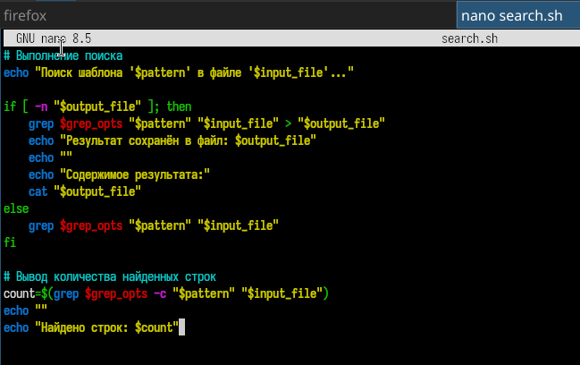
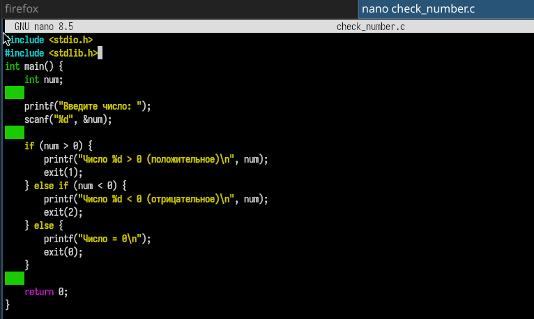
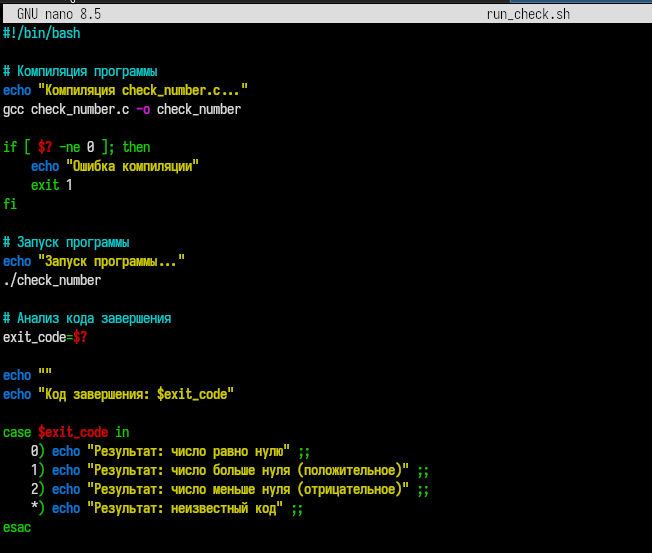
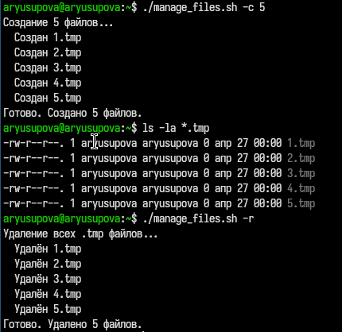

---
## Front matter
title: "Отчёт по лабораторной работе №13"
subtitle: "Программирование в командном процессоре ОС UNIX. Ветвления и циклы"
author: "Юсупова Амина Руслановна"

## Generic otions
lang: ru-RU
toc-title: "Содержание"

## Bibliography
bibliography: bib/cite.bib
csl: _resources/csl/gost-r-7-0-5-2008-numeric.csl

## Pdf output format
toc: true # Table of contents
toc-depth: 2
lof: true # List of figures
lot: true # List of tables
fontsize: 12pt
linestretch: 1.5
papersize: a4
documentclass: scrreprt
## I18n polyglossia
polyglossia-lang:
  name: russian
  options:
  - spelling=modern
  - babelshorthands=true
polyglossia-otherlangs:
  name: english
## I18n babel
babel-lang: russian
babel-otherlangs: english
## Fonts
mainfont: IBM Plex Serif
romanfont: IBM Plex Serif
sansfont: IBM Plex Sans
monofont: IBM Plex Mono
mathfont: STIX Two Math
mainfontoptions: Ligatures=Common,Ligatures=TeX,Scale=0.94
romanfontoptions: Ligatures=Common,Ligatures=TeX,Scale=0.94
sansfontoptions: Ligatures=Common,Ligatures=TeX,Scale=MatchLowercase,Scale=0.94
monofontoptions: Scale=MatchLowercase,Scale=0.94,FakeStretch=0.9
mathfontoptions: ''

biblatex: true
biblio-style: "gost-numeric"
biblatexoptions:
  - parentracker=true
  - backend=biber
  - hyperref=auto
  - language=auto
  - autolang=other*
  - citestyle=gost-numeric
## Pandoc-crossref LaTeX customization
figureTitle: "Рис."
tableTitle: "Таблица"
listingTitle: "Листинг"
lofTitle: "Список иллюстраций"
lotTitle: "Список таблиц"
lolTitle: "Листинги"
## Misc options
indent: true
header-includes:
  - \usepackage{indentfirst}
  - \usepackage{float} # keep figures where there are in the text
  - \floatplacement{figure}{H} # keep figures where there are in the text
---

# Цель работы

Изучить основы программирования в оболочке ОС UNIX. Научится писать более сложные командные файлы с использованием логических управляющих конструкций и циклов.

# Теоретические сведения

## Команда `getopts`

Команда `getopts` используется в bash для разбора аргументов командной строки. Она позволяет обрабатывать опции (ключи) и их аргументы, что делает скрипты более гибкими и удобными для пользователя. Синтаксис:

```bash
while getopts "опции" переменная; do
    case $переменная in опция) действия ;;
    esac
done
```

**Управляющие конструкции bash**

|Конструкция	| Назначение |
|-------------|------------|
|if-then-else	| Условное выполнение команд |
| for	| Цикл с перебором списка значений| 
| while |	Цикл с предусловием|
|until	| Цикл с постусловием |
|case |	Множественное ветвление |

**Команды break и continue**
- break — прерывает выполнение цикла

- continue — прерывает текущую итерацию и переходит к следующей

**Команды true и false**
- true — всегда возвращает код завершения 0 (истина)

- false — всегда возвращает код завершения 1 (ложь)
# Выполнение лабораторной работы

## Задание 1

### 1. Создание рабочего файла и написание кода  

Для начала я создала рабочий файл ```search.sh```. А далее я написала скрипт, который при запуске будет искать в указанном файле нужные строки, определяемые ключом -p

{#fig:001 width=70%}

### 2. Исполняемый скрипт 

Теперь я делаю скрипт исполняемым, чтобы программа работала 

{#fig:002 width=70%}

### 3. Запуск скрипта 
Теперь я запускаю скрипт в командной строке

{#fig:003 width=70%}


## Задание 2

### 1. Создание рабочего файла и написание кода  

Для начала я создала рабочий файл ```check_number.c```. А далее я написала скрипт, который вводит число и определяет, является ли оно
больше нуля, меньше нуля или равно нулю.

{#fig:004 width=70%}

### 2. Создание командного файл 
Создаю командный файл ```run_check.sh```, где я написала скрипт для работы файла ```check_number.c```

{#fig:005 width=70%}

### 3. Запуск скрипта 
Теперь я запускаю скрипт в командной строке

{#fig:006 width=70%}

Как видно на картинке программа выводит отрицательное или положительное число вводит пользователь. 

## Задание 3

### 1. Создание рабочего файла и написание кода  

Для начала я создала рабочий файл ```manage_files.sh```. А далее я написала скрипт, который создает указанное число файлов, пронумерованных последовательно.

{#fig:007 width=70%}

### 2. Исполняемый скрипт 

Теперь я делаю скрипт исполняемым, чтобы программа работала 

{#fig:008 width=70%}

### 3. Запуск скрипта 
Теперь я запускаю скрипт в командной строке

{#fig:009 width=70%}

Как видно на картинке программа создаёт файлы в каталоге, ищет их и удаляет

## Задание 4

### 1. Создание рабочего файла и написание кода  

Для начала я создала тестовые файлы. 

{#fig:010 width=70%}

### 2. Создание рабочего файла и написание скрипта  

Теперь я создаю рабочий файл и пишу скрипт, который  с помощью команды tar запаковывает в архив все файлы в указанной директории.

{#fig:011 width=70%}

### 3. Запуск скрипта 
Теперь я делаю файл исполняемым и запускаю скрипт в командной строке

{#fig:012 width=70%}

Как видно на картинке командный файл, который с помощью команды tar запаковывает в архив
все файлы в указанной директории, работает корректно. 


# Выводы 

В ходе выполнения 13 лабораторной работы я изучила основы программирования в оболочке ОС UNIX/Linux и получила практические навыки написания командных файлов с использованием логических управляющих конструкций, циклов и команды `getopts`.

# Ответы на контрольные вопросы

# Ответы на контрольные вопросы

## 1. Каково предназначение команды getopts?

Команда `getopts` предназначена для разбора аргументов командной строки в bash-скриптах. Она позволяет обрабатывать опции (ключи) и их аргументы, что делает скрипты более гибкими и удобными для пользователя.

**Основные особенности `getopts`:**
- Автоматически обрабатывает стандартные соглашения (опции с дефисом, группировка опций типа `-la`)
- Предоставляет встроенные переменные:
  - `OPTARG` — значение аргумента опции (если ожидается)
  - `OPTIND` — индекс следующего аргумента для обработки
- Обычно используется в цикле `while` с оператором `case`

**Пример использования:**
```bash
while getopts "i:o:p:Cn" opt; do
    case $opt in
        i) input_file="$OPTARG" ;;
        o) output_file="$OPTARG" ;;
        p) pattern="$OPTARG" ;;
        C) case_sensitive="C" ;;
        n) line_numbers="n" ;;
        *) usage ;;
    esac
done
```

## 2. Какое отношение метасимволы имеют к генерации имён файлов?
Метасимволы используются в bash для генерации имён файлов — это называется "подстановка имён файлов" (filename expansion или globbing). Shell автоматически заменяет шаблоны, содержащие метасимволы, на список имён файлов, которые соответствуют этому шаблону.

**Основные метасимволы для генерации имён файлов:**

|Метасимвол	| Описание	| Пример|
|-----------|-----------|-------|
|*| Любая строка (в том числе пустая)	|*.txt — все файлы с расширением .txt|
|?	| Любой один символ	file? | .txt — file1.txt, fileA.txt|
|[abc]	| Любой из указанных символов	| file[123].txt — file1.txt, file2.txt, file3.txt|
|[a-z]	|Любой символ в указанном диапазоне	|[a-z]* — все файлы, начинающиеся с буквы a-z|

Пример:

```bash
echo *.c          # выведет все файлы с расширением .c в текущей директории
ls [0-9]*         # покажет файлы, начинающиеся с цифры
```

### 3. Какие операторы управления действиями вы знаете?

|Оператор	| Назначение	| Пример|
|---------|-------------|-------|
|if-then-else	| Условное выполнение команд	| ```if [ -f file ]; then echo "exists"; else echo "not found"; fi```|
|for |	Цикл с перебором списка значений	| ```for i in 1 2 3; do echo $i; done```|
|while	| Цикл с предусловием (выполняется, пока условие истинно) |	```while [ $x -lt 5 ]; do echo $x; ((x++)); done```|
|until	| Цикл с постусловием (выполняется, пока условие ложно)|	```until [ $x -ge 5 ]; do echo $x; ((x++)); done```|
|case|	Множественное ветвление (аналог switch)	|```case $var in a) echo "A";; b) echo "B";; *) echo "other";; esac```|
|break	| Прерывание выполнения цикла |	break|
|continue|	Переход к следующей итерации цикла	|continue|
|exit	|Завершение скрипта с указанным кодом	| exit 1

4. Какие операторы используются для прерывания цикла?
5. 
Для прерывания цикла используются два оператора:

|Оператор	| Действие|
|---------|---------|
|break	| Полностью прерывает выполнение цикла. Управление передаётся командам, следующим за done|
|continue |	Прерывает только текущую итерацию цикла и переходит к следующей итерации|

*Пример:*

```bash
for i in 1 2 3 4 5; do
    if [ $i -eq 3 ]; then
        continue    # пропускаем число 3
    fi
    if [ $i -eq 5 ]; then
        break       # выходим из цикла на числе 5
    fi
    echo $i
done
# Вывод: 1 2 4
```

## 5. Для чего нужны команды false и true?
|Команда |	Код завершения	| Назначение|
|--------|------------------|-----------|
|true	| 0 (истина) |	Всегда возвращает успешный код завершения. Используется для создания бесконечных циклов и в условных конструкциях, где требуется всегда истинное условие|
|false	| 1 (ложь)	|Всегда возвращает код ошибки. Используется для создания циклов, которые никогда не выполняются, или в комбинации с until|

*Примеры использования:*

```bash
# Бесконечный цикл (будет работать, пока не прервут)
while true; do
    echo "Работает..."
    sleep 1
done

# Цикл, который не выполнится ни разу
while false; do
    echo "Это никогда не будет выведено"
done

# Цикл until с false (бесконечный)
until false; do
    echo "Это бесконечный цикл"
done
```

## 6. Что означает строка if test -f man$s/$i.$s, встреченная в командном файле?

Данная строка проверяет, существует ли файл с именем, составленным из значений переменных.

Разбор конструкции:

|Часть	|Описание|
|-------|--------|
|test -f	|Проверяет, является ли указанный путь обычным файлом|
|man$s/	| Директория, где $s подставляется (например, man1/)|
|$i.$s	|Имя файла, где $i и $s подставляются (например, 1.doc)|

Что делает:

- Подставляет значение переменной $s вместо man$s

- Подставляет значение переменной $i вместо $i

- Подставляет значение переменной $s вместо последнего $s

- Проверяет, существует ли файл по полученному пути

*Пример:*

```bash
# Если s="doc", i="1"
# то строка превращается в: if test -f man1/1.doc
# Проверяется существование файла man1/1.doc
```

## 7. Объясните различия между конструкциями while и until.

|Характеристика|	while	| until|
|--------------|--------|------|
|Условие выполнения|	Выполняется, пока условие истинно	|Выполняется, пока условие ложно|
|Когда прекращается	|Когда условие становится ложным	|Когда условие становится истинным|
|Смысл	|"Пока (условие верно) — делай"	|"До тех пор, пока (условие не станет верным) — делай"

Сравнение на примере:

```bash
# while: выполняется, пока x < 5
x=1
while [ $x -lt 5 ]; do
    echo "while: x=$x"
    ((x++))
done
# Вывод: x=1, x=2, x=3, x=4

# until: выполняется, пока x не станет >= 5
x=1
until [ $x -ge 5 ]; do
    echo "until: x=$x"
    ((x++))
done
# Вывод: x=1, x=2, x=3, x=4
```

Ключевое различие:

- while продолжает цикл, пока условие истинно

- until продолжает цикл, пока условие ложно (то есть до тех пор, пока условие не станет истинным)

Оба цикла могут давать одинаковый результат при использовании противоположных условий:

```bash
while [ $x -lt 5 ]   # эквивалентно
until [ $x -ge 5 ]   # потому что "меньше 5" = "не больше или равно 5"
```
