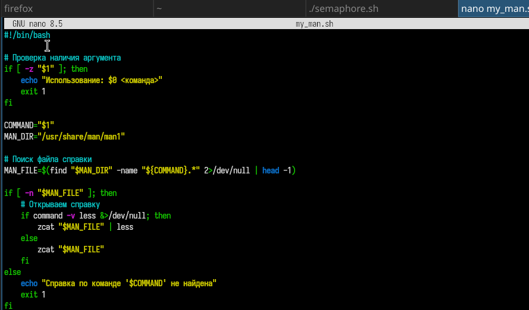
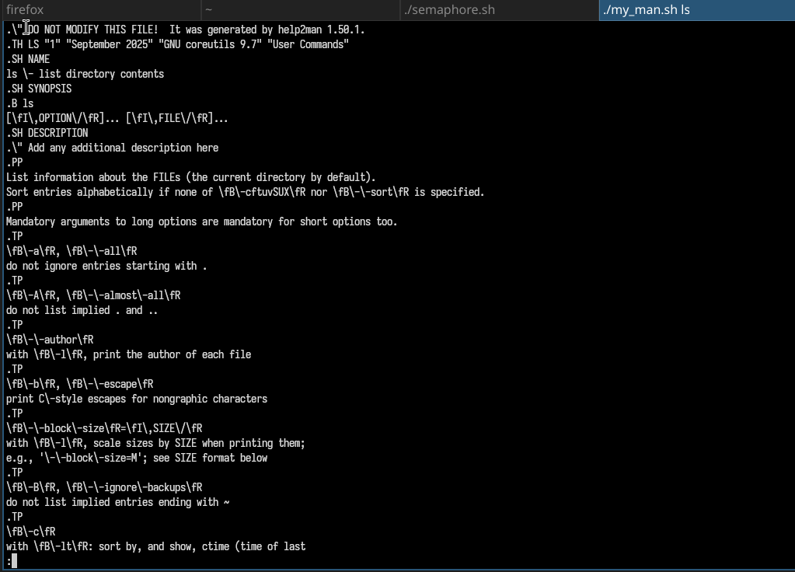
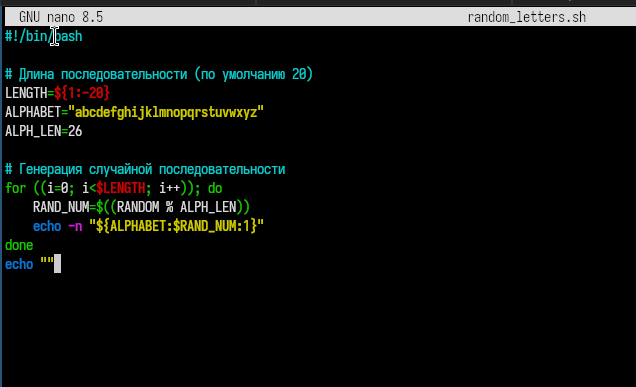

---
## Author
author:
  name: Юсупова Амина Руслановна
  affiliation:
    - name: Российский университет дружбы народов
      country: Российская Федерация
      postal-code: 117198
      city: Москва
      address: ул. Миклухо-Маклая, д. 6
lang: ru
format:
  pdf:
    documentclass: scrartcl
    latex-engine: xelatex
    mainfont: "Liberation Serif"
    sansfont: "Liberation Sans"
    monofont: "Liberation Mono"
    include-in-header:
      text: |
        \usepackage{fontspec}
        \setmainfont{Liberation Serif}
        \setsansfont{Liberation Sans}
        \setmonofont{Liberation Mono}
  pptx:
    toc: false
## Title
title: Лабораторная работа №14
subtitle: Программирование в командном процессоре ОС UNIX. Расширенное программирование
license: CC BY

---

# Цели и задачи лабораторной работы

## Цель работы

Изучить основы программирования в оболочке ОС UNIX. Научиться писать более сложные командные файлы с использованием логических управляющих конструкций и циклов.

## Задачи лабораторной работы

1. Написать скрипт по механизму семафоров
2. Написать скрипт - аналог команды man
3. Написать скрипт - генерация случайной последовательности букв

# Выполнение лабораторной работы

## Задание 1

### Создание рабочего файла и написание кода  

{#fig:001 width=70%}

### Запуск скрипта 

{#fig:002 width=70%}

## Задание 2

### Создание рабочего файла и написание кода  

{#fig:003 width=70%}

### Запуск скрипта 

{#fig:004 width=70%}

### Работа man

{#fig:005 width=70%}

## Задание 3

### Создание рабочего файла и написание кода  

{#fig:006 width=70%}

### Запуск скрипта

{#fig:007 width=70%}

# Выводы по проделанной работе

## Выводы 

В ходе выполнения лабораторной работы 14 я изучила основы программирования в оболочке ОС UNIX/Linux и получила практические навыки написания более сложных командных файлов с использованием логических управляющих конструкций, циклов и механизмов взаимодействия процессов.
