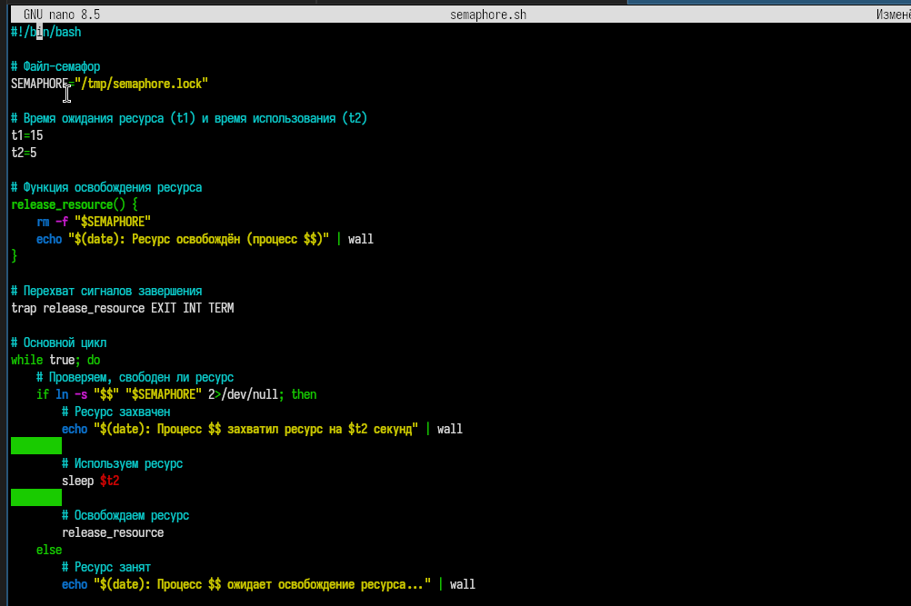
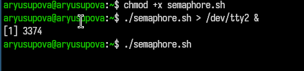
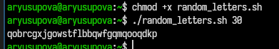

---
## Front matter
title: "Отчёт по лабораторной работе №14"
subtitle: "Программирование в командном процессоре ОС UNIX. Расширенное программирование"
author: "Юсупова Амина Руслановна"

## Generic otions
lang: ru-RU
toc-title: "Содержание"

## Bibliography
bibliography: bib/cite.bib
csl: _resources/csl/gost-r-7-0-5-2008-numeric.csl

## Pdf output format
toc: true # Table of contents
toc-depth: 2
lof: true # List of figures
lot: true # List of tables
fontsize: 12pt
linestretch: 1.5
papersize: a4
documentclass: scrreprt
## I18n polyglossia
polyglossia-lang:
  name: russian
  options:
  - spelling=modern
  - babelshorthands=true
polyglossia-otherlangs:
  name: english
## I18n babel
babel-lang: russian
babel-otherlangs: english
## Fonts
mainfont: IBM Plex Serif
romanfont: IBM Plex Serif
sansfont: IBM Plex Sans
monofont: IBM Plex Mono
mathfont: STIX Two Math
mainfontoptions: Ligatures=Common,Ligatures=TeX,Scale=0.94
romanfontoptions: Ligatures=Common,Ligatures=TeX,Scale=0.94
sansfontoptions: Ligatures=Common,Ligatures=TeX,Scale=MatchLowercase,Scale=0.94
monofontoptions: Scale=MatchLowercase,Scale=0.94,FakeStretch=0.9
mathfontoptions: ''

biblatex: true
biblio-style: "gost-numeric"
biblatexoptions:
  - parentracker=true
  - backend=biber
  - hyperref=auto
  - language=auto
  - autolang=other*
  - citestyle=gost-numeric
## Pandoc-crossref LaTeX customization
figureTitle: "Рис."
tableTitle: "Таблица"
listingTitle: "Листинг"
lofTitle: "Список иллюстраций"
lotTitle: "Список таблиц"
lolTitle: "Листинги"
## Misc options
indent: true
header-includes:
  - \usepackage{indentfirst}
  - \usepackage{float} # keep figures where there are in the text
  - \floatplacement{figure}{H} # keep figures where there are in the text
---

# Цель работы

Изучить основы программирования в оболочке ОС UNIX. Научиться писать более сложные командные файлы с использованием логических управляющих конструкций и циклов.

# Теоретические сведения

## Команда `getopts`

Команда `getopts` используется в bash для разбора аргументов командной строки. Она позволяет обрабатывать опции (ключи) и их аргументы, что делает скрипты более гибкими и удобными для пользователя. Синтаксис:

```bash
while getopts "опции" переменная; do
    case $переменная in опция) действия ;;
    esac
done
```

**Управляющие конструкции bash**

|Конструкция	| Назначение |
|-------------|------------|
|if-then-else	| Условное выполнение команд |
| for	| Цикл с перебором списка значений| 
| while |	Цикл с предусловием|
|until	| Цикл с постусловием |
|case |	Множественное ветвление |

**Команды break и continue**
- break — прерывает выполнение цикла

- continue — прерывает текущую итерацию и переходит к следующей

**Команды true и false**
- true — всегда возвращает код завершения 0 (истина)

- false — всегда возвращает код завершения 1 (ложь)
  
# Выполнение лабораторной работы

## Задание 1

### 1. Создание рабочего файла и написание кода  

Для начала я создала рабочий файл ```semaphone.sh```. А далее я написала скрипт, который при запуске будет работать по механизму семафоров

{#fig:001 width=70%}

### 2. Исполняемый скрипт и запуск

Теперь я делаю скрипт исполняемым, чтобы программа работала. И запускаю его

{#fig:002 width=70%}

## Задание 2

### 1. Создание рабочего файла и написание кода  

Для начала я создала рабочий файл ```my_man.sh```. А далее я написала скрипт, который является аналогом команды man в терминале.

{#fig:003 width=70%}

### 2. Запуск скрипта 

Сначала делаю файл исполняемым и потом запускаю 

{#fig:004 width=70%}

Вы можете увидеть результат запуска программы 

{#fig:005 width=70%}

## Задание 3

### 1. Создание рабочего файла и написание кода  

Для начала я создала рабочий файл ```random_letters.sh```. А далее я написала скрипт, который на вход получает количество символов, а далее из рандомных букв составляет слово.

{#fig:007 width=70%}

### 2. Исполняемый скрипт и запуск

Теперь я делаю скрипт исполняемым и запускаю

{#fig:008 width=70%}

# Выводы

В ходе выполнения лабораторной работы 14 я изучила основы программирования в оболочке ОС UNIX/Linux и получила практические навыки написания более сложных командных файлов с использованием логических управляющих конструкций, циклов и механизмов взаимодействия процессов.

# Ответы на контрольные вопросы

## 1. Найдите синтаксическую ошибку в следующей строке:

```bash
while [\\$1 != "exit"]
```

**Ошибки:**

- Лишний обратный слеш перед $1: \\$1 — вместо этого должно быть "$1" или $1

- Отсутствует пробел после [ и перед ]

- Отсутствует закрывающая квадратная скобка ]

**Исправленный вариант:**

```bash
while [ "$1" != "exit" ]
```
## 2. Как объединить (конкатенация) несколько строк в одну?

**Способы конкатенации строк в bash:**

```bash
# Способ 1: простой перебор (самый распространённый)
str1="Hello"
str2="World"
result="$str1 $str2"      # "Hello World"

# Способ 2: использование оператора +=
result=""
for word in Hello World; do
    result+="$word "
done
echo "$result"            # "Hello World "

# Способ 3: использование printf
result=$(printf "%s" "$str1" "$str2")

# Способ 4: удаление символов новой строки
lines=$(cat file.txt)
result="${lines//$'\n'/ }"   # замена перевода строки на пробел
```

## 3. Найдите информацию об утилите seq. Какими иными способами можно реализовать её функционал при программировании на bash?

- Утилита seq — генерирует последовательность чисел.

```bash
seq 1 5        # 1 2 3 4 5
seq 1 2 10     # 1 3 5 7 9
```

**Альтернативные способы без seq:**

```bash
# Способ 1: цикл for (встроенный в bash)
for i in {1..5}; do
    echo $i
done

# Способ 2: цикл while
i=1
while [ $i -le 5 ]; do
    echo $i
    ((i++))
done

# Способ 3: команда eval
eval echo {1..5}

# Способ 4: использование expr
i=1
while [ $i -le 5 ]; do
    echo $i
    i=$(expr $i + 1)
done
```

## 4. Какой результат даст вычисление выражения ((10 / 3))?

**Результат:**  3

**Пояснение:** В bash оператор (( )) выполняет целочисленное деление. Остаток отбрасывается.

```bash
echo $((10 / 3))   # выведет 3
echo $((10 % 3))   # выведет 1 (остаток)
```

## 5. Укажите кратко основные отличия командной оболочки zsh от bash.

|Характеристика	|bash	|zsh|
|---------------|-------|---|
|Автодополнение	|Базовое (Tab)	|Расширенное, с подсказками|
|Массивы	|Индексация с 0	|Индексация с 1|
|Глобализация	|Стандартная	|** (рекурсивный поиск)|
|Проверка орфографии	|Нет	|Есть (исправление опечаток)|
|Промпт	|Ограниченные возможности	|Расширенные настройки|
|Совместимость	|POSIX-совместимая	|Не полностью совместима с POSIX|
|Интерактивность	|Меньше возможностей|	Больше возможностей|

## 6. Проверьте, верен ли синтаксис данной конструкции

```bash
for ((a=1; a <= LIMIT; a++))
```
**Ошибка:** Отсутствует закрывающая двойная скобка ))

**Исправленный вариант:**

```bash
for ((a=1; a <= LIMIT; a++))
#                                 ^^ должны быть две закрывающие скобки
# В коде выше показана только одна ) в конце строки
```

**Правильно:**

```bash
for ((a=1; a <= LIMIT; a++)); do
    echo $a
done
```

## 7. Сравните язык bash с какими-либо языками программирования. Какие преимущества у bash по сравнению с ними? Какие недостатки?

**Сравнение с Python**

|Характеристика	|bash	|Python|
|---------------|-------|------|
|Предназначение	|Управление системой, автоматизация	|Универсальное программирование|
|Синтаксис	|Специфичный, много метасимволов|	Читаемый, интуитивный|
|Скорость	|Быстрый запуск	|Медленнее из-за интерпретации|
|Типизация	|Слабая (всё строки)	|Динамическая, строгая|
|Работа с процессами	|Встроенная	|Через модули (subprocess)|
|Массивы	|Ограниченные возможности|	Полноценные структуры данных|

**Преимущества bash**
- Встроенные команды для работы с файлами и процессами

- Лёгкость запуска других программ

- Быстрый старт (нет загрузки интерпретатора)

- Естественность для системного администрирования

**Недостатки bash**
- Сложный синтаксис (пробелы имеют значение, много метасимволов)

- Нет поддержки плавающей запятой

- Нет структур данных (массивы ограничены)

- Сложная отладка

- Медленная обработка больших объёмов текста

- Ограниченные возможности для сложной бизнес-логики