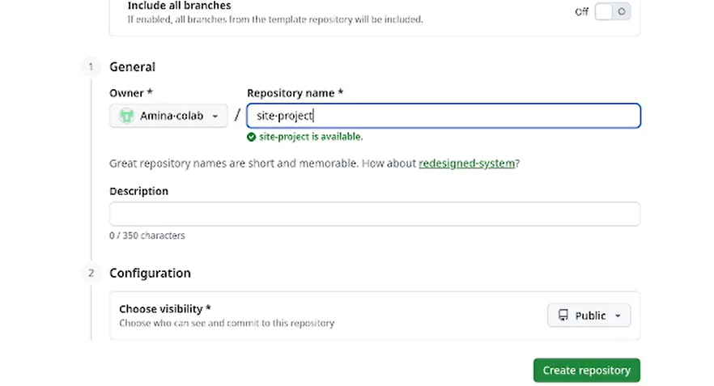
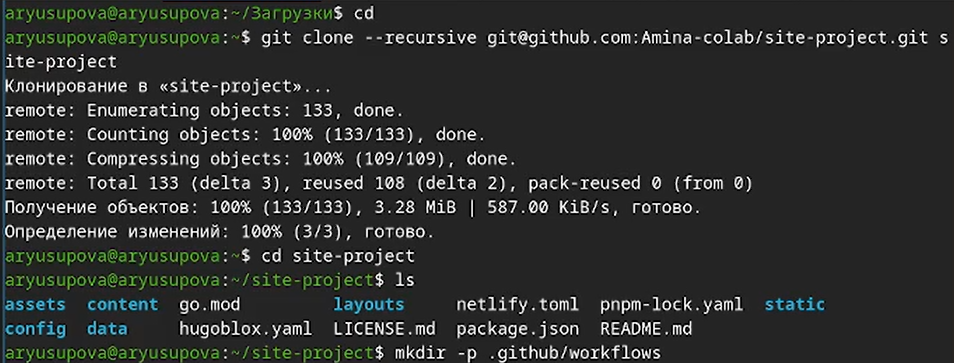
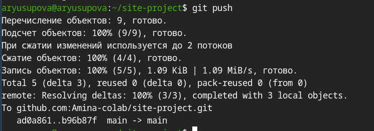

---
## Author
author:
  name: Юсупова Амина Руслановна
  affiliation:
    - name: Российский университет дружбы народов
      country: Российская Федерация
      postal-code: 117198
      city: Москва
      address: ул. Миклухо-Маклая, д. 6
lang: ru
format:
  pdf:
    documentclass: scrartcl
    latex-engine: xelatex
    mainfont: "Liberation Serif"
    sansfont: "Liberation Sans"
    monofont: "Liberation Mono"
    include-in-header:
      text: |
        \usepackage{fontspec}
        \setmainfont{Liberation Serif}
        \setsansfont{Liberation Sans}
        \setmonofont{Liberation Mono}
  pptx:
    toc: false
## Title
title: "Отчёт по 1 этапу проекта"
subtitle: Сайт научного работника
license: CC BY
---

# Цели и задачи
## Цель лабораторной работы

Подготовить репозиторий на основе шаблона. Ознакомиться с генератором сайтов hugo.

# Выполнение лабораторной работы

## Установка Hugo

{ #fig:001 width=70% height=70% }

## Создание репозитория на GitHub

{ #fig:002 width=70% height=70% }

## Клонирование репозитория и подготовка структуры

{ #fig:003 width=70% height=70% }

## Настройка конфигурации Hugo

{ #fig:004 width=70% height=70% }

## Фиксация изменений в Git

{ #fig:005 width=70% height=70% }

## Выбор источника публикации GitHub Pages

{ #fig:006 width=70% height=70% }

## Отправка изменений на GitHub
{ #fig:007 width=70% height=70% }

## Результат публикации

{ #fig:008 width=70% height=70% }

## Внешний вид заготовки сайта

{ #fig:009 width=70% height=70% }

# Выводы

## Резултат по проделанной работе 

Подготовили репозиторий и установили hugo. 

