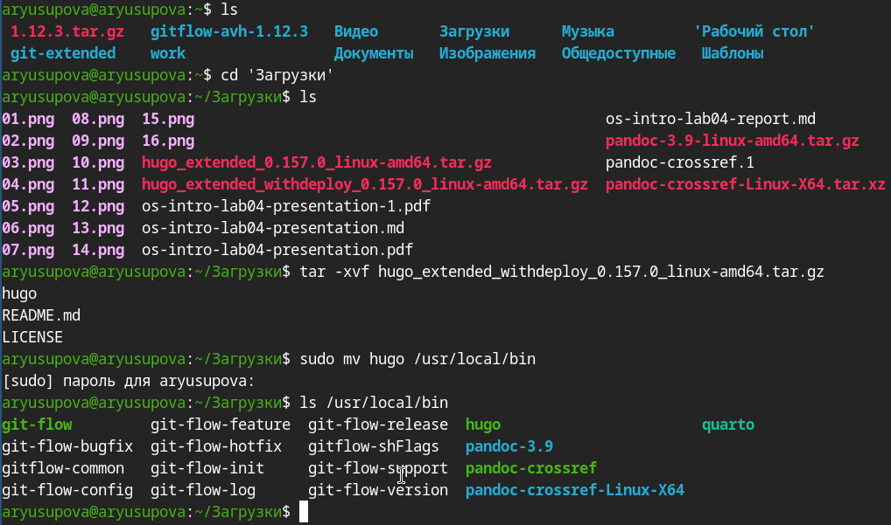
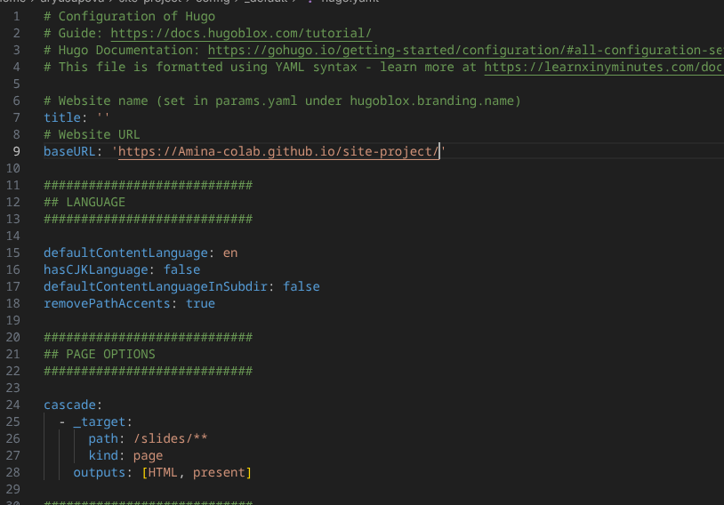
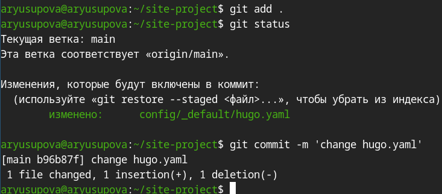
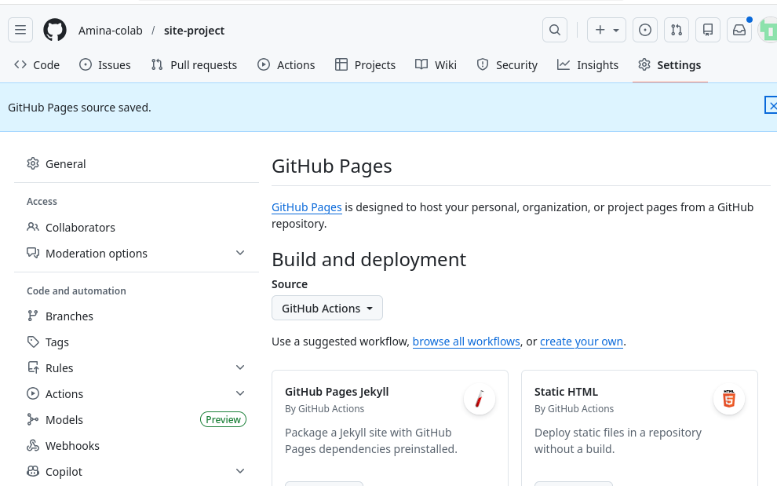
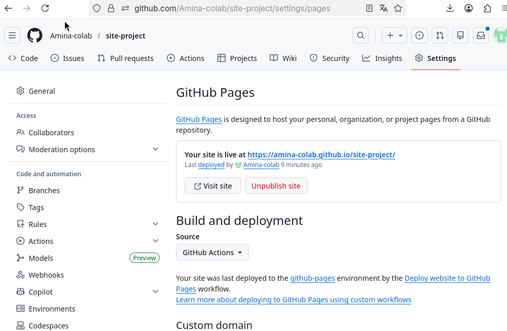

---
## Front matter
title: "Отчёт по 1 этапу проекта"
subtitle: "Сайт научного работника"
author: "Юсупова Амина Руслановна"

## Generic otions
lang: ru-RU
toc-title: "Содержание"

## Bibliography
bibliography: bib/cite.bib
csl: _resources/csl/gost-r-7-0-5-2008-numeric.csl

## Pdf output format
toc: true # Table of contents
toc-depth: 2
lof: true # List of figures
lot: true # List of tables
fontsize: 12pt
linestretch: 1.5
papersize: a4
documentclass: scrreprt
## I18n polyglossia
polyglossia-lang:
  name: russian
  options:
  - spelling=modern
  - babelshorthands=true
polyglossia-otherlangs:
  name: english
## I18n babel
babel-lang: russian
babel-otherlangs: english
## Fonts
mainfont: IBM Plex Serif
romanfont: IBM Plex Serif
sansfont: IBM Plex Sans
monofont: IBM Plex Mono
mathfont: STIX Two Math
mainfontoptions: Ligatures=Common,Ligatures=TeX,Scale=0.94
romanfontoptions: Ligatures=Common,Ligatures=TeX,Scale=0.94
sansfontoptions: Ligatures=Common,Ligatures=TeX,Scale=MatchLowercase,Scale=0.94
monofontoptions: Scale=MatchLowercase,Scale=0.94,FakeStretch=0.9
mathfontoptions: ''

biblatex: true
biblio-style: "gost-numeric"
biblatexoptions:
  - parentracker=true
  - backend=biber
  - hyperref=auto
  - language=auto
  - autolang=other*
  - citestyle=gost-numeric
## Pandoc-crossref LaTeX customization
figureTitle: "Рис."
tableTitle: "Таблица"
listingTitle: "Листинг"
lofTitle: "Список иллюстраций"
lotTitle: "Список таблиц"
lolTitle: "Листинги"
## Misc options
indent: true
header-includes:
  - \usepackage{indentfirst}
  - \usepackage{float} # keep figures where there are in the text
  - \floatplacement{figure}{H} # keep figures where there are in the text
---

# Цель работы
Подготовить репозиторий на основе шаблона. Ознакомиться с генератором сайтов hugo.

# Выполнение работы

## Установка Hugo

Скачаны два варианта Hugo версии 0.157.0: обычная расширенная (extended) и расширенная с поддержкой deploy. Выбрана версия withdeploy (включает все функции extended), архив распакован, исполняемый файл hugo перемещён в системную директорию /usr/local/bin с помощью sudo. Проверено наличие файла в списке программ.

{ #fig:001 width=70% height=70% }

## Создание репозитория на GitHub

В аккаунте Amina-colab создан новый публичный репозиторий с именем site-project. Репозиторий будет использоваться для хранения исходных файлов сайта и его публикации через GitHub Pages.

{ #fig:002 width=70% height=70% }

## Клонирование репозитория и подготовка структуры
Репозиторий склонирован на локальную машину по SSH. После перехода в каталог site-project создана папка .github/workflows – в ней будет размещён конфигурационный файл для автоматической сборки и развёртывания сайта через GitHub Actions.

{ #fig:003 width=70% height=70% }

## Настройка конфигурации Hugo
В файле config/_default/hugo.yaml изменён параметр baseURL на адрес будущего сайта: https://Amina-colab.github.io/site-project/. Это необходимо для корректной генерации ссылок при публикации на GitHub Pages.

{ #fig:004 width=70% height=70% }

## Фиксация изменений в Git
Изменённый файл hugo.yaml добавлен в индекс (git add) и выполнен коммит с сообщением change hugo.yaml. Статус показывает, что изменения готовы к отправке.

{ #fig:005 width=70% height=70% }

## Выбор источника публикации GitHub Pages
В настройках репозитория в разделе Pages выбран вариант GitHub Actions в качестве источника сборки и развёртывания. Это позволит использовать автоматический workflow для публикации сайта.

{ #fig:006 width=70% height=70% }

## Отправка изменений на GitHub
Выполнена команда git push, локальные коммиты отправлены в удалённый репозиторий. Это запустит процесс сборки сайта на стороне GitHub.

{ #fig:007 width=70% height=70% }

## Результат публикации
Сайт успешно развёрнут и доступен по адресу https://amina-colab.github.io/site-project/. В интерфейсе GitHub Pages отображается информация о последнем деплое и среде github-pages.

{ #fig:008 width=70% height=70% }

## Внешний вид заготовки сайта
По указанному URL открывается стартовая страница, сгенерированная шаблоном Hugo Academic Theme. Отображается тестовое содержимое (имя, профессиональное резюме), которое в дальнейшем будет заменено на собственные данные.

{ #fig:009 width=70% height=70% }

# Выводы
Подготовили репозиторий и установили hugo. 

