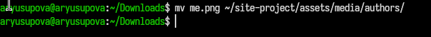
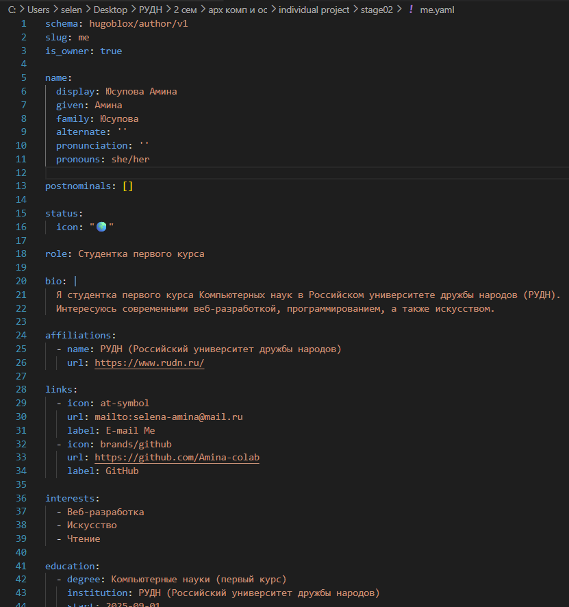
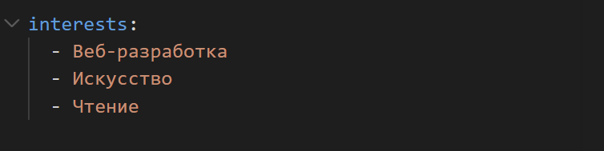
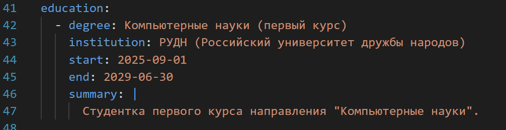
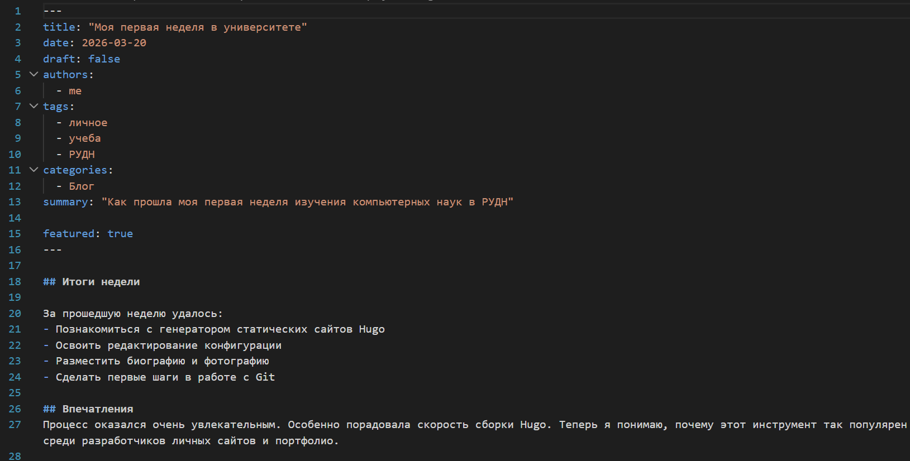
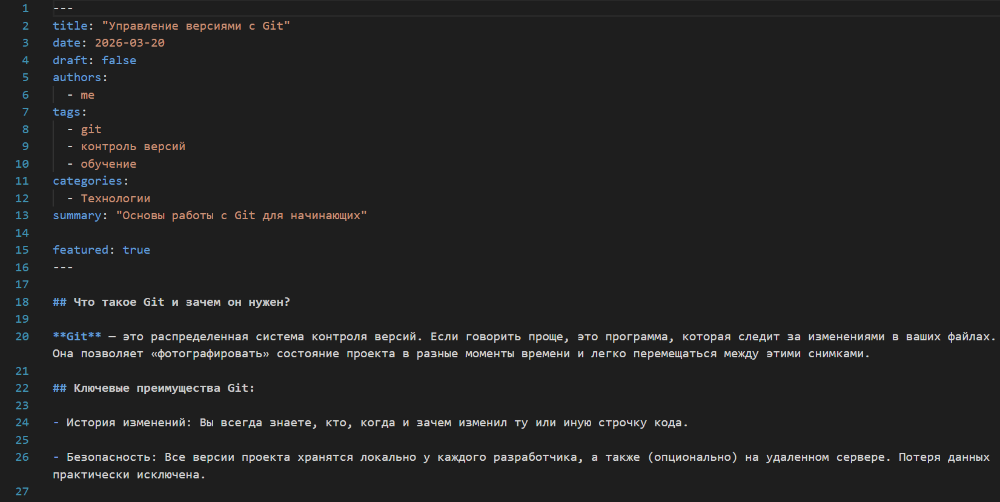
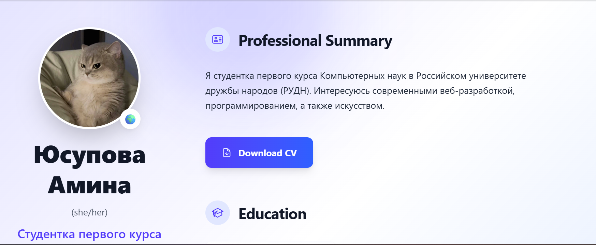

---
## Author
author:
  name: Юсупова Амина Руслановна
  affiliation:
    - name: Российский университет дружбы народов
      country: Российская Федерация
      postal-code: 117198
      city: Москва
      address: ул. Миклухо-Маклая, д. 6
lang: ru
format:
  pdf:
    documentclass: scrartcl
    latex-engine: xelatex
    mainfont: "Liberation Serif"
    sansfont: "Liberation Sans"
    monofont: "Liberation Mono"
    include-in-header:
      text: |
        \usepackage{fontspec}
        \setmainfont{Liberation Serif}
        \setsansfont{Liberation Sans}
        \setmonofont{Liberation Mono}
  pptx:
    toc: false
## Title
title: "Отчёт по 2 этапу проекта"
subtitle: Сайт научного работника
license: CC BY
---

# Цели и задачи
## Цель лабораторной работы

Добавить к сайту персональные данные: фотографию, биографию, информацию об интересах и образовании, а также опубликовать два поста.

# Задание

1. Разместить фотографию владельца сайта.
2. Разместить краткое описание владельца сайта (Biography).
3. Добавить информацию об интересах (Interests).
4. Добавить информацию об образовании (Education).
5. Сделать пост по прошедшей неделе.
6. Добавить пост на тему "Управление версиями. Git" или "Непрерывная интеграция и непрерывное развертывание (CI/CD)".

# Выполнение этапа проекта

## 1. Размещение фотографии владельца сайта

{ #fig:001 width=70% height=70% }

## 2. Добавление информации о владельце сайта

{ #fig:002 width=70% height=70% }

## 3. Добавление информации об интересах

{ #fig:003 width=70% height=70% }

## 4. Добавление информации об образовании

{ #fig:004 width=70% height=70% }

## 5. Создание поста по прошедшей неделе

{ #fig:005 width=70% height=70% }

## 6. Создание поста на выбранную тему

{ #fig:006 width=70% height=70% }

## Конечный вид сайта

{ #fig:007 width=70% height=70% }

# Выводы

В ходе выполнения второго этапа индивидуального проекта на сайт добавлена персональная информация и два тематических поста.
