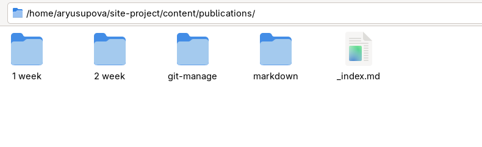
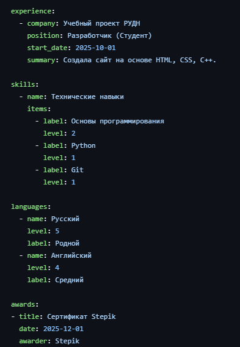
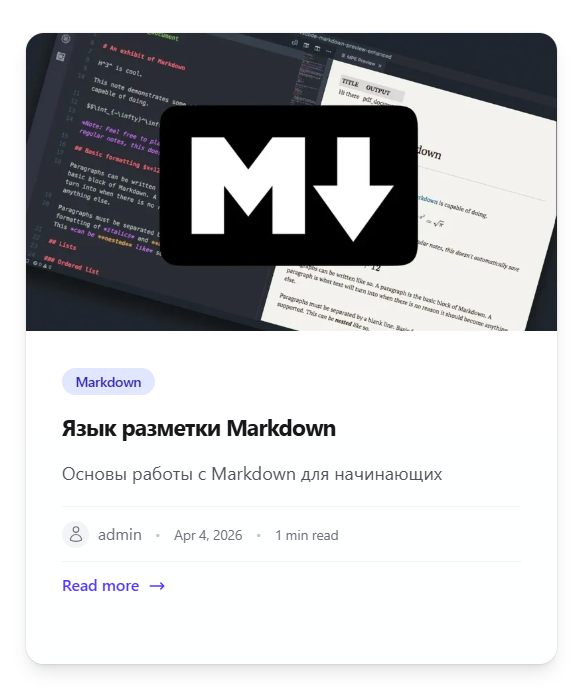

---
## Author
author:
  name: Юсупова Амина Руслановна
  affiliation:
    - name: Российский университет дружбы народов
      country: Российская Федерация
      postal-code: 117198
      city: Москва
      address: ул. Миклухо-Маклая, д. 6
lang: ru
format:
  pdf:
    documentclass: scrartcl
    latex-engine: xelatex
    mainfont: "Liberation Serif"
    sansfont: "Liberation Sans"
    monofont: "Liberation Mono"
    include-in-header:
      text: |
        \usepackage{fontspec}
        \setmainfont{Liberation Serif}
        \setsansfont{Liberation Sans}
        \setmonofont{Liberation Mono}
  pptx:
    toc: false
## Title
title: "Отчёт по 3 этапу проекта"
subtitle: Сайт научного работника
license: CC BY
---

# Цели и задачи
## Цель лабораторной работы

Добавить к сайту список достижений, сделать пост по прошедшей неделе, добавить пост на выбранную тему.

# Задание

 1. Добавить информацию о навыках (Skills)
 2. Добавить информацию об опыте (Experience)
 3. Добавить информацию о достижениях (Accomplishments)
 4. Сделать пост по прошедшей неделе
 5. Добавить пост на тему "Язык разметки Markdown".

# Выполнение этапа проекта

## 1. Создание необходимых папок 

{ #fig:001 width=70% height=70% }

## 2. Добавление информации о достижениях, навыках и опыте

{ #fig:002 width=70% height=70% }

## 3. Создание поста по прошедшей неделе 

{ #fig:003 width=70% height=70% }

## 4. Создание поста на выбранную тему

{ #fig:004 width=70% height=70% }

# Выводы по проделанной работе 

## Выводы

В ходе выполнения третьего этапа индивидуального проекта на сайт добавлена персональная информация о достижениях, навыках, опыте и два тематических поста.

