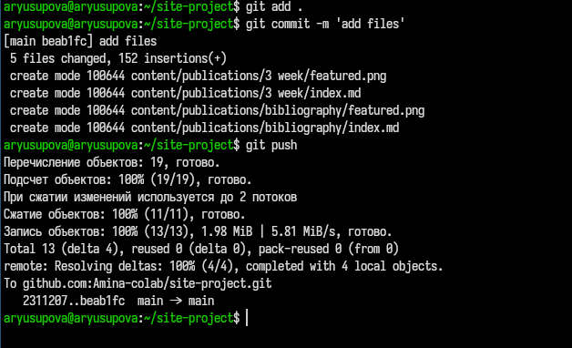
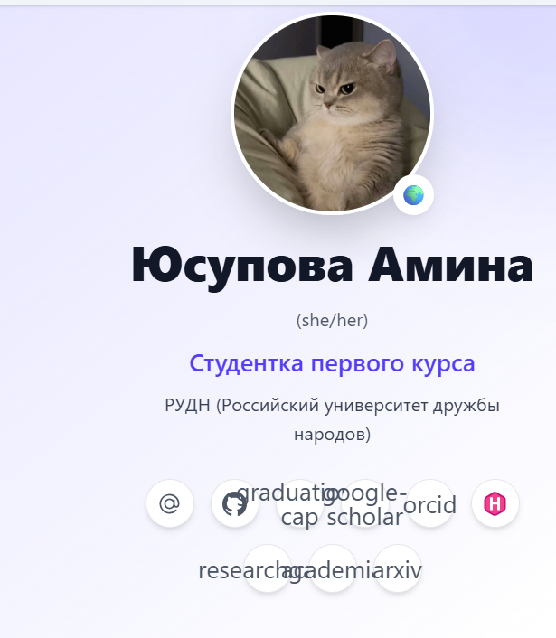
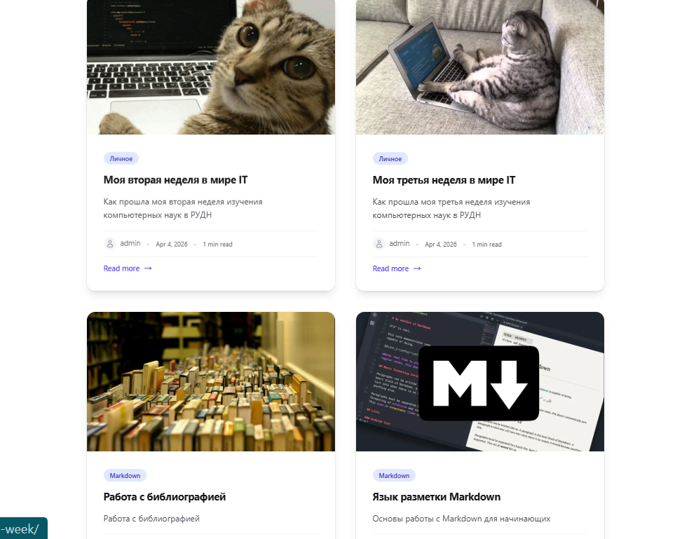

---
## Front matter
title: "Отчёт по 4 этапу проекта"
subtitle: "Сайт научного работника"
author: "Юсупова Амина Руслановна"

## Generic otions
lang: ru-RU
toc-title: "Содержание"

## Bibliography
bibliography: bib/cite.bib
csl: _resources/csl/gost-r-7-0-5-2008-numeric.csl

## Pdf output format
toc: true # Table of contents
toc-depth: 2
lof: true # List of figures
lot: true # List of tables
fontsize: 12pt
linestretch: 1.5
papersize: a4
documentclass: scrreprt
## I18n polyglossia
polyglossia-lang:
  name: russian
  options:
  - spelling=modern
  - babelshorthands=true
polyglossia-otherlangs:
  name: english
## I18n babel
babel-lang: russian
babel-otherlangs: english
## Fonts
mainfont: IBM Plex Serif
romanfont: IBM Plex Serif
sansfont: IBM Plex Sans
monofont: IBM Plex Mono
mathfont: STIX Two Math
mainfontoptions: Ligatures=Common,Ligatures=TeX,Scale=0.94
romanfontoptions: Ligatures=Common,Ligatures=TeX,Scale=0.94
sansfontoptions: Ligatures=Common,Ligatures=TeX,Scale=MatchLowercase,Scale=0.94
monofontoptions: Scale=MatchLowercase,Scale=0.94,FakeStretch=0.9
mathfontoptions: ''

biblatex: true
biblio-style: "gost-numeric"
biblatexoptions:
  - parentracker=true
  - backend=biber
  - hyperref=auto
  - language=auto
  - autolang=other*
  - citestyle=gost-numeric
## Pandoc-crossref LaTeX customization
figureTitle: "Рис."
tableTitle: "Таблица"
listingTitle: "Листинг"
lofTitle: "Список иллюстраций"
lotTitle: "Список таблиц"
lolTitle: "Листинги"
## Misc options
indent: true
header-includes:
  - \usepackage{indentfirst}
  - \usepackage{float} # keep figures where there are in the text
  - \floatplacement{figure}{H} # keep figures where there are in the text
---

# Цель работы

Добавить к сайту ссылки на научные и библиометрические ресурсы, сделать пост по прошедшей неделе, добавить тематичексий пост

# Задание
1. Зарегистрироваться на соответствующих ресурсах и разместить на них ссылки на сайте
2. Сделать пост по прошедшей неделе
3. Добавить пост на тему "Работа с библиографией"

# Выполнение этапа проекта

## 1. Создание необходимых папок 

Для того чтобы опубликовать новые посты, я создала папки под названием `3 week` и `bibliography`, где в каждой папке хранится файл в формате markdown с текстом для публикации.

{ #fig:001 width=70% height=70% }

## 2. Создание поста по прошедшей неделе 

Создан пост, описывающий события прошедшей недели.

{ #fig:002 width=70% height=70% }

## 3. Создание поста на выбранную тему

Создан пост на тему "Работа с библиографией".

{ #fig:003 width=70% height=70% }

## 4. Добавление ссылок 

Я зарегистрировалась на соответствующих ресурсах и разместила на них ссылки на сайте

{ #fig:004 width=70% height=70% }

## 5. Добавление файлов на github

Все обновленные файлы я закинула в github

{ #fig:005 width=70% height=70% }

## 6. Конечный вид сайта 

{ #fig:006 width=70% height=70% }

##

{ #fig:007 width=70% height=70% }

# Выводы

В ходе выполнения четвертого этапа индивидуального проекта на сайт добавлены ссылки на необходимые ресурсы и два тематических поста.

