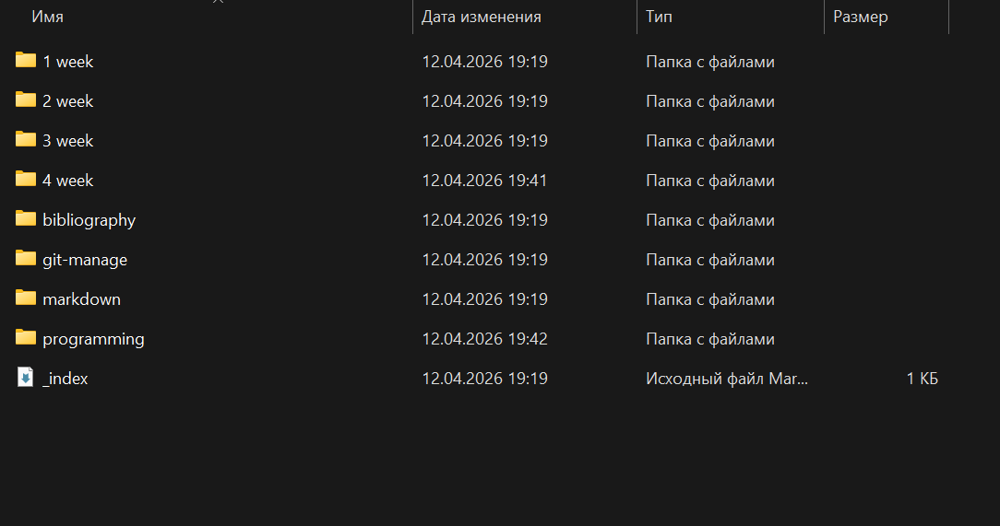
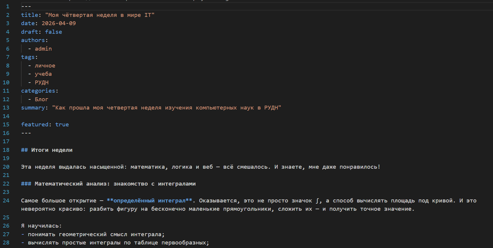
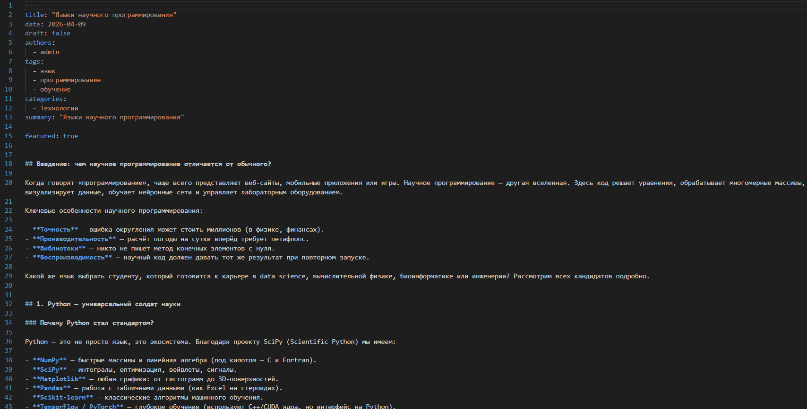
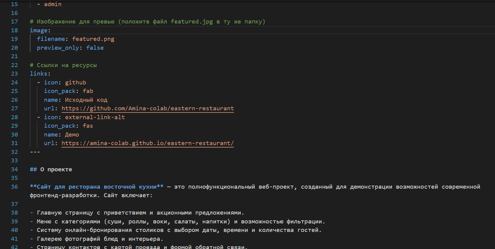
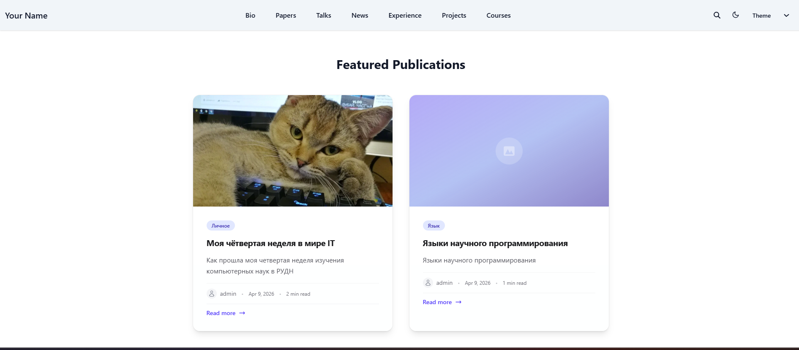

---
## Author
author:
  name: Юсупова Амина Руслановна
  affiliation:
    - name: Российский университет дружбы народов
      country: Российская Федерация
      postal-code: 117198
      city: Москва
      address: ул. Миклухо-Маклая, д. 6
lang: ru
format:
  pdf:
    documentclass: scrartcl
    latex-engine: xelatex
    mainfont: "Liberation Serif"
    sansfont: "Liberation Sans"
    monofont: "Liberation Mono"
    include-in-header:
      text: |
        \usepackage{fontspec}
        \setmainfont{Liberation Serif}
        \setsansfont{Liberation Sans}
        \setmonofont{Liberation Mono}
  pptx:
    toc: false
## Title
title: "Отчёт по 5 этапу проекта"
subtitle: Сайт научного работника
license: CC BY
---

# Цели и задачи
## Цель лабораторной работы

# Цель работы

Добавить к сайту тематический пост, пост по прошлой неделе, сделать записи для персональных проектов.

# Задание

1. Сделать записи для персональных проектов
2. Сделать пост по прошедшей неделе
3. Добавить пост на темук: "Языки научного программирования"

# Выполнение этапа проекта

## 1. Создание необходимых папок 

{ #fig:001 width=70% height=70% }

## 2. Создание поста по прошедшей неделе 

{ #fig:002 width=70% height=70% }

## 3. Создание поста на выбранную тему

{ #fig:003 width=70% height=70% }

## 4. Создание записи для персональных проектов

{ #fig:004 width=70% height=70% }

## 6. Конечный вид сайта 

{ #fig:006 width=70% height=70% }

# Выводы

В ходе выполнения пятого этапа индивидуального проекта на сайт добавлены два тематических поста и записи о персональных проектах.

