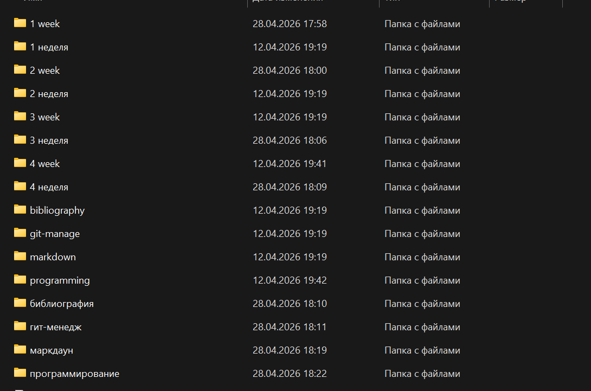
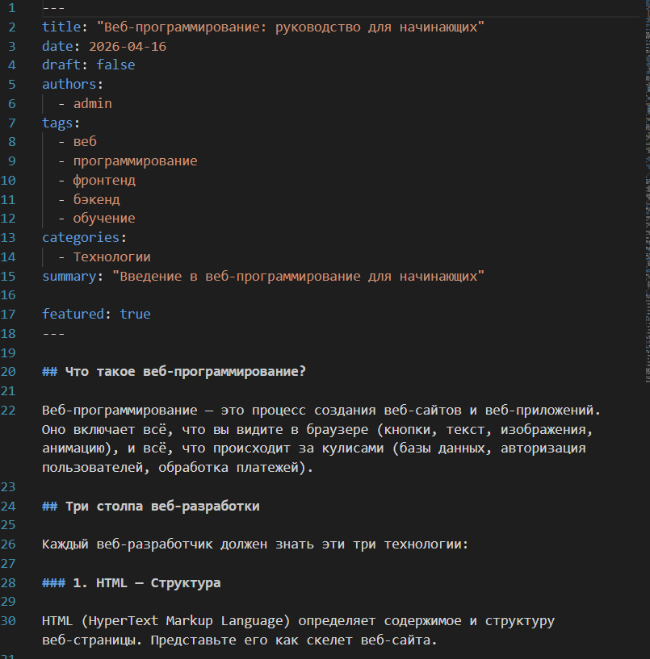
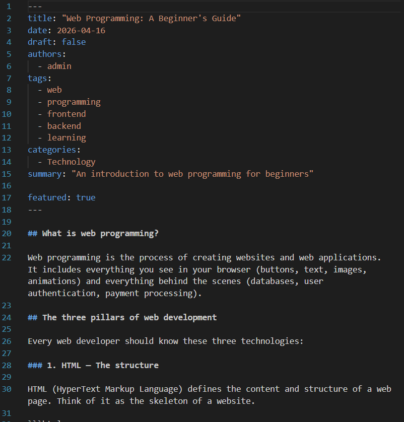
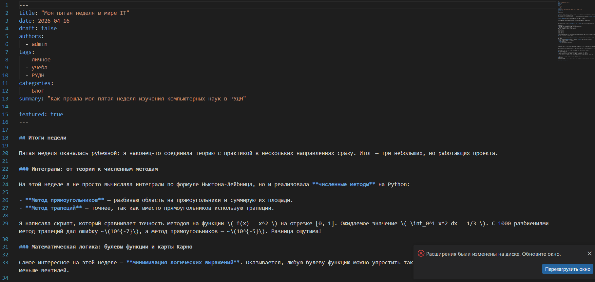
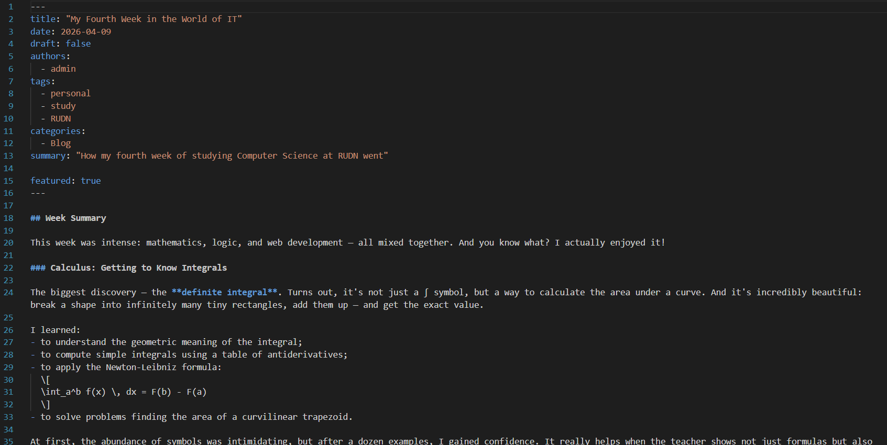
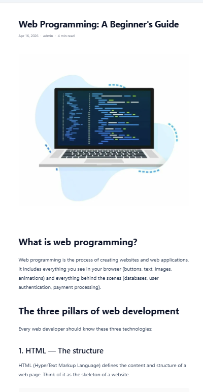
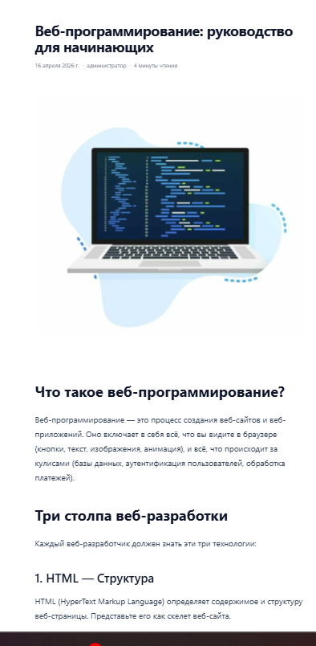

---
## Author
author:
  name: Юсупова Амина Руслановна
  affiliation:
    - name: Российский университет дружбы народов
      country: Российская Федерация
      postal-code: 117198
      city: Москва
      address: ул. Миклухо-Маклая, д. 6
lang: ru
format:
  pdf:
    documentclass: scrartcl
    latex-engine: xelatex
    mainfont: "Liberation Serif"
    sansfont: "Liberation Sans"
    monofont: "Liberation Mono"
    include-in-header:
      text: |
        \usepackage{fontspec}
        \setmainfont{Liberation Serif}
        \setsansfont{Liberation Sans}
        \setmonofont{Liberation Mono}
  pptx:
    toc: false
## Title
title: "Отчёт по 6 этапу проекта"
subtitle: Сайт научного работника
license: CC BY
---

# Цели и задачи
## Цель лабораторной работы

# Цель работы

Добавить к сайту поддержку английского языка, разместить посты на двух языках

# Задание

1. Сделать поддержку английского и русского языков.
2. Разместить элементы сайта на обоих языках.
3. Разместить контент на обоих языках.
4. Сделать пост по прошедшей неделе.
5. Добавить пост на тему по выбору (на двух языках).

# Выполнение этапа проекта

## 1. Размещение элементов сайта на двух языках

{ #fig:001 width=70% height=70% }

## 2. Создание поста на выбранную тему

{ #fig:002 width=70% height=70% }

{ #fig:003 width=70% height=70% }

## 3. Создание поста по прошлой наделе 

{ #fig:004 width=70% height=70% }

## Английский

{ #fig:005 width=70% height=70% }

## 4. Конечный вид сайта 

{ #fig:006 width=70% height=70% }

## Пост на русском

{ #fig:007 width=70% height=70% }

# Выводы

В ходе выполнения шестого этапа индивидуального проекта на сайт добавлены: поддержка английского языка, посты на двух языках, пост по 5 неделе и пост на тему:"Веб программирование"

